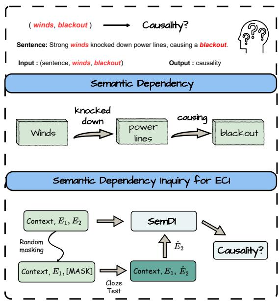
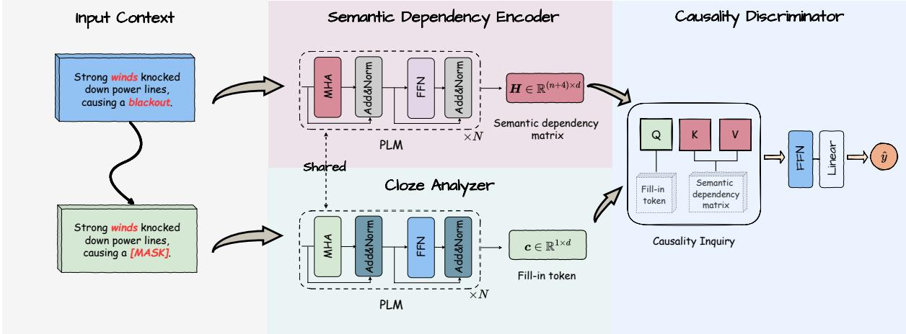
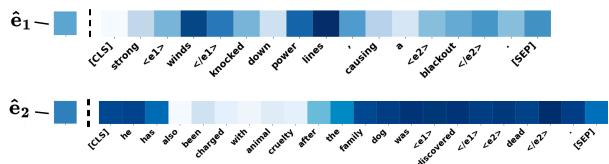
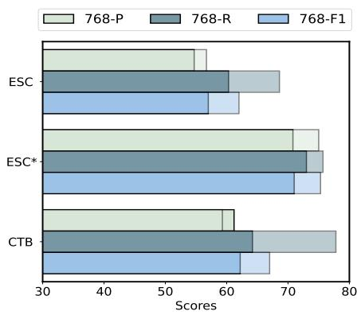

# Advancing Event Causality Identification via Heuristic Semantic Dependency Inquiry Network

Haoran Li1, Qiang Gao2,3, Hongmei Wu2, Li Huang2,3\*

1College of Computer Science, Sichuan University

2School of Computing and Artificial Intelligence,

Southwestern University of Finance and Economics 3Engineering Research Center of Intelligent Finance, Ministry of Education, Southwestern University of Finance and Economics haoran.li.cs@gmail.com, {qianggao, lihuang}@swufe.edu.cn

## Abstract

Event Causality Identification (ECI) focuses on extracting causal relations between events in texts. Existing methods for ECI primarily rely on causal features and external knowledge. However, these approaches fall short in two dimensions: (1) causal features between events in a text often lack explicit clues, and (2) external knowledge may introduce bias, while specific problems require tailored analyses. To address these issues, we propose SemDI - a simple and effective Semantic Dependency Inquiry Network for ECI. SemDI captures semantic dependencies within the context using a unified encoder. Then, it utilizes a Cloze Analyzer to generate a fill-in token based on comprehensive context understanding. Finally, this fill-in token is used to inquire about the causal relation between two events. Extensive experiments demonstrate the effectiveness of SemDI, surpassing state-of-the-art methods on three widely used benchmarks. Code is available at https://github.com/hrlics/SemDI.

## 1 Introduction

Event Causality Identification (ECI) aims to catch causal relations between event pairs in text. This task is critical for Natural Language Understanding (NLU) and exhibits various application values. For example, an accurate ECI system can facilitate question answering (Liu et al., 2023b; Zang et al., 2023), narrative generation (Ammanabrolu et al., 2021), and summarization (Huang et al., 2023). However, identifying causal relationships within text is challenging due to the intricate and often implicit causal clues embedded in the context. For instance, in the sentence "But tremors are likely in the junk-bond market, which has helped tofinance the takeover boom ofrecent years.", an ECI model should identify the causal relation between event pair (tremors, boom), which is not immediately evident without understanding the context.

  
Figure 1: Introduction of the ECI task, along with our motivation: causal relations are heavily contextdependent.

The conventional approach for ECI involves a binary classification model that takes a triplet (sentence, event-1, event-2) as input to determine the existence of a causal relation between the two events, as illustrated at the top of Figure 1. Various methods have been proposed to enhance ECI performance. While early feature-based methods (Hashimoto et al., 2014; Ning et al., 2018; Gao et al., 2019) laid the foundation, more recent representation-based methods have demonstrated superior ECI capabilities, including Pre-trained Language Models (PLMs) based methods (Shen et al., 2022; Man et al., 2022), and data augmentation methods (Zuo et al., 2020, 2021b). A notable recent trend is augmenting ECI models with external prior knowledge (Liu et al., 2021; Cao et al., 2021; Liu et al., 2023a). However, it can also introduce potential bias. For example, consider the event pairs (winds, blackout) mentioned in Figure 1. While there seems to be no direct causal relation from prior knowledge, contextual inference makes it reasonable to deduce causality. Upon analysis, we can observe a causal semantic dependency between "winds" and "blackout": winds knocked down causing−−−−→ blackout. This re- power lines veals that causal relations between events within a sentence often appear as context-dependent semantic dependencies. Thus, we claim that the ECI task can be reformulated as a semantic dependency inquiry task between two events within the context.

To this end, we propose a Heuristic Semantic Dependency Inquiry Network (SemDI) for the ECI task. The key idea behind SemDI is to explore implicit causal relationships guided by contextual semantic dependency analysis. Specifically, we first capture the semantic dependencies using a unified encoder. Then, we randomly mask out one event from the event pair and utilize a Cloze analyzer to generate a fill-in token based on comprehensive context understanding. Finally, this fill-in token is used to inquire about the causal relation between the two events in the given sentence. The main contributions of this work are summarized as follows:

• We propose the Semantic Dependency Inquiry as a promising alternative solution to the ECI task, highlighting the significance of contextual semantic dependency analysis in detecting causal relations.

• We introduce a heuristic Semantic Dependency Inquiry Network (SemDI) for ECI, which offers simplicity, effectiveness, and robustness.

• The experimental results on three widely used datasets demonstrate that SemDI achieves 7.1%, 10.9%, and 14.9% improvements in F1- score compared to the previous SOTA methods, confirming its effectiveness.

## 2 Related Work

Identifying causal relationships between events in the text is challenging and has attracted massive attention in the past few years (Feder et al., 2022). Early approaches primarily rely on explicit causal patterns (Hashimoto et al., 2014; Riaz and Girju, 2014a), lexical and syntactic features (Riaz and Girju, 2013, 2014b), and causal indicators or signals (Do et al., 2011; Hidey and McKeown, 2016) to identify causality.

Recently, representation-based methods leveraging Pre-trained Language Models (PLMs) have significantly enhanced the ECI performance. To mitigate the issue of limited training data for ECI, Zuo et al. (2020, 2021b) proposed data augmentation methods that generate additional training data, thereby reducing overfitting. Recognizing the importance of commonsense causal relations for ECI, Liu et al. (2021); Cao et al. (2021); Liu et al. (2023a) incorporated external knowledge from the knowledge graph ConceptNet (Speer et al., 2017) to enrich the representations derived from PLMs. However, the effectiveness of external knowledgebased methods is highly contingent on the consistency between the target task domain and the utilized knowledge bases, which can introduce bias and create vulnerabilities in these approaches.

In contrast to previous methods, Man et al. (2022) introduced a dependency path generation approach for ECI, explicitly enhancing the causal reasoning process. Hu et al. (2023) exploited two types of semantic structures, namely event-centered structure and event-associated structure, to capture associations between event pairs.

## 3 Preliminaries

## 3.1 Problem Statement

Let $S = [ S _ { 1 } , \cdots , S _ { n } ] \in \mathbb { R } ^ { 1 \times | S | }$ refer to a sentence with S tokens, where each token $S _ { i }$ is a word/symbol, including special identifiers to indicate event pair $( S _ { e _ { 1 } } , \ S _ { e _ { 2 } } )$ in causality. Traditional ECI models determine if there exists a causal relation between two events by focusing on event correlations, which can be written as ${ \mathcal { F } } ( S , S _ { e _ { 1 } } , S _ { e _ { 2 } } ) = \{ 0 , 1 \}$ . Actually, correlation does not necessarily imply causation, but it can often be suggestive. Therefore, this study investigates the Semantic Dependency Inquiry (SemDI) as a potential alternative solution to the ECI task. For clarity, we introduce two fundamental problems:

Cloze Test. We denote a mask indicator as $m = [ m _ { 1 } , \cdot \cdot \cdot , m _ { | S | } \} \in \{ 0 , 1 \} ^ { 1 \times | S | }$ , where $m _ { i } =$ 0 if $S _ { i }$ is event token, otherwise $m _ { j } ~ = ~ 1 , j ~ \in$ $[ 1 , \cdots , | S | ] , j \ \ne \ i$ . We use $\hat { S }$ instead of S to explicitly represent the incomplete sentence, i.e, $\hat { S } = m S$ . For simplicity, if the event contains more than one word, we replace all words in the event with one ’<MASK>’ token. The Cloze test in this study is to develop a contextual semanticbased network $\Omega ( \cdot )$ to fill in the masked word, i.e., $\Omega ( \hat { S } ) \mapsto S _ { m }$ , where $S _ { m }$ denotes the generated fill-in token.

Semantic Dependency Inquiry. There often exists a semantic dependency between two causally related events, as illustrated in Figure 1. In light of this, we propose to inquire about such causal semantic dependency between two events within the context through the generated fill-in token. This approach aligns with our motivation that causal relations are heavily context-dependent. To elaborate, given the input tuple $( S , S _ { m } )$ , a discriminator $\mathcal { D } ( \cdot )$ aims to examine the presence of causal semantic dependency in sentence S through $S _ { m }$ , i.e., $\mathcal { D } ( S , S _ { m } ) \in \{ 0 , 1 \}$

## 3.2 Basic Technique

The multi-head attention mechanism is the core part of Transformer (Vaswani et al., 2017) and has been widely adopted for sequential knowledge modeling. It measures the similarity scores between a given query and a key, whereafter formulating the attentive weight for a value. The canonical formulation can be conducted by the scaled dot-product as follows:

$$
\begin{array} { r l } & { \mathrm { M H A } ( A , B ) = \mathrm { C o n c a t } ( H ^ { 1 } , \cdot \cdot \cdot , H ^ { h } ) , } \\ & { \quad \mathrm { w h e r e \ } H ^ { i } = s o f t m a x ( \frac { Q K ^ { T } } { \sqrt { d _ { h } } } ) V , } \\ & { \quad \quad \mathrm { a n d \ } Q = A W _ { Q } , \{ K , V \} = B \{ W _ { K } , W _ { V } \} , } \end{array}\tag{1}
$$

herein, $W _ { \{ Q , K , V \} } \in \mathbb { R } ^ { d \times d _ { h } }$ are head mapping parameters. Typically, the multi-head attention mechanism can be categorized into two types: (1) when $A = B$ , the attention mechanism focuses on the relationship between different elements within the same input; (2) when $A \neq B$ , the attention mechanism captures the relationship between elements from different inputs.

## 4 Methodology

## 4.1 Overview

This section presents our proposed SemDI model, which reformulates the ECI task as a causal semantic dependency inquiry problem. As illustrated in Figure 2, we first capture the semantic dependencies within the source sentence using a Semantic Dependency Encoder (SDE). Then, we randomly mask out one event from the event pair and utilize a Cloze Analyzer (CA) to generate a fill-in token based on comprehensive context understanding. Finally, this fill-in token is used to inquire about the causal semantic dependency between the two events in a Causality Discriminator. It is worth noting that the SDE and CA share the same parameters initialized from a Pre-trained Language Model (PLM), e.g., RoBERTa. The key distinguishing feature of our approach is its full utilization of reading comprehension within the generative model, eliminating the need for additional prior knowledge and prioritizing simplicity and efficiency.

## 4.2 Cloze Analyzer

It is reasonable to believe that a well-trained deep generative model is powerful in context awareness (Goswami et al., 2020). In light of this, we adopt a straightforward approach of randomly masking one event from the event pair, and then predicting this event. This approach is inspired by the literary puzzle Cloze, which plays a crucial role in our framework. The Cloze facilitates the prediction of the most appropriate fill-in token for the masked word, thereby revealing the probable semantic relationships within the given context.

Input Embedding Layer aims to encode sentences into a latent space. Given a sentence $\pmb { S } = [ S _ { 1 } , \cdots , S _ { e _ { 1 } } , \cdots , S _ { e _ { 2 } } , \cdots , S _ { n } ]$ , we correlate a $\hat { S } = S \odot M _ { m a s k }$ , where denotes the elementwise product and $M _ { m a s k } \ = \ \{ m _ { 1 : n } \} \ \in \ \{ 0 , 1 \} ^ { n }$ indicates the randomly masked word. If $m _ { i } = 0$ , it means the $S _ { i }$ word is masked, which can be either $S _ { e _ { 1 } }$ or $S _ { e _ { 2 } }$ . In order to adhere to the $C l o z e$ puzzle setting, we utilize two pairs of specification symbols $< e _ { 1 } > , < / e _ { 1 } >$ and $< e _ { 2 } > , < / e _ { 2 } >$ to mark $S _ { e _ { 1 } }$ and $S _ { e _ { 2 } }$ in source sentence $S .$ . Importantly, the masked word does not have the marker, thus resulting in $| \hat { S } | = | S | - 2$

The input embedding layer encodes the $s , { \hat { s } }$ associated with its position. The word embeddings are trained along with the model and initialized from pre-trained RoBERTa word vectors with a dimensionality of $d = 1 0 2 4$ . The specification symbol $< e _ { * } >$ and [mask] are mapped to the appointed tokens, and their embeddings are trainable with random initialization. The position embedding is computed by the sine and cosine functions proposed by Transformer. Finally, the outputs of a given sentence from this layer are the sum of the word embedding and position embedding, namely X and Xˆ for simplicity, respectively. The latter corresponds to a sentence with the masked word. Notably, ${ X \in \mathbb { R } ^ { ( n + 4 ) \times d } , \hat { X } \in \mathbb { R } ^ { ( n + 2 ) \times d } }$

Semantic Completion Block receives the incomplete sentence Xˆ as input, aiming to fill in the blank that is marked by [mask] $( \mathrm { i } . \mathrm { e } . , \ \hat { x } _ { m } )$ . We leverage a PLM, specifically RoBERTa, to address this Cloze test. The main idea of this block is to take advantage of the $\hat { x } _ { m }$ as a query, then fill the man-made gap. The process can be formulated as:

  
Figure 2: Overview of our proposed SemDI for event causality identification, which consists of (1) a Semantic Dependency Encoder to capture the intricate semantic dependencies within the context; (2) a Cloze Analyzer to generate a fill-in token; (3) a Causality Discriminator to conduct causality inquiry.

$$
\mathbf { c } = P L M ( { \hat { x } } _ { m } , { \hat { X } } ) ,\tag{2}
$$

where $\pmb { c } \in \mathbb { R } ^ { 1 \times d }$ is the output of this block, i.e., the embedding of the generated fill-in token.

## 4.3 Semantic Dependency Encoder

To capture the semantic dependencies between words within the context, we utilize a PLM, e.g., RoBERTa, as the Semantic Dependency Encoder to facilitate comprehensive information reception. It receives the source sentence X as input to establish the semantic dependencies present in the entire sentence, which can be formulated as:

$$
\pmb { H } = P L M ( X ) ,\tag{3}
$$

where $\pmb { H } \in \mathbb { R } ^ { ( n + 4 ) \times d }$ denotes sentence representation that assimilate intricate semantic dependencies among words.

## 4.4 Causality Discriminator

According to our motivation, we conduct a causality inquiry between the fill-in token c and the semantic dependency matrix H by utilizing cross attentive network, namely:

$$
z = \mathrm { M H A } ( c , H ) .\tag{4}
$$

After that, we obtain the $\boldsymbol { z } \in \mathbb { R } ^ { 1 \times d }$ as the result of the inquiry. A two-layer feed-forward network transforms it to the causality classifier as:

$$
\pmb { y } _ { z } = ( R e L U ( z W _ { i n } + b _ { i n } ) W _ { o u t } + b _ { o u t } ) ,\tag{5}
$$

where $\{ W _ { * } , b _ { * } \}$ are learnable parameters.

## 4.5 Training Criterion

We adopt the cross-entropy loss function to train SemDI:

$$
J ( \Theta ) = - \sum _ { ( s _ { e _ { 1 } } , s _ { e _ { 2 } } ) \in S } { y _ { ( s _ { e _ { 1 } } , s _ { e _ { 2 } } ) } \log \left( s o f t m a x ( y _ { z } W _ { y } + b _ { y } ) \right) } ,\tag{6}
$$

where Θ denotes the model parameters, S refers to all sentences in the training set, $( s _ { e _ { 1 } } , s _ { e _ { 2 } } )$ are the events pairs and $\pmb { y } _ { ( s _ { e _ { 1 } } , s _ { e _ { 2 } } ) }$ is a one-hot vector indicating the gold relationship between $\mathit { s } _ { e 1 }$ and $s _ { e _ { 2 } }$ . We utilize $y _ { ( s _ { e _ { 1 } } , s _ { e _ { 2 } } ) }$ to guide the learning process in which the generated fill-in token is used to inquire about the causal semantic dependencies within the original sentence, as shown in Figure 3.

It is worth noting that we do not establish a loss function to directly guide the generation of fill-in tokens. This decision is because we do not require alignment between the fill-in tokens and the original words. Instead, our objective is to generate a token based on comprehensive context understanding, which we then use to inquire about the presence of a causal relationship. This approach aligns with our main argument: the existence of a causal relationship between two events is heavily context-dependent.

## 5 Experiments

In this section, we empirically investigate the effectiveness of SemDI, aiming to answer the following questions: (1) Can SemDI consistently perform well across various ECI benchmarks? (2) Can the proposed moduls (e.g., Cloze Analyzer) effectively enhance performance? (3) Does SemDI exhibit interpretability during the causality inquiry process?

(4) Is SemDI robust to diffrent backbone sizes and masking strategies?

## 5.1 Experimental Setup

Evaluation Benchmarks. We evaluate our SemDI on three widely-used ECI benchmarks, including two from EventStoryLine v0.9 (Caselli and Vossen, 2017) and one from Causal-TimeBank (Mirza et al., 2014), namely ESC, ESC\*, and CTB. ESC1 contains 22 topics, 258 documents, and 5334 event mentions. This corpus contains 7805 intra-sentence event pairs, of which 1770 (22.67%) are annotated with causal relations. $\mathbf { E S C } ^ { * }$ is a different partition setting of the ESC dataset, utilized by Man et al. (2022); Shen et al. (2022); Hu et al. (2023). Unlike the original ESC dataset, which sorts documents by topic IDs, this setting involves random shuffling of documents, leading to more consistent training and testing distributions. $\mathbf { C T B } ^ { 2 }$ consists of 183 documents and 6811 event mentions. Among the 9721 intra-sentence event pairs, 298 (3.1%) are annotated with causal relations. Table 1 provides statistics of these benchmarks. More detailed descriptions are discussed in Appendix A.2.

Table 1: Statistics of evaluation benchmarks, where OOD denotes Out-of-Distribution, ID denotes In-Distribution, and CI denotes Class Imbalance.
<table><tr><td>Dataset</td><td># Doc</td><td># Pairs</td><td># Causal</td><td>Evaluation</td></tr><tr><td>ESC</td><td>258</td><td>7805</td><td>1770</td><td>OOD</td></tr><tr><td>ESC*</td><td>258</td><td>7805</td><td>1770</td><td>ID</td></tr><tr><td>CTB</td><td>183</td><td>9721</td><td>298</td><td>CI</td></tr></table>

Baselines. We first compare our proposed SemDI with the feature-based methods. For the ESC dataset, we adopted the following baselines: LSTM (Cheng and Miyao, 2017), a dependency path boosted sequential model; Seq (Choubey and Huang, 2017), a sequence model explores manually designed features for ECI. LR+ and ILP (Gao et al., 2019), models considering document-level structure. For the CTB dataset, we select RB (Mirza and Tonelli, 2014), a rule-based ECI system; DD (Mirza and Tonelli, 2016), a data-driven machine learning-based method; VR-C (Mirza, 2014), a verb rule-based model boosted by filtered data and causal signals.

Furthermore, we compare SemDI with the following PLMs-based methods: MM (Liu et al., 2021), a commonsense knowledge enhanced method with mention masking generalization; KnowDis (Zuo et al., 2020), a knowledgeenhanced distant data augmentation approach; LearnDA (Zuo et al., 2021b), a learnable augmentation framework alleviating lack of training data; LSIN (Cao et al., 2021), an approach which constructs a descriptive graph to exploit external knowledge; CauSeRL (Zuo et al., 2021a), a selfsupervised method utilizing external causal statements; GenECI and T5 Classify (Man et al., 2022), methods that formulates ECI as a generation problem; KEPT (Liu et al., 2023a), a study that leverages BERT to integrate external knowledge bases for ECI; SemSIn (Hu et al., 2023), the previous SOTA method that leverages event-centric structure and event-associated structure for causal reasoning. Similar to our approach, it does not utilize external knowledge;

We also compare SemDI with other state-ofthe-art Large Language Models (LLMs), including GPT-3.5-turbo, GPT-4 (Achiam et al., 2023), and LLaMA2-7B (Touvron et al., 2023). These models are known for their extensive pre-training on diverse datasets and their superior performance across multiple tasks.

Implementation Details. We adopt the commonly used Precision, Recall, and F1-score as evaluation metrics. Following the existing studies (Shen et al., 2022; Hu et al., 2023; Liu et al., 2023a), we select the last two topics in ESC as development set and use the remaining 20 topics for a 5-fold cross-validation. In addition, we perform a 10-fold cross-validation on CTB. Given the sparsity of causality in the CTB dataset, we follow Cao et al. (2021); Hu et al. (2023) to conduct a negative sampling technique for training with a sampling rate of 0.7. The pre-trained RoBERTa-large model (Liu et al., 2019) is chosen as the backbone of our Cloze Analyzer and Semantic Dependency Encoder. The hidden dimension is 1024, the batch size is 20, and the dropout rate is 0.5. We train our model via the AdamW (Loshchilov and Hutter, 2017) optimizer with an initial learning rate of 1e  5. The entire training process spans 100 epochs and takes approximately 2 hours. Additionally, we fine-tune the Llama-2-7b-chat-hf (Touvron et al., 2023) using the LlamaFactory (Zheng et al., 2024). Detailed prompts guiding LLMs to identify causality are provided in Appendix A.1. All experiments are conducted on one Nvidia GeForce RTX 3090.

<table><tr><td rowspan=1 colspan=5>Method</td><td rowspan=1 colspan=1>P</td><td rowspan=1 colspan=2>R   F1</td></tr><tr><td rowspan=11 colspan=5>LSTM (Cheng and Miyao, 2017)Seq (Choubey and Huang, 2017)LR+ (Gao et al., 2019)ILP (Gao et al., 2019)KnowDis (Zuo et al., 2020)MM (Liu et al., 2021)CauSeRL (Zuo et al., 2021a)LSIN (Cao et al., 2021)LearnDA (Zuo et al., 2021b)SemSIn (Hu et al., 2023)KEPT (Liu et al., 2023a)</td><td rowspan=1 colspan=1>34.0</td><td rowspan=1 colspan=1>41.5</td><td rowspan=1 colspan=1>37.4</td></tr><tr><td rowspan=1 colspan=2>17)</td><td rowspan=1 colspan=1>32.7</td><td rowspan=1 colspan=1>44.9</td><td rowspan=1 colspan=1>37.8</td></tr><tr><td rowspan=1 colspan=3></td><td rowspan=1 colspan=3></td><td rowspan=1 colspan=1>37.0</td><td rowspan=1 colspan=1>45.2</td></tr><tr><td rowspan=1 colspan=1>37.4</td><td rowspan=1 colspan=1>55.8</td><td rowspan=1 colspan=1>44.7</td></tr><tr><td rowspan=1 colspan=1>39.7</td><td rowspan=1 colspan=1>66.5</td><td rowspan=1 colspan=1>49.7</td></tr><tr><td rowspan=1 colspan=1>41.9</td><td rowspan=1 colspan=1>62.5</td><td rowspan=1 colspan=1>50.1</td></tr><tr><td rowspan=1 colspan=1>41.9</td><td rowspan=1 colspan=1>69.0</td><td rowspan=1 colspan=1>52.1</td></tr><tr><td rowspan=1 colspan=1>49.7</td><td rowspan=1 colspan=1>58.1</td><td rowspan=1 colspan=1>52.5</td></tr><tr><td rowspan=1 colspan=1>42.2</td><td rowspan=1 colspan=1>69.8</td><td rowspan=1 colspan=1>52.6</td></tr><tr><td rowspan=1 colspan=1>50.5</td><td rowspan=1 colspan=1>63.0</td><td rowspan=1 colspan=1>56.1</td></tr><tr><td rowspan=1 colspan=1>50.0</td><td rowspan=1 colspan=1>68.8</td><td rowspan=1 colspan=1>57.9</td></tr><tr><td rowspan=4 colspan=5>LLaMA2-7BLLaMA2-7BftGPT-3.5-turboGPT-4.0SemDI</td><td rowspan=1 colspan=1>11.4</td><td rowspan=1 colspan=1>50.0</td><td rowspan=2 colspan=1>18.629.8</td></tr><tr><td rowspan=1 colspan=1>20.5</td><td rowspan=1 colspan=1>57.1</td></tr><tr><td rowspan=1 colspan=1>39.5</td><td rowspan=1 colspan=1>40.3</td><td rowspan=2 colspan=1>39.745.262.0</td></tr><tr><td rowspan=1 colspan=1>30.756.7</td><td rowspan=1 colspan=1>85.768.6</td></tr><tr><td rowspan=2 colspan=5>T5 Classify* (Man et al., 2022)GenECI* (Man et al., 2022)SemSIn* (Hu et al., 2023)DPJL*(Shen et al., 2022)</td><td rowspan=1 colspan=1>39.159.564.2</td><td rowspan=1 colspan=1>69.557.165.7</td><td rowspan=1 colspan=1>47.758.864.9</td></tr><tr><td rowspan=1 colspan=1>65.3</td><td rowspan=1 colspan=1>70.8</td><td rowspan=1 colspan=1>67.9</td></tr><tr><td rowspan=3 colspan=5>LLaMA2-7B $\mathbf { L L a M A 2 - 7 B } ^ { \hbar ^ { * } }$  $\mathrm { G P T } { - } 3 . 5 { \mathrm { - t u r b o } } ^ { \ast }$ </td><td rowspan=1 colspan=1>12.1</td><td rowspan=1 colspan=1>50.7</td><td rowspan=2 colspan=1>19.530.0</td></tr><tr><td rowspan=1 colspan=1>20.3</td><td rowspan=1 colspan=1>57.6</td></tr><tr><td rowspan=1 colspan=1>40.1</td><td rowspan=1 colspan=1>41.2</td><td rowspan=1 colspan=1>40.6</td></tr><tr><td rowspan=1 colspan=5> $\boldsymbol { \mathrm { G P T - 4 . 0 } } ^ { * }$ </td><td rowspan=1 colspan=1>31.2</td><td rowspan=1 colspan=1>86.3</td><td rowspan=1 colspan=1>45.8</td></tr><tr><td rowspan=1 colspan=5> $\mathbf { S e m D I } ^ { * }$ </td><td rowspan=1 colspan=1>75.0</td><td rowspan=1 colspan=1>75.7</td><td rowspan=1 colspan=1>75.3</td></tr></table>

Table 2: Experimental results on ESC and ${ \mathrm { E S C } } ^ { * }$ \* denotes experimental results on ESC\* and ft denotes fine-tuning the LLM.

Table 2 and Table 3 present the performance of different approaches on three benchmarks, respectively. The best scores are highlighted in bold, while the second-best scores are underlined. We summarize our observations as follows:

SemDI consistently outperforms all baselines in terms of the F1-score. More specifically, SemDI surpasses the previous SOTA methods by significant margins of 4.1, 7.4, and 8.7 in F1-score on the ESC, ESC\*, and CTB datasets, respectively. This result aligns with our motivation, as prioritizing the context-dependent nature of causal relations enables the model to identify causality more accurately, thereby mitigating potential bias introduced by external prior knowledge.

Domain Generalization Ability. On the ESC dataset, ECI models need to generalize to test topics $\mathcal { D } _ { t e s t }$ that are disjoint from the training topics $\mathcal { D } _ { t r a i n } .$ , i.e., $\mathcal { D } _ { t r a i n } \cap \mathcal { D } _ { t e s t } = \emptyset$ . From Table 2, we observe that SemDI demonstrates superior performance under this Out-of-Distribution (OOD)

<table><tr><td rowspan=1 colspan=2>Method</td><td rowspan=1 colspan=1>P</td><td rowspan=1 colspan=1>R</td><td rowspan=1 colspan=1>F1</td></tr><tr><td rowspan=11 colspan=2>RB (Mirza and Tonelli, 2014)DD (Mirza and Tonelli, 2016)VR-C(Mirza, 2014)MM (Liu et al., 2021)KnowDis (Zuo et al., 2020)LearnDA (Zuo et al., 2021b)LSIN (Cao et al., 2021)CauSeRL (Zuo et al., 2021a)KEPT (Liu et al., 2023a)GenECI (Man et al., 2022)SemSIn (Hu et al., 2023)</td><td rowspan=1 colspan=1>36.8</td><td rowspan=1 colspan=1>12.3</td><td rowspan=1 colspan=1>18.4</td></tr><tr><td rowspan=1 colspan=1>67.3</td><td rowspan=1 colspan=1>22.6</td><td rowspan=1 colspan=1>33.9</td></tr><tr><td rowspan=1 colspan=1>69.0</td><td rowspan=1 colspan=1>31.5</td><td rowspan=1 colspan=1>43.2</td></tr><tr><td rowspan=1 colspan=1>36.6</td><td rowspan=1 colspan=1>55.6</td><td rowspan=1 colspan=1>44.1</td></tr><tr><td rowspan=1 colspan=1>42.3</td><td rowspan=1 colspan=1>60.5</td><td rowspan=1 colspan=1>49.8</td></tr><tr><td rowspan=1 colspan=1>41.9</td><td rowspan=1 colspan=1>68.0</td><td rowspan=1 colspan=1>51.9</td></tr><tr><td rowspan=1 colspan=1>51.5</td><td rowspan=1 colspan=1>56.2</td><td rowspan=1 colspan=1>52.9</td></tr><tr><td rowspan=1 colspan=1>43.6</td><td rowspan=1 colspan=1>68.1</td><td rowspan=1 colspan=1>53.2</td></tr><tr><td rowspan=1 colspan=1>48.2</td><td rowspan=1 colspan=1>60.0</td><td rowspan=1 colspan=1>53.5</td></tr><tr><td rowspan=1 colspan=1>60.1</td><td rowspan=1 colspan=1>53.3</td><td rowspan=1 colspan=1>56.5</td></tr><tr><td rowspan=1 colspan=1>52.3</td><td rowspan=1 colspan=1>65.8</td><td rowspan=1 colspan=1>58.3</td></tr><tr><td rowspan=5 colspan=2>LLaMA2-7BLLaMA2- $\cdot 7 \mathbf { B } ^ { f t }$ GPT-3.5-turboGPT-4.0SemDI</td><td rowspan=1 colspan=1>5.4</td><td rowspan=1 colspan=1>53.9</td><td rowspan=1 colspan=1>9.8</td></tr><tr><td rowspan=1 colspan=1>10.5</td><td rowspan=1 colspan=1>61.8</td><td rowspan=1 colspan=1>17.9</td></tr><tr><td rowspan=1 colspan=1>7.0</td><td rowspan=1 colspan=1>49.7</td><td rowspan=1 colspan=1>12.3</td></tr><tr><td rowspan=1 colspan=1></td><td rowspan=1 colspan=1>4.6</td><td rowspan=1 colspan=1>84.6</td><td rowspan=1 colspan=1>8.7</td></tr><tr><td rowspan=1 colspan=1>59.3</td><td rowspan=1 colspan=1>77.8</td><td rowspan=1 colspan=1>67.0</td></tr></table>

Table 3: Experimental results on CTB. ft denotes finetuning the LLM.

testing. This result verifies SemDI’s potential as a general framework for event causality identification. Furthermore, training and testing distributions are more consistent under the ESC\* dataset, resulting in relatively higher performance.

Comparison with PLMs-based Methods. Compared to LearnDA, which achieves the secondhighest Recall score on the ESC dataset (at the top of Table 2), SemDI shows a significant improvement of 34.3% in Precision. This indicates that SemDI is more reliable in decision-making. It is understandable that LearnDA achieves better recall, as it can generate additional training event pairs beyond the training set. While KEPT shares the same fundamental architecture with SemDI, it mainly focuses on integrating external knowledge for causal reasoning. In contrast, SemDI highlights the importance of contextual semantic dependency analysis, outperforming KEPT by a significant margin.

Comparison with LLMs. Our SemDI model demonstrates superior performance compared to state-of-the-art Large Language Models (LLMs) across all benchmarks, despite its significantly smaller size. Specifically, SemDI (368M parameters) is 19 times smaller than fine-tuned LLaMA2-7B, yet it achieves an average improvement of 177.8% in F1-score. The efficiency of SemDI makes it ideal for deployment in resourceconstrained and time-demanding environments. Additionally, we observe that LLMs often exhibit overconfidence in determining causal relationships, resulting in high recall but low precision. This observation is consistent with previous findings in the literature (Si et al., 2022; Mielke et al., 2022; Xiong et al., 2024).

<table><tr><td rowspan="2">Method</td><td colspan="3">ESC</td><td colspan="3"> $\mathbf { E S C } ^ { * }$ </td><td colspan="3">CTB</td></tr><tr><td>P</td><td>R</td><td>F1</td><td>P</td><td>R</td><td>F1</td><td>P</td><td>R</td><td>F1</td></tr><tr><td>SemDI w/o. CA</td><td>57.8</td><td>64.0</td><td>60.8</td><td>74.8</td><td>75.2</td><td>74.9</td><td>63.8</td><td>65.0</td><td>63.9</td></tr><tr><td>SemDI w/o. SDE</td><td>56.8</td><td>57.9</td><td>56.9</td><td>67.2</td><td>68.9</td><td>68.0</td><td>64.4</td><td>61.9</td><td>62.5</td></tr><tr><td>SemDI w/o. RoBERTa</td><td>52.2</td><td>68.5</td><td>59.1</td><td>70.9</td><td>73.0</td><td>71.9</td><td>59.1</td><td>66.4</td><td>61.0</td></tr><tr><td>SemDI</td><td>56.7</td><td>68.6</td><td>62.0</td><td>75.0</td><td>75.7</td><td>75.3</td><td>59.3</td><td>77.8</td><td>67.9</td></tr></table>

Table 4: Results of ablation study, which demonstrates the impact of different components on the overall performance of our model.

## 5.3 Ablation Study

In this subsection, we conduct comprehensive ablation studies to demonstrate the effectiveness of our key components, including the Cloze Analyzer (CA), the Semantic Dependency Encoder (SDE), and the backbone model RoBERTa. Concretely, we remove Cloze Analyzer and utilize the original event embedding for causality inquiry in SemDI w/o CA. In SemDI w/o SDE, we remove the Semantic Dependency Encoder and directly feed the embedding of the generated fill-in token to the classifier, thus omitting the causality inquiry process. In SemDI w/o RoBERTa, we replace the backbone RoBERTa-large model with a BERT-large model. The results are shown in Table 4.

From this table, we observe that: (1) SemDI outperforms all the variants, demonstrating the effectiveness of multiple components in SemDI, including the generation of fill-in token for causality inquiry, the encoding of semantic dependency, and the backbone selection. (2) SemDI w/o CA performs worse than SemDI, which indicates the importance of using a generated fill-in token to perform causality inquiry. Using the original token embedding that lacks the comprehensive context understanding for causality inquiry will lead to performance degradation. (3) SemDI w/o SDE shows the worst performance. This result is not surprising, as the analysis and inquiry of semantic dependency play the most crucial role in our approach to detecting causal relations. (4) Even if we replace the backbone RoBERTa model with a less optimized BERT model, our approach still outperforms the existing SOTA methods, including KEPT, SemSIn, and GPT-4.0, whose results are shown in Table 2 and Table 3. This further supports our claim that comprehensive contextual analysis is crucial for identifying causal relations within sentences.

  
Figure 3: Visualization of the attention heatmap in the causality inquiry process. Token $" \hat { e } _ { * } "$ denotes the generated fill-in token for event $e _ { * } .$

## 5.4 Interpretability Analysis

In this subsection, we visualize the causality inquiry process in SemDI to demonstrate its interpretability. Specifically, in this process, the generated fill-in token is used to inquire about the causal semantic dependencies between two events within the context, as shown in the middle of Figure 1. We randomly select two examples from the ESC dataset and present their attention heatmap of the causality inquiry process in Figure 3. It can be observed that the causality inquiry process can effectively uncover the intricate semantic dependencies between two events. For example, SemDI tends to uniformly distribute its attention to the sentence with non-causal event pairs, as shown in the heatmap of the second sentence. In contrast, we can observe a clear causal semantic dependency between "winds" and "blackout" in the heatmap of the first sentence: winds power lines blackout. This phenomenon not only supports our motivation that causal relations are heavily context-dependent, but also demonstrates the effectiveness of using generated fill-in token to inquire about such causal semantic dependencies.

<table><tr><td rowspan=1 colspan=1>Sentence</td><td rowspan=1 colspan=1>Masked</td><td rowspan=1 colspan=1>Fill-in</td><td rowspan=1 colspan=1>Golden</td><td rowspan=1 colspan=1>SemDI</td></tr><tr><td rowspan=1 colspan=1>A goth was being questioned on suspicion of murder yesterdayafter his mother and sister were found dead at home.</td><td rowspan=1 colspan=1>questioned</td><td rowspan=1 colspan=1>investigated</td><td rowspan=1 colspan=1>√</td><td rowspan=1 colspan=1>√</td></tr><tr><td rowspan=1 colspan=1>A Kraft Foods plant worker who had been suspended for feudingwith colleagues, then escorted from the building, returned minuteslater with a handgun, found her foes in a break room and executedtwo of them with a single bullet each and critically wounded athird, police said Friday.</td><td rowspan=1 colspan=1>escorted</td><td rowspan=1 colspan=1>retired</td><td rowspan=1 colspan=1>X</td><td rowspan=1 colspan=1>√</td></tr></table>

Table 5: Case studies of SemDI. Two examples are randomly selected from the testing set of the ESC dataset.

## 5.5 Robustness Analysis

We now evaluate how different selections of key hyper-parameters impact our model’s performance.

Impact of hidden size. We further analyze the impact of hidden size on two classic dimensions, 768 and 1024, as depicted in Figure 4, where the shaded portion corresponds to 1024. From these results, we observe that: (1) Even if we reduce the hidden size from 1024 to 768, our SemDI still outperforms the previous SOTA methods, confirming its effectiveness and robustness. (2) The overall performance of SemDI shows a significant improvement with an increase in hidden size, particularly for the CTB dataset. This phenomenon can be attributed to the enhanced representation capability brought by higher model dimensions (Kaplan et al., 2020), which in turn facilitate reading comprehension - the core part of SemDI. (3) SemDI is relatively sensitive to the hidden size under lowresource scenarios (CTB) while maintaining good performance with sufficient annotated data for training (ESC and ESC\*).

  
Figure 4: Robustness analysis on hidden size. The shaded portion represents hidden size = 1024.

Impact of masking strategy. In Sec 4.2, we randomly mask out one event from the event pair and then utilze a Cloze Analyzer to generate a fill-in token. To evaluate our model’s sensitivity to the masking strategy applied in this Cloze test, we conduct further experiments on the ESC dataset with three specific approaches: (1) randomly mask e or $e _ { 2 }$ with a 50/50 chance (Random); (2) "100% mask ${ e _ { 1 } } "$ (Event1 only); (3) "100% mask ${ e _ { 2 } } "$ (Event2 only). As shown in Table 6, our SemDI maintains superior performance under all approaches in terms of the F1-score, confirming its robustness to varying masking strategies.

<table><tr><td>Strategy</td><td>P</td><td>R</td><td>F1</td></tr><tr><td>Random</td><td>56.7</td><td>68.8</td><td>62.0</td></tr><tr><td>Event1 only</td><td>58.2</td><td>68.0</td><td>62.7</td></tr><tr><td>Event2 only</td><td>55.5</td><td>70.0</td><td>61.8</td></tr></table>

Table 6: Robustness analysis on masking strategy applied in the Cloze Test.

## 5.6 Case Studies

In this subsection, we present case studies in Table 5 to further analyze the performance of SemDI. It is worth noting that tied embeddings are employed to map the fill-in tokens to specific words. In case 1, we can observe a clear causal semantic dependency: murder causing questioned. With a comprehensive understanding of the context, the Cloze Analyzer can generate a fill-token that fits seamlessly within the given context, i.e., (questioned, investigated). Case 2 demonstrates a faulty decision, likely due to the complex multi-hop reasoning required. Interestingly, the fill-in token "retired" also sharply contrasts with the original word "escorted." This misalignment may suggest a failure of SemDI to understand the semantic dependency between two events within the context.

## 6 Conclusions

In this paper, we present SemDI, a simple and effective semantic dependency inquiry approach for

Event Causality Identification. We first encode the semantic dependencies using a unified encoder. Subsequently, we utilize a Cloze Analyzer to generate a fill-in token based on comprehensive context understanding. This token is then used to inquire about the causal relation between two events within the context. Extensive experiments on three widely recognized datasets demonstrate the superior performance of SemDI while highlighting its robustness and efficiency.

## Limitations

The limitations of this work can be concluded as follows:

1. SemDI exhibits sensitivity to the quantity of annotated event pairs available for training. Consequently, it demonstrates reduced accuracy in capturing causal relations within the CTB dataset, as illustrated in Table. 3. Therefore, further improvements are needed to enhance its performance in low-resource scenarios.

2. While acknowledging the potential for bias introduced by external knowledge, we argue that incorporating commonsense is crucial for ECI. SemDI concentrates on investigating the effectiveness of semantic dependency inquiry for ECI, leaving the opportunity to take advantage of commonsense reasoning. Investigating how to properly integrate commonsense reasoning within the semantic-guided framework presents a promising avenue for future research.

## Acknowledgements

This work was supported by the Guanghua Talent Project.

## References

Josh Achiam, Steven Adler, Sandhini Agarwal, Lama Ahmad, Ilge Akkaya, Florencia Leoni Aleman, Diogo Almeida, Janko Altenschmidt, Sam Altman, Shyamal Anadkat, et al. 2023. Gpt-4 technical report. arXiv preprint arXiv:2303.08774.

Prithviraj Ammanabrolu, Wesley Cheung, William Broniec, and Mark O Riedl. 2021. Automated storytelling via causal, commonsense plot ordering. In Proceedings of the AAAI Conference on Artificial Intelligence, volume 35, pages 5859–5867.

Pengfei Cao, Xinyu Zuo, Yubo Chen, Kang Liu, Jun Zhao, Yuguang Chen, and Weihua Peng. 2021. Knowledge-enriched event causality identification via latent structure induction networks. In Proceedings ofthe 59th Annual Meeting ofthe Associationfor Computational Linguistics and the 11th International Joint Conference on Natural Language Processing (Volume 1: Long Papers), pages 4862–4872.

Tommaso Caselli and Piek Vossen. 2017. The event StoryLine corpus: A new benchmark for causal and temporal relation extraction. In Proceedings of the Events and Stories in the News Workshop, pages 77– 86, Vancouver, Canada. Association for Computational Linguistics.

Fei Cheng and Yusuke Miyao. 2017. Classifying temporal relations by bidirectional LSTM over dependency paths. In Proceedings ofthe 55th Annual Meeting of the Associationfor Computational Linguistics (Volume 2: Short Papers), pages 1–6, Vancouver, Canada. Association for Computational Linguistics.

Prafulla Kumar Choubey and Ruihong Huang. 2017. A sequential model for classifying temporal relations between intra-sentence events. In Proceedings of the 2017 Conference on Empirical Methods in Natural Language Processing, pages 1796–1802, Copenhagen, Denmark. Association for Computational Linguistics.

Quang Do, Yee Seng Chan, and Dan Roth. 2011. Minimally supervised event causality identification. In Proceedings of the 2011 conference on empirical methods in natural language processing, pages 294– 303.

Amir Feder, Katherine A. Keith, Emaad Manzoor, Reid Pryzant, Dhanya Sridhar, Zach Wood-Doughty, Jacob Eisenstein, Justin Grimmer, Roi Reichart, Margaret E. Roberts, Brandon M. Stewart, Victor Veitch, and Diyi Yang. 2022. Causal inference in natural language processing: Estimation, prediction, interpretation and beyond. Transactions ofthe Associationfor Computational Linguistics, 10:1138–1158.

Lei Gao, Prafulla Kumar Choubey, and Ruihong Huang. 2019. Modeling document-level causal structures for event causal relation identification. In Proceedings of the 2019 Conference of the North American Chapter of the Association for Computational Linguistics: Human Language Technologies, Volume 1 (Long and Short Papers), pages 1808–1817, Minneapolis, Minnesota. Association for Computational Linguistics.

Ankur Goswami, Akshata Bhat, Hadar Ohana, and Theodoros Rekatsinas. 2020. Unsupervised relation extraction from language models using constrained cloze completion. In Findings of the Association for Computational Linguistics: EMNLP 2020, pages 1263–1276, Online. Association for Computational Linguistics.

Chikara Hashimoto, Kentaro Torisawa, Julien Kloetzer, Motoki Sano, István Varga, Jong-Hoon Oh, and

Yutaka Kidawara. 2014. Toward future scenario generation: Extracting event causality exploiting semantic relation, context, and association features. In Proceedings of the 52nd Annual Meeting of the Associationfor Computational Linguistics (Volume 1: Long Papers), pages 987–997, Baltimore, Maryland. Association for Computational Linguistics.

Christopher Hidey and Kathleen McKeown. 2016. Identifying causal relations using parallel wikipedia articles. In Proceedings of the 54th Annual Meeting of the Association for Computational Linguistics (Volume 1: Long Papers), pages 1424–1433.

Zhilei Hu, Zixuan Li, Xiaolong Jin, Long Bai, Saiping Guan, Jiafeng Guo, and Xueqi Cheng. 2023. Semantic structure enhanced event causality identification. In Proceedings of the 61st Annual Meeting of the Associationfor Computational Linguistics (Volume 1: Long Papers), pages 10901–10913, Toronto, Canada. Association for Computational Linguistics.

Jia-Hong Huang, Chao-Han Huck Yang, Pin-Yu Chen, Min-Hung Chen, and Marcel Worring. 2023. Causalainer: Causal explainer for automatic video summarization. In Proceedings of the IEEE/CVF Conference on Computer Vision and Pattern Recognition, pages 2629–2635.

Jared Kaplan, Sam McCandlish, Tom Henighan, Tom B. Brown, Benjamin Chess, Rewon Child, Scott Gray, Alec Radford, Jeffrey Wu, and Dario Amodei. 2020. Scaling laws for neural language models.

Jian Liu, Yubo Chen, and Jun Zhao. 2021. Knowledge enhanced event causality identification with mention masking generalizations. In Proceedings of the Twenty-Ninth International Conference on International Joint Conferences on Artificial Intelligence, pages 3608–3614.

Jintao Liu, Zequn Zhang, Zhi Guo, Li Jin, Xiaoyu Li, Kaiwen Wei, and Xian Sun. 2023a. Kept: Knowledge enhanced prompt tuning for event causality identification. Knowledge-Based Systems, 259:110064.

Yang Liu, Guanbin Li, and Liang Lin. 2023b. Crossmodal causal relational reasoning for event-level visual question answering. IEEE Transactions on Pattern Analysis and Machine Intelligence.

Yinhan Liu, Myle Ott, Naman Goyal, Jingfei Du, Mandar Joshi, Danqi Chen, Omer Levy, Mike Lewis, Luke Zettlemoyer, and Veselin Stoyanov. 2019. Roberta: A robustly optimized bert pretraining approach.

Ilya Loshchilov and Frank Hutter. 2017. Decoupled weight decay regularization. arXiv preprint arXiv:1711.05101.

Hieu Man, Minh Nguyen, and Thien Nguyen. 2022. Event causality identification via generation of important context words. In Proceedings ofthe 11th Joint Conference on Lexical and Computational Semantics, pages 323–330, Seattle, Washington. Association for Computational Linguistics.

Sabrina J. Mielke, Arthur Szlam, Emily Dinan, and Y-Lan Boureau. 2022. Reducing conversational agents overconfidence through linguistic calibration. Transactions ofthe Associationfor Computational Linguistics, 10:857–872.

Paramita Mirza. 2014. Extracting temporal and causal relations between events. In Proceedings ofthe ACL 2014 Student Research Workshop, pages 10–17.

Paramita Mirza, Rachele Sprugnoli, Sara Tonelli, and Manuela Speranza. 2014. Annotating causality in the TempEval-3 corpus. In Proceedings of the EACL 2014 Workshop on Computational Approaches to Causality in Language (CAtoCL), pages 10–19, Gothenburg, Sweden. Association for Computational Linguistics.

Paramita Mirza and Sara Tonelli. 2014. An analysis of causality between events and its relation to temporal information. In Proceedings of COLING 2014, the 25th International Conference on Computational Linguistics: Technical Papers, pages 2097–2106.

Paramita Mirza and Sara Tonelli. 2016. Catena: Causal and temporal relation extraction from natural language texts. In The 26th international conference on computational linguistics, pages 64–75. ACL.

Qiang Ning, Zhili Feng, Hao Wu, and Dan Roth. 2018. Joint reasoning for temporal and causal relations. In Proceedings of the 56th Annual Meeting of the Associationfor Computational Linguistics (Volume 1: Long Papers), pages 2278–2288, Melbourne, Australia. Association for Computational Linguistics.

Mehwish Riaz and Roxana Girju. 2013. Toward a better understanding of causality between verbal events: Extraction and analysis of the causal power of verbverb associations. In Proceedings of the SIGDIAL 2013 Conference, pages 21–30.

Mehwish Riaz and Roxana Girju. 2014a. In-depth exploitation of noun and verb semantics to identify causation in verb-noun pairs. In Proceedings of the 15th Annual Meeting of the Special Interest Group on Discourse and Dialogue (SIGDIAL), pages 161–170.

Mehwish Riaz and Roxana Girju. 2014b. Recognizing causality in verb-noun pairs via noun and verb semantics. In Proceedings of the EACL 2014 Workshop on Computational Approaches to Causality in Language (CAtoCL), pages 48–57.

Shirong Shen, Heng Zhou, Tongtong Wu, and Guilin Qi. 2022. Event causality identification via derivative prompt joint learning. In Proceedings of the 29th International Conference on Computational Linguistics, pages 2288–2299, Gyeongju, Republic of Korea. International Committee on Computational Linguistics.

Chenglei Si, Chen Zhao, Sewon Min, and Jordan Boyd-Graber. 2022. Re-examining calibration: The case of question answering. In Findings of the Association for Computational Linguistics: EMNLP 2022,

pages 2814–2829, Abu Dhabi, United Arab Emirates. Association for Computational Linguistics.

Robyn Speer, Joshua Chin, and Catherine Havasi. 2017. Conceptnet 5.5: An open multilingual graph of general knowledge. In Proceedings ofthe AAAI conference on artificial intelligence, volume 31.

Hugo Touvron, Louis Martin, Kevin Stone, Peter Albert, Amjad Almahairi, Yasmine Babaei, Nikolay Bashlykov, Soumya Batra, Prajjwal Bhargava, Shruti Bhosale, et al. 2023. Llama 2: Open foundation and fine-tuned chat models. arXiv preprint arXiv:2307.09288.

Ashish Vaswani, Noam Shazeer, Niki Parmar, Jakob Uszkoreit, Llion Jones, Aidan N Gomez, Łukasz Kaiser, and Illia Polosukhin. 2017. Attention is all you need. Advances in neural information processing systems, 30.

Miao Xiong, Zhiyuan Hu, Xinyang Lu, Yifei Li, Jie Fu, Junxian He, and Bryan Hooi. 2024. Can llms express their uncertainty? an empirical evaluation of confidence elicitation in llms.

Chuanqi Zang, Hanqing Wang, Mingtao Pei, and Wei Liang. 2023. Discovering the real association: Multimodal causal reasoning in video question answering. In Proceedings of the IEEE/CVF Conference on Computer Vision and Pattern Recognition, pages 19027–19036.

Yaowei Zheng, Richong Zhang, Junhao Zhang, Yanhan Ye, Zheyan Luo, and Yongqiang Ma. 2024. Llamafactory: Unified efficient fine-tuning of 100+ language models. arXiv preprint arXiv:2403.13372.

Xinyu Zuo, Pengfei Cao, Yubo Chen, Kang Liu, Jun Zhao, Weihua Peng, and Yuguang Chen. 2021a. Improving event causality identification via selfsupervised representation learning on external causal statement. In Findings of the Association for Computational Linguistics: ACL-IJCNLP 2021, pages 2162–2172, Online. Association for Computational Linguistics.

Xinyu Zuo, Pengfei Cao, Yubo Chen, Kang Liu, Jun Zhao, Weihua Peng, and Yuguang Chen. 2021b. LearnDA: Learnable knowledge-guided data augmentation for event causality identification. In Proceedings of the 59th Annual Meeting of the Association for Computational Linguistics and the 11th International Joint Conference on Natural Language Processing (Volume 1: Long Papers), pages 3558–3571, Online. Association for Computational Linguistics.

Xinyu Zuo, Yubo Chen, Kang Liu, and Jun Zhao. 2020. KnowDis: Knowledge enhanced data augmentation for event causality detection via distant supervision. In Proceedings ofthe 28th International Conference on Computational Linguistics, pages 1544–1550, Barcelona, Spain (Online). International Committee on Computational Linguistics.

## A Appendix

## A.1 Prompt

In Sec 5.1, we utilize a prompt to guide the LLMs, including GPT-3.5-turbo, GPT-4, and LLaMA2- 7B, to identify causal relations between two events within the sentence. We detail the prompt as follows.

"Given a sentence: {sentence}, decide if there exists a causal relation between {event\_1} and {event\_2} in this sentence. Your answer should be yes or no."

We also provide two examples from the ESC and CTB dataset in Table 7.

ESC

Given a sentence: "Strong winds knocked down power lines, causing a blackout.", decide if there exists a causal relation between "winds" and "blackout" in this sentence. Your answer should be yes or no.

Given a sentence: "He indicated that some assets might be sold off to service the debt.", decide if there exists a causal relation between "indicated" and "service" in this sentence. Your answer should be yes or no.

Table 7: Examples of prompt guiding LLMs to identify causal relations.

## A.2 Dataset Description

In this subsection, we provide detailed descriptions for the three datasets we used in experiments, i.e., ESC, ESC\*, and CTB.

• ESC. This dataset contains 22 topics, 258 documents, and 5334 event mentions. The same as (Gao et al., 2019), we exclude aspectual, causative, perception, and reporting event mentions, since most of which were not annotated with any causal relation. After the data processing, there are 7805 intrasentence event mention pairs in the corpus, 1770 (22.67%) of which are annotated with a causal relation. Identical to the data split in previous methods (Hu et al., 2023; Zuo et al., 2021b), we select the last two topics in ESC as development set and use the remaining 20 topics for a 5-fold cross-validation. Note that the documents are sorted according to their topic

IDs under this data partition setting, which means that the training and test sets are crosstopic. Due to the distribution gap between the training and test sets, the domain generalization ability of the model can be better evaluated.

• ESC\*. This dataset is a different partitioning of the ESC dataset. More specifically, it randomly shuffles the documents before training. Therefore, the distributions of the training and test sets are more consistent, because both two sets contain data on all topics. The experimental results under this setting can better demonstrate the model’s ability to identify causal relations in topic-centered documents, which are common in real-world scenarios.

• CTB. CTB consists of 183 documents and 6811 event mentions. Among the 9721 intrasentence event pairs, 298 (3.1%) are annotated with causal relations. Given the sparsity of causality in the CTB dataset, we follow existing works (Cao et al., 2021; Hu et al., 2023) to conduct a negative sampling technique for training with the sampling rate of 0.7.