# Cross-domain NER with Generated Task-Oriented Knowledge: An Empirical Study from Information Density Perspective

Zhihao Zhang<sup>1</sup>, Sophia Yat Mei Lee<sup>2</sup>, Junshuang Wu<sup>3</sup>, Dong Zhang<sup>1</sup>∗, Shoushan Li<sup>1</sup>, Erik Cambria<sup>4</sup> and Guodong Zhou<sup>1</sup>

<sup>1</sup>School of Computer Science & Technology, NLP Lab, Soochow University, China <sup>2</sup>Department of Chinese and Bilingual Studies, The Hong Kong Polytechnic University

<sup>3</sup>Beijing Jinghang Research Institute of Computing and Communication, China <sup>4</sup>College of Computing and Data Science, Nanyang Technological University, Singapore dzhang@suda.edu.cn

## Abstract

Cross-domain Named Entity Recognition (CD-NER) is crucial for Knowledge Graph (KG) construction and natural language processing (NLP), enabling learning from source to target domains with limited data. Previous studies often rely on manually collected entity-relevant sentences from the web or attempt to bridge the gap between tokens and entity labels across domains. These approaches are time-consuming and inefficient, as these data are often weakly correlated with the target task and require extensive pre-training. To address these issues, we propose automatically generating task-oriented knowledge (GTOK) using large language models (LLMs), focusing on the reasoning process of entity extraction. Then, we employ taskoriented pre-training (TOPT) to facilitate domain adaptation. Additionally, current crossdomain NER methods often lack explicit explanations for their effectiveness. Therefore, we introduce the concept of information density to better evaluate the model’s effectiveness before performing entity recognition. We conduct systematic experiments and analyses to demonstrate the effectiveness of our proposed approach and the validity of using information density for model evaluation <sup>†</sup>

## 1 Introduction

Cross-domain Named Entity Recognition (CD-NER) involves identifying and classifying named entities (e.g., people, organizations, locations) in text from different domains. Traditional NER systems (Ju et al., 2021; Chen et al., 2023a), typically trained on domain-specific data, often perform poorly on text from other domains (Jin et al., 2023; Chen et al., 2024b). While, CDNER addresses this by developing approaches and models that generalize across domains.

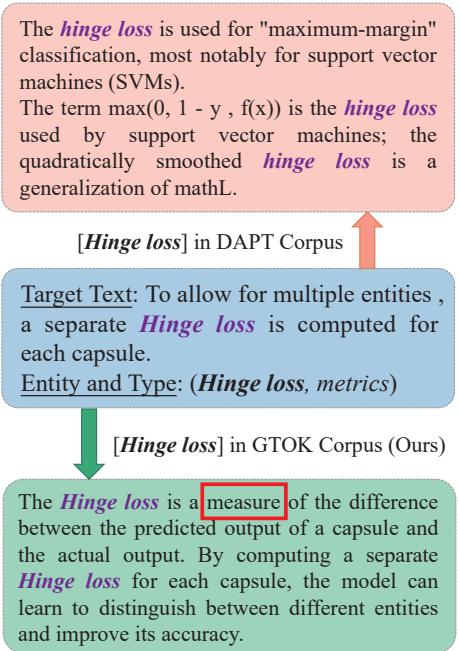  
Figure 1: DAPT Corpus based on retrieval denotes the manual collected knowledge related to target domain entity from web (Liu et al., 2021). While, our GTOK Corpus based on generation is automatically generated from a fundamental large language model (LLM), which is strongly related to the target domain entity and the recognition process.

Previous CDNER studies mainly adopt two paradigms: 1) Capturing domain differences (Jia et al., 2019; Liu et al., 2020b; Jia and Zhang, 2020), such as linking tokens to domain-specific entity types to enhance generalization (Hu et al., 2022b). 2) Relying on external knowledge (Zheng et al., 2022; Chen et al., 2023b), like manually collecting entity descriptions from a few labeled samples in the target domain and using continuous pre-training on this knowledge to facilitate entity recognition (DAPT Corpus (Liu et al., 2021)).

Despite their success, these methods have limitations: 1) Manual Collection: Collecting large-scale external knowledge is time-consuming and laborintensive. Automating this process could save considerable time. 2) Relevance: Much of the collected entity knowledge is only relevant to the entity but not closely related to the CDNER task. For example, Figure 1 shows that sentences about "Hinge Loss" in the DAPT Corpus are mere definitions, irrelevant to the NER task, which requires identifying all possible entity spans and types in the text. The automatically extracted logical reasoning processes of NER, as shown in the GTOK Corpus, could more effectively help models generalize. 3) Validation Strategies: Current works mostly use post-analysis methods like NER performance comparison implicitly to validate their approaches. Employing quantitative pre-analysis methods, such as estimating the impact of external knowledge explicitly before the NER task, would mark significant progress.

To tackle these issues, we propose a novel generative framework with NER task-oriented pretraining on generated knowledge, namely TOPT. Our framework comprises generating task-oriented knowledge, task-oriented pre-training with masked span modeling, fine-tuning the NER model, and inferring on the target domain. Inspired by the strong emergence and reasoning capabilities of large language models (LLMs, 7B level), we first use an LLM to generate a small-scale task-oriented knowledge corpus (GTOK Corpus), illustrating the entity recognition reasoning flow, as in Figure 1. Next, we employ masked span language modeling (MSLM) to pre-train the NER model on the GTOK Corpus, guiding the model to understand the entity recognition task. We then fine-tune the model with labeled samples from both source and target domains. Finally, the fine-tuned model infers entity spans and labels in the target test set. Note that information density is introduced to evaluate the model potential ability with external knowledge to perform CDNER. In summary, our contributions are:

We utilize LLMs to automatically generate task-oriented knowledge corpora, facilitating the NER model’s understanding of entity recognition logic. This is the first automated generative framework of NER task-oriented knowledge using LLMs, requiring minimal data, easy collection, and fast pre-training compared to traditional DAPT-based studies.

We introduce the theory of information density to explain our TOPT approach’s effectiveness. This is the first analysis of external knowledge rationale for CDNER using information theory.

Through experiments in single-source and multi-source domains, and extensive analysis, we demonstrate the effectiveness of our task-oriented knowledge pre-training and the introduced information density theory for CDNER.

## 2 Related Work

Cross-domain NER (CDNER). Previous CDNER works rely on auxiliary tasks (Liu et al., 2020a; Dou et al., 2023; Fang et al., 2023) or propose novel model architectures for multi-task and fewshot learning (Wang et al., 2020; Hu et al., 2022b; Hou et al., 2020). However, these methods often require extensive manual acquisition of external corpora, specific settings for entity categories, and large labeled datasets, leading to inefficient transfer ability (Kim et al., 2015; Liu et al., 2020a; Lee et al., 2018). Our approach differs by using large language models (LLMs) to auto-generate taskoriented knowledge, rather than entity-specific information, saving time and resources. We also reformulate CDNER as a text-to-text generation problem with instructive learning, enabling the model to learn entity identification and label classification more effectively.

Large Language Models (LLMs). LLMs have shown potential across various NLP tasks (OpenAI and et al., 2024). Direct fine-tuning of LLMs, even with parameter-efficient methods (Houlsby et al., 2019; Li and Liang, 2021; Hu et al., 2022a), is costly and time-consuming (Yang et al., 2024). However, LLMs can be applied to downstream tasks without fine-tuning, such as generating highquality corpora for text classification (Li et al., 2023) and expanding multilingual datasets for commonsense reasoning (Whitehouse et al., 2023). Unlike above studies, we use LLMs to generate taskoriented knowledge, focusing on logical reasoning paths for CDNER in the target domain. Moreover, we utilize these corpora to pre-train the NER model, which is then fine-tuned with labeled data from source and target domains to bridge the domain gap.

Uniform Information Density (UID). UID theory explains efficient human communication. Jaeger and Levy (2006) and Zhan and Levy (2019) discuss UID in human speech, while Collins (2014) shows UID can predict natural syntactic alternations. Meister et al. (2020) links beam search in decoding models to UID, and Meister et al. (2021) relates UID to reading time, quantifying sentence communication efficiency. Based on these works, we creatively apply UID theory to analyse generated corpus so as to explain the enhancement of our CDNER approach.

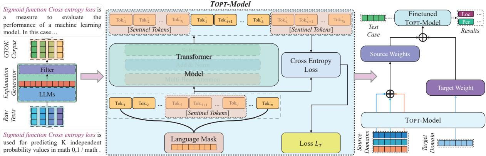  
Figure 2: The overall architecture of our proposed TOPT framework.

## 3 Methodology

In this section, we first present the detailed modules of our TOPT: task-oriented knowledge generation, masked span modeling for pre-training, text-to-text generation for CDNER. Then, we introduce how to employ the UID to explain why our approach with generative task-oriented knowledge (GTOK) outperforms SOTA with other manual large-scale corpus.

Problem Definition. Given a n-token sentence $\pmb { x } = < x _ { 1 } , \pmb { \cdot } \cdot \pmb { \cdot } , x _ { n } >$ and k-type entity set $\tau = <$ $t _ { 1 } , \cdots , t _ { k } > ,$ the object of NER task is to extract all entities $e _ { i } \in \mathcal { E }$ from x and assign one of the types in $\tau$ to each entity, where $\pmb { e } _ { i } = ( \pmb { x } _ { s t a r t : e n d } , t )$ denotes the i-th entity of x and $t \in \tau$ refers to the type of the entity. $\pmb { x } _ { s t a r t : e n d }$ refers to a continues word span $< x _ { s t a r t } , \cdot \cdot \cdot , x _ { e n d } >$ in x, where start and end refers to the entity boundary indexes respectively. Given dataset of the source domain and dataset $\tau$ of the target domain, the object of the cross-domain NER task is to acquire targetrelated knowledge from to enhance model’s performance on  . To be accordant with real-world applications, is supposed to contain a single source as well as a combined multiple sources.

## 3.1 Task-Oriented Knowledge Generation

To further amplify domain-adaptation and enhance the task relevance of the pre-training strategy, we construct a generated task-oriented knowledge corpus (GTOK Corpus) by applying large language models (LLMs) since LLMs are trained on manifold corpora that are supposed to involve domains of NER tasks. Moreover, directly fine-tuning LLMs seems consuming too much time and too many resources, which is not a good idea for downstream tasks.

Specifically, an intuitive instruction as below is constructed to guide the LLM model to explain why the given text span should be recognized as an entity to generate task-oriented corpus. For sentence x of domain d and entities $e _ { i } \in E$ of ${ \mathbf { } } x ,$ the LLM model is instructed:

INSTRUCTION: Take the text <x> and give an explanation of why the text span $< x _ { \mathit { s t a r t } : e n d } >$ can be labeled as <t> in the domain <d>.

Given this instruction X, the generated sequence regarding entity $< x _ { s t a r t : e n d } >$ with label $< t >$ in domain $< d >$ is predicted by the following conditional probability:

$$
p ( Y | X ) = \prod _ { t = 1 } ^ { n } p ( y _ { i } | X , y _ { 0 } , y _ { 1 } , \dots , y _ { i - 1 } )\tag{1}
$$

where $y _ { i } \in \mathbf { A } = \left\{ a _ { 0 } , a _ { 1 } , \cdot \cdot \cdot , a _ { N - 1 } \right\}$ , which is a finite alphabet.

Consequently, we can obtain several sentences of an entity extraction flow by reasoning in the raw textual context $< \textbf { \em x } > .$ , such as the bottom part in Figure 1. Then, with respect to all entities in raw textual context $< x > ,$ we employ the frozen LLM to get an entity explanation cluster of each $< x >$ . Formally,

$$
\mathbf { Y } = \mathcal { M } _ { F r o z e n } ( X _ { e _ { i } } ) , e _ { i } \in E\tag{2}
$$

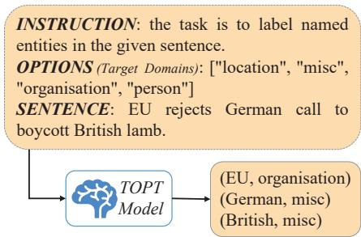  
Figure 3: The simple structure of text-to-text generation with instructor in one target domain.

where $X _ { e _ { i } }$ denotes the instruction X with the corresponding slots of entity $e _ { i }$ . Following (Liu et al., 2021), we build the GTOK corpus from the labeled raw texts in target domain.

## 3.2 Masked Span Language Modeling Pre-training

Masked language modeling(MLM) is a common approach for training models in a self-supervised setting. Meanwhile, inspired by the better learning ability of span masking (Liu et al., 2021), we use span-level MLM (Masked Span Language Modeling, MSLM) to amplify domain adaptation based above obtained GTOK corpus . As shown in Figure 2, for a given sentence $\pmb { x } = < x _ { 1 } , \pmb { \cdot } \cdot \pmb { \cdot } , x _ { n } >$ stochastic text span $< x _ { i } , x _ { i + 1 } , \cdot \cdot \cdot , x _ { j } >$ is masked by so called sentinel token to distinct from ordinary stochastic token masks [mask]. We abide by the mask setting of BERT(Devlin et al., 2019) and apply Bernoulli distribution to create matrix M of masked vector L:

$$
M = < L _ { 1 } , \cdot \cdot \cdot , L _ { \lambda } >\tag{3}
$$

where ${ \cal L } = < m _ { 0 } , \cdots , m _ { n } > .$ λ denotes the number of masked vectors from each layer and $m _ { i } = 0$ or $m _ { i } = 1$ denotes token $x _ { i }$ is not or is masked respectively. Given the masking probability $p ,$ each masked vector $\scriptstyle L _ { x }$ assumes: $L _ { x } \sim B ( p )$ , where the probability mass function of L is:

$$
P ( L = m | p ) = p ^ { m } ( 1 - p ) ^ { 1 - m } \mathbb { 1 } _ { m \in ( 0 , 1 ) } ( m )\tag{4}
$$

where $\mathbb { 1 } ( m )$ is the indicator function.

Cross-entropy loss is optimized to train the model:

$$
L _ { T } = - \frac { 1 } { \gamma } \sum _ { i = 1 } ^ { \gamma } \log w _ { i } y _ { i }\tag{5}
$$

where w<sub>i</sub> $\in \textbf { \em w } = < \mathbf { \em w } _ { 1 } , \cdot \cdot \cdot \mathbf { \ j } , w _ { \gamma } \ >$ denotes the word-embedding of masked x as well as $y _ { i } \in$ $y = < y _ { 1 } , \cdot \cdot \cdot , y _ { \gamma } >$ denotes the output of the model, and $\gamma$ denotes the max input sequence length of the model. All input sequences are replenished with token [pad] and sentinel tokens are represented by special tokens in vocabulary.

## 3.3 Text-to-text Generation for CDNER

To reduce the variance between different domains, we reformulate the NER task as a text-to-text generation problem with the instructor of a target domain. Specifically, the inputs are divided into 3 parts:

INSTRUCTION: asks the model to work as an annotator to label the entities.

OPTIONS: contains all domain specific entity in τ .

• <sup>SENTENCE:</sup> <sup>the</sup> <sup>input</sup> <sup>sentence</sup> <sup>x.</sup>

To be specific, the model takes the reformulated input $( I , o , x )$ and generates the output y that contains the entities:

$$
\pmb { y } = \mathrm { L M } _ { \pmb { \theta } } ( I , \pmb { o } , \pmb { x } )\tag{6}
$$

where θ denotes the trained parameters of the model LM. The output sequence y is converted into a natural language which is consistent with the input x and reformulated to the template as $( x _ { s t a r t : e n d } , t )$ . Figure 3 gives an example of the general workflow.

The model is supposed to be more effective in generating a sequence of entities with options containing domain-specific entities. Hence there is no need to modify the structure of the model for transferring to a new domain. Despite transferring from only a single domain, a naive idea to enhance the model’s performance is transferring from multiple domains. Given domains $\mathcal { D } = <$ $d _ { 1 } , \cdots , d _ { \eta } \ >$ and their corresponding parameters $\Theta = < \theta _ { 1 } , \cdot \cdot \cdot , \theta _ { \eta } >$ , the combined multiple source parameter is:

$$
\theta _ { \mathcal { D } } = \frac { 1 } { \eta } \sum _ { i = 1 } ^ { \eta } \theta _ { i }\tag{7}
$$

where $\eta$ denotes the number of the source domains. Algorithm 1 in Appendix shows the detailed procedure of domain transferring.

## 3.4 Uniform Information Density Hypothesis

To explain the difference between DAPT and GTOK corpus as well as why GTOK corpus do better, we introduce the uniform information density (UID) (Jaeger and Levy, 2006; Meister et al., 2021) hypothesis:

Hypothesis 3.1 UID predicts that communicative efficiency is maximized when information—again quantified as per-unit surprisal—is distributed as uniformly as possible throughout a signal.

In other words, UID-based features enable observable distinctions in the surprisal patterns of texts, which helps in understanding why GTOK Corpus facilitates the model performing better than DAPT Corpus (Venkatraman et al., 2023). Following this claim, we further assume:

Hypothesis 3.2 Communication efficiency can be correlated with the learning efficiency of the language model, which means the model could learn better on unlabeled corpora with more uniformly distributed information(quantified by UID).

To this end, we first theoretically present the rationality. In Shannon’s information theory, language can be regarded as a communication system and each linguistic unit of the language carries some information. The amount of information can be quantified with surprisal (degree of surprise) (Tribus, 1961). Suppose a linguistic signal: ${ \textbf { \em u } } = \langle u _ { 1 } , \cdots , u _ { n } \rangle$ , where $u _ { i }$ is the ith linguistic unit, the surprisal $s ( \cdot )$ is defined as: $\pmb { s } ( u _ { i } ) = - l o g P ( u _ { i } | u _ { < i } )$ . That is, the smaller the probability of occurrence of a linguistic unit, the more information it contains. We can assume that the cognitive load of the entire linguistic signal u derives from the sum of each linguistic unit in it: $\begin{array} { r } { { \pmb s } ( { \pmb u } ) = \sum { \pmb s } ( u _ { i } ) } \end{array}$

To simplify the calculations, we leverage Bi-Gram language model for approximate UID:

$$
\begin{array} { l } { { \displaystyle U I D ( { \pmb u } ) \ { \overset { d e f } { \approx } } \sum _ { n } { \pmb s } _ { | B i } ( { \pmb u } ) } } \\ { { \displaystyle \qquad = - \sum _ { i = 1 } ^ { n } l o g P ( u _ { i } | u _ { i - 1 } ) } } \end{array}
$$

In addition to UID hypothesis, Shannon information entropy is also a common method to quantify the information of texts. To follow the UID settings of using the Bi-Gram Model, we use joint information entropy as an alternative:

$$
H ( U , V ) = - \sum _ { v \in V } \sum _ { u \in U } P ( u , v ) l o g P ( u | v )
$$

and this expression can be simplified as:

$$
\begin{array} { l } { { \displaystyle { \cal H } ( u ) = \sum _ { i = 1 } ^ { n } { \cal H } ( u _ { i - 1 } , u _ { i } ) } \ ~ } \\ { { \displaystyle ~ = - \sum _ { i = 1 } ^ { n } P ( u _ { i - 1 } , u _ { i } ) l o g P ( u _ { i } | u _ { i - 1 } ) } } \end{array}
$$

<table><tr><td></td><td>AI</td><td>Lit.</td><td>Mus.</td><td>Pol.</td><td>Sci.</td></tr><tr><td>DAPT</td><td>3.1 M</td><td>114.8M</td><td>147.6 M</td><td>99.2 M</td><td>44.0 M</td></tr><tr><td>GTOK</td><td>66.9 K</td><td>48.3 K</td><td>57.1 K</td><td>72.1 K</td><td>83.6 K</td></tr></table>

Table 1: The statistics of tokens for each domain in DAPT and GTOK corpus (M: million, K: kilo-).

where $P ( u _ { i - 1 } , u _ { i } )$ denotes the joint probability of $u _ { i - 1 } , u _ { i }$ appearing at the same time with $u _ { i }$ exactly after $u _ { i - 1 }$ , and $P ( u _ { i } | u _ { i - 1 } )$ denotes the conditional probability of $u _ { i }$ appearing behind $u _ { i - 1 }$

Based on the above rationale, we can conclude that if information density of one corpus for pretraining distributes more uniformly than that of another corpus, the former corpus involves more effective information for subsequent NER task (Jain et al., 2018; Clark et al., 2023). Then, we empirically present the rationality of our hypothesis through corresponding results as Section 4.4, also including the calculation of information entropy in different corpus for domain adaptation.

## 4 Experiments

## 4.1 Datasets

The experiments are conducted on two public datasets, including CrossNER (Liu et al., 2021) and CoNLL2003 (Tjong Kim Sang and De Meulder, 2003) following previous studies (Hu et al., 2022b; Chen et al., 2023b):

1) CoNLL2003 has been widely used to evaluate NER models and contains four entity categories: PERSON (PER), LOCATION (LOC), ORGANI-ZATION (ORG), and Miscellaneous (MISC). We utilize the CoNLL2003 dataset as the source domain for its extensive knowledge. 2) The Cross-NER dataset involves five separate domains of $\mathbf { A r } _ { - }$ tificial Intelligence, Literature, Music, Politics, and Natural Science, where each domain contains more variance entity categories than CoNLL2003. We abide by the original splits of train, validation, and test sets. More detailed information and statistics about these datasets can be found in Appendix C.

Note that we use the previous DAPT and our GTOK as the external pre-training corpus for CD-NER. The statistics summary can refer to Table 1.

## 4.2 Implementation Details

We first generate GTOK corpus with Llama-2 (Touvron et al., 2023) by using a train set in the target domain (Note that validation and test sets in the target domain are strictly invisible in black boxes). The LLM is asked to explain why the entity could be labeled in the given sentence, however not all entities can be covered for the limitation of the knowledge that LLM contains (generated texts with/without explanations are marked as positive/negative texts respectively). We remove all negative texts by keyword detection (e.g. "not accurate") and positive texts are cleaned by using regular expressions to exclude non-task-relevant sentences (e.g. "Thank you for ..."). Ultimately, the remaining explanations are constructed as the GTOK corpus. We measure several statistics of GTOK corpus and the results are listed in Table 3.

<table><tr><td rowspan="2">Models</td><td colspan="6">CoNLL2003</td></tr><tr><td>AI</td><td>Literature</td><td>Music</td><td>Politics</td><td>Science</td><td>Avg.</td></tr><tr><td>GPT-4 (OpenAI and et al., 2024)</td><td>49.27</td><td>54.31</td><td>65.02</td><td>45.84</td><td>52.74</td><td>53.44</td></tr><tr><td>CP-NER (Chen et al., 2023b)</td><td>67.95</td><td>72.17</td><td>79.10</td><td>74.25</td><td>75.82</td><td>73.86</td></tr><tr><td>LANER (Hu et al., 2022b)</td><td>65.79</td><td>71.11</td><td>78.78</td><td>74.06</td><td>71.83</td><td>72.31</td></tr><tr><td>LightNER (Chen et al., 2022)</td><td>35.82</td><td>65.17</td><td>72.28</td><td>72.78</td><td>66.74</td><td>62.56</td></tr><tr><td>LST (Zheng et al., 2022)</td><td>63.28</td><td>70.76</td><td>76.83</td><td>73.25</td><td>70.07</td><td>70.84</td></tr><tr><td>DAPTN (Liu et al., 2021)</td><td>63.07</td><td>65.18</td><td>74.30</td><td>72.76</td><td>68.28</td><td>69.63</td></tr><tr><td>MCCL (Jia and Zhang, 2020)</td><td>61.64</td><td>68.63</td><td>74.19</td><td>71.45</td><td>67.68</td><td>68.72</td></tr><tr><td>TOPT (Ours)</td><td>72.34</td><td>77.85</td><td>82.03</td><td>81.55</td><td>80.16</td><td>78.78</td></tr><tr><td>w/o GTOK</td><td>67.90</td><td>74.91</td><td>75.17</td><td>70.50</td><td>70.64</td><td>71.82</td></tr><tr><td>w/ DAPT</td><td>70.89</td><td>75.13</td><td>80.94</td><td>73.48</td><td>71.42</td><td>74.37</td></tr></table>

Table 2: Performance comparison of existing studies and our approaches on single source domain.

<table><tr><td></td><td>AI</td><td>Lit.</td><td>Mus.</td><td>Pol.</td><td>Sci.</td></tr><tr><td>Avg. Sen.</td><td>4.46</td><td>3.56</td><td>4.34</td><td>6.02</td><td>6.11</td></tr><tr><td>Fail Rate</td><td>0.16</td><td>0.34</td><td>0.33</td><td>0.54</td><td>0.43</td></tr></table>

Table 3: The statistics of generated GTOK corpus. Avg. Sen. denotes the average explanation sentences of a raw text. Fail Rate denotes the rate of LLM failing to explain an entity.

The GTOK corpus produced as described above is leveraged to further pre-train the model Flan-T5- base (Chung et al., 2024) by MSLM pre-training. The unlabeled corpus is masked by sentinel tokens and fed into the model, where each sentence (contains n tokens) will be duplicated to make a 10 n matrix and the matrix is masked by the mask matrix M defined in Section 3.2. After several epochs of training, we will end up with the TOPT-model.

## 4.3 Baselines

Due to better performance with DAPT as previous studies, we also report all baselines with DAPT Corpus except closed source methods: 1) GPT-4 (OpenAI and et al., 2024) exhibits the SOTA in LLMs, which results are obtained by directly instructing it (1800B parameters) with the same prompt in Figure3. 2) CP-NER (Chen et al., 2023b) introduces collaborative domain-prefix tuning based T5 as well, which is the SOTA model. 3) LANER (Hu et al., 2022b) proposes a novel autoregressive framework by label-aware(relevance of label and token). 4) LightNER (Chen et al., 2022) proposes a tuning structure for low-resource NER by pluggable prompting. 5) LST (Zheng et al., 2022) reformulates the NER task as the graphmatching problem that the label relevance is represented as graphs. 6) DAPTN (Liu et al., 2021) leverages retrieval-based unlabeled corpus to adapt the model to the target domain, which is the first time to emphasize the importance of focusing on building a knowledge base only in the target domain. 7) MCCL (Jia and Zhang, 2020) proposes a multi-cell compositional LSTM structure and each entity type is modeled by a separate cell state.

<table><tr><td rowspan="2">Models</td><td colspan="6">Multi-Source</td></tr><tr><td>AI</td><td>Lit.</td><td>Mus.</td><td>Pol.</td><td>Sci.</td><td>Avg.</td></tr><tr><td>CP-NER LANER</td><td>65.04 64.21</td><td>69.80 68.87</td><td>77.56 72.22</td><td>76.04 72.81</td><td>75.28 70.53</td><td>72.74 69.73</td></tr><tr><td>LightNER</td><td>48.33</td><td>49.41</td><td>52.34</td><td>44.67</td><td>52.33</td><td>49.42</td></tr><tr><td>TOPT (Ours) w/o GTOK w/ DAPT</td><td>73.50 71.31</td><td>79.86 75.96</td><td>83.63 76.54</td><td>85.87 79.84</td><td>81.09 73.72</td><td>80.79 75.47</td></tr></table>

Table 4: Performance comparison of existing bestperformed baselines with our TOPT on multiple source domains.

## 4.4 Main Results

We conduct various experiments to demonstrate that our approach indeed handles the abovementioned challenges and report as follows with metrics micro F1 score (higher corresponding to better: ) and UID variance (lower corresponding to better: ). Through the main experiments, we mainly answer the following questions:

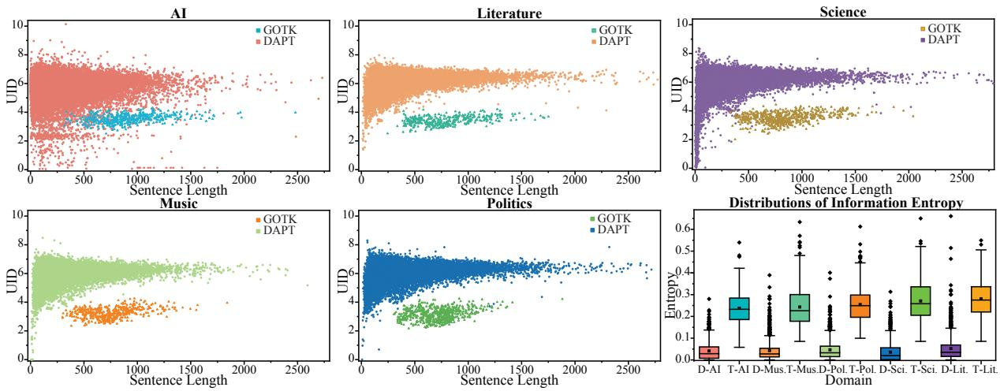  
Figure 4: The distribution of UID values and information entropy for each domain. The sentence length is calculated by token amounts and ’D-’ denotes DAPT corpus while ’T-’ denotes GTOK corpus in the last plot.

(1) Is it necessary to design our TOPT? Table 2 and 4 display the performance comparison of existing recent and representative studies for CDNER with single source and multi-source, respectively. From these tables, we can observe that 1) As the SOTA in LLMs’ family with 1800B parameters, GPT-4 performs very well in many generation and reasoning tasks, however, it exhibits the worst performance in NER. This may be because the training objective of GPT-4 focus on generative tasks, which predict the next word based on context, rather than optimizing specifically for NER tasks even though it utilized various very largescale corpora for training. 2) Among all baselines, CP-NER is obviously superior to previous other approaches. This is mainly because it employs a prefix-based pre-training method between source and target domains, as well as the simple setting to only detect the start position of an entity span. 3) It is worth noting an interesting phenomenon that previous studies have only improved by 1%-2% each time in terms of average results in the singlesource scenario, which is very limited. However, our TOPT directly improves by about 5% regarding single-source and 8% regarding multi-source, compared to the SOTA CP-NER. The reason may be two-folds. Firstly, we have discovered external knowledge related to the task by LLMs rather than entity-related only. Secondly, the NER task has been transformed into a text-to-text generation problem based on our pre-trained TOPT model, which is consistent with the previous pre-training objective.

(2) Does the GTOK corpus work? We conduct an ablation study to evaluate the model pretrained by DAPT (w/ DAPT) or without GTOK (w/o GTOK) corpus. From Table 2 and 4, we can find that the model pre-trained by GTOK corpus performs better than those not pre-trained on GTOK or pre-trained by DAPT corpus. The result highlights the significant role of our GTOK corpus in TOPT framework. Besides, according to the statistics of GTOK and DAPT in Table 1, with quantifying corpus scale by word token amounts, DAPT corpus contains almost a thousand times tokens than GTOK corpus (81740K to 65.6K per domain on average respectively), which represents pre-training with DAPT corpus will consume much more time and hardware devices. Conversely, our GTOK corpus is more efficient and economical for pre-training.

(3) How does UID explain the reason that our TOPT outperforms all baselines? We obtain the UID results of DAPT and GTOK corpus by the method described in Section 3.4. Figure 4 shows the UID distributions of each domain, where the y axis denotes the UID value of a sentence and the x axis denotes the length of a sentence. As demonstrated in this figure and the variance of UID values in Table 5, our GTOK corpus has a more uniformly distributed UID than the DAPT corpus, that is the y-values of these points are relatively close. Hence, the GTOK corpus carries more information and can train the text-to-text model better, which is consistent with our Hypothesis 3.2. Note that although the corpus we generate contains rich information, it needs to be combined with our designed pre-training and generative fine-tuning. They have the same generative objectives. Therefore, directly using previous methods with BERT pre-training and sequence labelling cannot fully leverage the advantages of the above corpus, which is indeed the case in our preliminary experiments listed in Appendix E.

<table><tr><td></td><td>|AI</td><td>Lit.</td><td>Mus.</td><td>Pol.</td><td>Sci.</td></tr><tr><td>DAPT</td><td>0.75</td><td>0.31</td><td>0.33</td><td>0.33</td><td>0.89</td></tr><tr><td>GTOK</td><td>0.09</td><td>0.09</td><td>0.13</td><td>0.17</td><td>0.13</td></tr></table>

Table 5: The variance of UID values (a lower value represents a richer amount information: ) for each domain in DAPT and GTOK corpus.
<table><tr><td rowspan="2"></td><td colspan="2">AI</td><td colspan="2">Mus.</td></tr><tr><td>F1-Score↑</td><td>UID Var.↓</td><td>F1-Score↑</td><td>UID Var.↓</td></tr><tr><td>Llama-2-7b</td><td>70.89</td><td>0.088</td><td>82.03</td><td>0.134</td></tr><tr><td>Vicuna-7b</td><td>70.83</td><td>0.092</td><td>81.67</td><td>0.138</td></tr></table>

Table 6: Performance of our model pre-trained by GTOK corpora which are generated by various LLMs.

## 4.5 Analysis and Discussion

To better verify the effectiveness of our TOPT framework, we conduct further analyses on transferring single source CoNLL2023 to the AI and Music domains, respectively. This is not lacking in generality since two single-source transfers also demonstrate the same rationale as other alternatives.

Effect of GTOK Generated from Different LLMs. We evaluate the impact of different LLMs applied to generate GTOK corpus. We adopt Vicuna-7b (Chiang et al., 2023) as another GTOK corpus generator to construct v-GTOK and continue model pre-training as well as fine-tuning under the same setting of Llama. As shown in Table 6, the models pre-trained on GTOK and v-GTOK have similar performance on domain AI and Music. This indicates that our framework is not sensitive to different LLMs for CDNER.

Effect of GTOK with Mixed Source Domain Data. To further verify the importance of GTOK in the target domain rather than the source, we generate task-oriented knowledge on training sets from both the source domain and the target domain. As displayed in Table 7, Unmixed represents GTOK only from the target, and 50 denotes GTOK also from 50 samples of the source besides all target samples. The meanings of 100 and 200 are similar. From this table, we can see that the use of task-oriented knowledge from the source domain reduces performance. This is mainly because it increases the importance of the source domain and thus causes the domain adaptation to lose balance.

<table><tr><td rowspan="2"></td><td colspan="2">AI</td><td colspan="2">Mus.</td></tr><tr><td>F1-Score↑</td><td>UID Var.↓</td><td>F1-Score↑</td><td>UID Var.↓</td></tr><tr><td>Unmixed</td><td>72.34</td><td>0.09</td><td>82.03</td><td>0.13</td></tr><tr><td>50</td><td>71.14</td><td>0.11</td><td>79.78</td><td>0.15</td></tr><tr><td>100</td><td>70.98</td><td>0.13</td><td>78.75</td><td>0.16</td></tr><tr><td>200</td><td>69.70</td><td>0.15</td><td>77.11</td><td>0.18</td></tr></table>

Table 7: Test results and variance of UID values for mixed corpus. The raw GTOK corpus is mixed with 50/100/200 explanations from other domains for AI and Music, respectively.

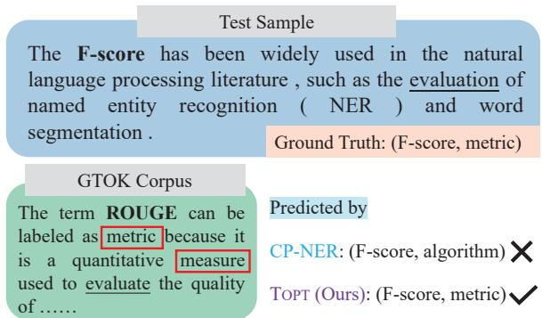  
Figure 5: The prediction result of a testing case in AI domain.

Case Study. From Figure 5, we can find that there is the reasoning path for the recognition of entity "ROUGE" in our GTOK Corpus, which provides a similar context with the testing sample and presents obvious entity extraction clues ("metric, measure, and evaluate") for CDNER. Therefore, our TOPT can predict the exact entity and its type. While, CP-NER only resorts to its unified prefix and task-irrelevant external knowledge, thus identifying the wrong entity label as "algorithm". More cases are given in the Appendix E.

## 5 Conclusion

We propose a novel approach for cross-domain NER tasks, namely TOPT. We first apply LLMs to automatically generate a task-oriented knowledge corpus and pre-train the model on the generated corpus to enhance domain-adaptation and NER task sensitivity, thus, improving the model’s performance on cross-domain NER. Employing these comprehensive experiments, our approach achieves a better performance than previous SOTA crossdomain NER approaches. Besides, we reformulate the NER task as "text-to-text" generation, which avoids unique settings for separated domains and makes real-world applications easier. Moreover, we introduce uniform information density theory to analyze the effectiveness of our approach and explain why the generated corpus is better.

In the future, we will attempt to mine more taskoriented knowledge for CDNER, and investigate more domain to verify our approach. Moreover, we plan to apply our task-oriented pre-training strategies into other areas to motivate their further development in NLP.

## 6 Acknowledgements

This work was supported by the National Natural Science Foundation of China grant (NSFC No. 62206193 and No.62076176), and the General Research Fund (GRF) project sponsored by the Research Grants Council Hong Kong (Project No.15611021).

## Limitations

Although our approach has achieved impressive results on cross-domain NER, there is still a limitation. The GTOK corpus is the most significant part of TOPT, while the GTOK corpus is strongly correlated to the LLMs’ knowledge and generative ability. The LLMs are not omnipotent in all domains (especially specialized domains, e.g. Bio-Medical NER), which means the LLMs might fail to generate a corpus for some domains due to a lack of knowledge. Thus, when applying our approach in specialized domains, the LLM may need to be replaced by LLMs fine-tuned for specific domains.

## References

M. Aylett and A. Turk. 2004. The smooth signal redundancy hypothesis: a functional explanation for relationships between redundancy, prosodic prominence, and duration in spontaneous speech. Lang Speech, 47(Pt 1):31–56.

Qiang Chen, Dong Zhang, Shoushan Li, and Guodong Zhou. 2023a. A unified MRC framework with multiquery for multi-modal relation triplets extraction. In Proceedings of IEEE ICME 2023, pages 552–557. IEEE.

Shuhao Chen, Yulong Zhang, Weisen Jiang, Jiangang Lu, and Yu Zhang. 2024a. Vllavo: Mitigating visual gap through llms.

Xiang Chen, Lei Li, Shumin Deng, Chuanqi Tan, Changliang Xu, Fei Huang, Luo Si, Huajun Chen, and Ningyu Zhang. 2022. LightNER: A lightweight tuning paradigm for low-resource NER via pluggable prompting. In Proceedings of the 29th International Conference on Computational Linguistics, pages 2374–2387, Gyeongju, Republic of Korea. International Committee on Computational Linguistics.

Xiang Chen, Lei Li, Shuofei Qiao, Ningyu Zhang, Chuanqi Tan, Yong Jiang, Fei Huang, and Huajun Chen. 2023b. One model for all domains: Collaborative domain-prefix tuning for cross-domain ner. In Proceedings of the Thirty-Second International Joint Conference on Artificial Intelligence, IJCAI-23, pages 5030–5038. International Joint Conferences on Artificial Intelligence Organization. Main Track.

Xiang Chen, Lei Li, Yuqi Zhu, Shumin Deng, Chuanqi Tan, Fei Huang, Luo Si, Ningyu Zhang, and Huajun Chen. 2024b. Sequence labeling as nonautoregressive dual-query set generation. IEEE ACM Trans. Audio Speech Lang. Process., 32:1546–1558.

Wei-Lin Chiang, Zhuohan Li, Zi Lin, Ying Sheng, Zhanghao Wu, Hao Zhang, Lianmin Zheng, Siyuan Zhuang, Yonghao Zhuang, Joseph E. Gonzalez, Ion Stoica, and Eric P. Xing. 2023. Vicuna: An opensource chatbot impressing gpt-4 with 90%\* chatgpt quality.

Hyung Won Chung, Le Hou, Shayne Longpre, Barret Zoph, Yi Tay, William Fedus, Yunxuan Li, Xuezhi Wang, Mostafa Dehghani, Siddhartha Brahma, Albert Webson, Shixiang Shane Gu, Zhuyun Dai, Mirac Suzgun, Xinyun Chen, Aakanksha Chowdhery, Alex Castro-Ros, Marie Pellat, Kevin Robinson, Dasha Valter, Sharan Narang, Gaurav Mishra, Adams Yu, Vincent Zhao, Yanping Huang, Andrew Dai, Hongkun Yu, Slav Petrov, Ed H. Chi, Jeff Dean, Jacob Devlin, Adam Roberts, Denny Zhou, Quoc V. Le, and Jason Wei. 2024. Scaling instruction-finetuned language models. Journal of Machine Learning Research, 25(70):1–53.

Thomas Hikaru Clark, Clara Meister, Tiago Pimentel, Michael Hahn, Ryan Cotterell, Richard Futrell, and Roger Levy. 2023. A Cross-Linguistic Pressure for Uniform Information Density in Word Order. Transactions ofthe Associationfor Computational Linguistics, 11:1048–1065.

Michael Xavier Collins. 2014. Information density and dependency length as complementary cognitive models. Journal ofPsycholinguistic Research, 43(5):651– 681.

Tim Dettmers, Artidoro Pagnoni, Ari Holtzman, and Luke Zettlemoyer. 2023. Qlora: Efficient finetuning of quantized llms. In Advances in Neural Information Processing Systems, volume 36, pages 10088–10115. Curran Associates, Inc.

Jacob Devlin, Ming-Wei Chang, Kenton Lee, and Kristina Toutanova. 2019. BERT: Pre-training of

deep bidirectional transformers for language understanding. In Proceedings ofthe 2019 Conference of the North American Chapter ofthe Associationfor Computational Linguistics: Human Language Technologies, Volume 1 (Long and Short Papers), pages 4171–4186, Minneapolis, Minnesota. Association for Computational Linguistics.

Chenxiao Dou, Xianghui Sun, Yaoshu Wang, Yunjie Ji, Baochang Ma, and Xiangang Li. 2023. Domainadapted dependency parsing for cross-domain named entity recognition. In Proceedings of the Thirty-Seventh AAAI Conference on Artificial Intelligence and Thirty-Fifth Conference on Innovative Applications ofArtificial Intelligence and Thirteenth Symposium on Educational Advances in Artificial Intelligence, AAAI’23/IAAI’23/EAAI’23. AAAI Press.

Jinyuan Fang, Xiaobin Wang, Zaiqiao Meng, Pengjun Xie, Fei Huang, and Yong Jiang. 2023. MANNER: A variational memory-augmented model for cross domain few-shot named entity recognition. In Proceedings of the 61st Annual Meeting of the Association for Computational Linguistics (Volume 1: Long Papers), pages 4261–4276, Toronto, Canada. Association for Computational Linguistics.

Dmitriy Genzel and Eugene Charniak. 2002. Entropy rate constancy in text. In Proceedings ofthe 40th Annual Meeting of the Association for Computational Linguistics, pages 199–206, Philadelphia, Pennsylvania, USA. Association for Computational Linguistics.

Yutai Hou, Wanxiang Che, Yongkui Lai, Zhihan Zhou, Yijia Liu, Han Liu, and Ting Liu. 2020. Few-shot slot tagging with collapsed dependency transfer and label-enhanced task-adaptive projection network. In Proceedings of the 58th Annual Meeting of the Associationfor Computational Linguistics, pages 1381– 1393, Online. Association for Computational Linguistics.

Neil Houlsby, Andrei Giurgiu, Stanislaw Jastrzebski, Bruna Morrone, Quentin De Laroussilhe, Andrea Gesmundo, Mona Attariyan, and Sylvain Gelly. 2019. Parameter-efficient transfer learning for NLP. In Proceedings of the 36th International Conference on Machine Learning, volume 97 of Proceedings of Machine Learning Research, pages 2790–2799. PMLR.

Edward J Hu, yelong shen, Phillip Wallis, Zeyuan Allen-Zhu, Yuanzhi Li, Shean Wang, Lu Wang, and Weizhu Chen. 2022a. LoRA: Low-rank adaptation of large language models. In International Conference on Learning Representations.

Jinpeng Hu, He Zhao, Dan Guo, Xiang Wan, and Tsung-Hui Chang. 2022b. A label-aware autoregressive framework for cross-domain NER. In Findings ofthe Association for Computational Linguistics: NAACL 2022, pages 2222–2232, Seattle, United States. Association for Computational Linguistics.

T. Jaeger and Roger Levy. 2006. Speakers optimize information density through syntactic reduction. In

Advances in Neural Information Processing Systems, volume 19. MIT Press.

Ayush Jain, Vishal Singh, Sidharth Ranjan, Rajakrishnan Rajkumar, and Sumeet Agarwal. 2018. Uniform Information Density effects on syntactic choice in Hindi. In Proceedings ofthe Workshop on Linguistic Complexity and Natural Language Processing, pages 38–48, Santa Fe, New-Mexico. Association for Computational Linguistics.

Chen Jia, Liang Xiao, and Yue Zhang. 2019. Crossdomain NER using cross-domain language modeling. In Proceedings ofthe 57th Conference ofthe Associationfor Computational Linguistics, ACL 2019, Florence, Italy, July 28- August 2, 2019, Volume 1: Long Papers, pages 2464–2474. Association for Computational Linguistics.

Chen Jia and Yue Zhang. 2020. Multi-cell compositional LSTM for NER domain adaptation. In Proceedings of the 58th Annual Meeting of the Associationfor Computational Linguistics, pages 5906– 5917, Online. Association for Computational Linguistics.

Zhuoran Jin, Pengfei Cao, Zhitao He, Yubo Chen, Kang Liu, and Jun Zhao. 2023. Alignment precedes fusion: Open-vocabulary named entity recognition as context-type semantic matching. In Findings ofthe Associationfor Computational Linguistics: EMNLP 2023, Singapore, December 6-10, 2023, pages 14616– 14637. Association for Computational Linguistics.

Xincheng Ju, Dong Zhang, Rong Xiao, Junhui Li, Shoushan Li, Min Zhang, and Guodong Zhou. 2021. Joint multi-modal aspect-sentiment analysis with auxiliary cross-modal relation detection. In Proceedings ofEMNLP 2021, pages 4395–4405. Association for Computational Linguistics.

Young-Bum Kim, Karl Stratos, Ruhi Sarikaya, and Minwoo Jeong. 2015. New transfer learning techniques for disparate label sets. In Proceedings of the 53rd Annual Meeting of the Association for Computational Linguistics and the 7th International Joint Conference on Natural Language Processing (Volume 1: Long Papers), pages 473–482, Beijing, China. Association for Computational Linguistics.

Ji Young Lee, Franck Dernoncourt, and Peter Szolovits. 2018. Transfer learning for named-entity recognition with neural networks. In Proceedings of the Eleventh International Conference on Language Resources and Evaluation (LREC 2018), Miyazaki, Japan. European Language Resources Association (ELRA).

Xiang Lisa Li and Percy Liang. 2021. Prefix-tuning: Optimizing continuous prompts for generation. In Proceedings ofthe 59th Annual Meeting ofthe Associationfor Computational Linguistics and the 11th International Joint Conference on Natural Language Processing (Volume 1: Long Papers), pages 4582– 4597, Online. Association for Computational Linguistics.

Zhuoyan Li, Hangxiao Zhu, Zhuoran Lu, and Ming Yin. 2023. Synthetic data generation with large language models for text classification: Potential and limitations. In Proceedings ofthe 2023 Conference on Empirical Methods in Natural Language Processing, pages 10443–10461, Singapore. Association for Computational Linguistics.

Zihan Liu, Genta Indra Winata, and Pascale Fung. 2020a. Zero-resource cross-domain named entity recognition. In Proceedings ofthe 5th Workshop on Representation Learning for NLP, pages 1–6, Online. Association for Computational Linguistics.

Zihan Liu, Genta Indra Winata, Peng Xu, and Pascale Fung. 2020b. Coach: A coarse-to-fine approach for cross-domain slot filling. In Proceedings of the 58th Annual Meeting of the Association for Computational Linguistics, ACL 2020, Online, July 5-10, 2020, pages 19–25. Association for Computational Linguistics.

Zihan Liu, Yan Xu, Tiezheng Yu, Wenliang Dai, Ziwei Ji, Samuel Cahyawijaya, Andrea Madotto, and Pascale Fung. 2021. Crossner: Evaluating cross-domain named entity recognition. Proceedings ofthe AAAI Conference on Artificial Intelligence, 35(15):13452– 13460.

Clara Meister, Ryan Cotterell, and Tim Vieira. 2020. If beam search is the answer, what was the question? In Proceedings of the 2020 Conference on Empirical Methods in Natural Language Processing (EMNLP), pages 2173–2185, Online. Association for Computational Linguistics.

Clara Meister, Tiago Pimentel, Patrick Haller, Lena Jäger, Ryan Cotterell, and Roger Levy. 2021. Revisiting the Uniform Information Density hypothesis. In Proceedings of the 2021 Conference on Empirical Methods in Natural Language Processing, pages 963– 980, Online and Punta Cana, Dominican Republic. Association for Computational Linguistics.

OpenAI and et al. 2024. Gpt-4 technical report.

Erik F. Tjong Kim Sang and Fien De Meulder. 2003. Introduction to the CoNLL-2003 shared task: Language-independent named entity recognition. In Proceedings of the Seventh Conference on Natural Language Learning at HLT-NAACL 2003, pages 142– 147.

Hugo Touvron, Louis Martin, Kevin Stone, and et al. 2023. Llama 2: Open foundation and fine-tuned chat models.

Myron T. Tribus. 1961. Thermostatics and Thermodynamics. New York : Van Nostrand.

Saranya Venkatraman, Adaku Uchendu, and Dongwon Lee. 2023. Gpt-who: An information densitybased machine-generated text detector. CoRR, abs/2310.06202.

Jing Wang, Mayank Kulkarni, and Daniel Preotiuc-Pietro. 2020. Multi-domain named entity recognition with genre-aware and agnostic inference. In Proceedings of the 58th Annual Meeting of the Association for Computational Linguistics, pages 8476–8488, Online. Association for Computational Linguistics.

Chenxi Whitehouse, Monojit Choudhury, and Alham Aji. 2023. LLM-powered data augmentation for enhanced cross-lingual performance. In Proceedings of the 2023 Conference on Empirical Methods in Natural Language Processing, pages 671–686, Singapore. Association for Computational Linguistics.

Linting Xue, Noah Constant, Adam Roberts, Mihir Kale, Rami Al-Rfou, Aditya Siddhant, Aditya Barua, and Colin Raffel. 2021. mT5: A massively multilingual pre-trained text-to-text transformer. In Proceedings of the 2021 Conference of the North American Chapter of the Association for Computational Linguistics: Human Language Technologies, pages 483–498, Online. Association for Computational Linguistics.

Jingfeng Yang, Hongye Jin, Ruixiang Tang, Xiaotian Han, Qizhang Feng, Haoming Jiang, Shaochen Zhong, Bing Yin, and Xia Hu. 2024. Harnessing the power of llms in practice: A survey on chatgpt and beyond. ACM Trans. Knowl. Discov. Data, 18(6).

Meilin Zhan and Roger Levy. 2019. Availability-based production predicts speakers’ real-time choices of mandarin classifiers.

Junhao Zheng, Haibin Chen, and Qianli Ma. 2022. Cross-domain named entity recognition via graph matching. In Findings of the Association for Computational Linguistics: ACL 2022, pages 2670–2680, Dublin, Ireland. Association for Computational Linguistics.

## Appendix

## A The Algorithm of TOPT

The detailed procedure of domain transferring is shown in Algorithm 1.

## B The Rationale of UID

To explain the difference between DAPT and GTOK corpus as well as why GTOK corpus do better, we introduce the uniform information density (UID) (Jaeger and Levy, 2006; Meister et al., 2021) hypothesis:

Hypothesis B.1 UID predicts that communicative efficiency is maximized when information—again quantified as per-unit surprisal—is distributed as uniformly as possible throughout a signal.

In other words, UID-based features enable observable distinctions in the surprisal patterns of texts, which help in understanding why GTOK Corpus facilitates the model performing better than DAPT Corpus (Venkatraman et al., 2023). Follow this claim, we further assumes:

```latex
Algorithm 1 Transfer from to $\overline { { T } }$
Input: Domain , (contain sentence with la
bels $( { \pmb x } ^ { i } , { \pmb y } ^ { i } ) , i = 1$ to Num); Instruction $I ;$
Domain specific options $\pmb { o } = ( \pmb { o } _ { 1 } , \cdots , \pmb { o } _ { \eta } )$
Output: Trained parameters $\theta \tau$
1: Source parameters $\pmb { \theta } _ { s } = ( \pmb { \theta } _ { 1 } , \cdots , \pmb { \theta } _ { \eta } )$
2: for each domain $\pmb { d } _ { i } \in \mathcal { D } , \pmb { d } _ { T } \in \mathcal { T }$ do
3: for $( \pmb { x } ^ { j } , \pmb { y } ^ { j } ) \in d _ { i }$ do
4: Get output $O ^ { j } = L M _ { \pmb { \theta } _ { i } } ( I , \pmb { o } _ { i } , \pmb { x } ^ { j } )$
5: Predictions ${ \hat { \pmb y } } ^ { j } = a r g m a x ( { \pmb O } ^ { j } )$
6: Update corresponding parameter θ by
minimizing:
$L o s s = - \frac { 1 } { N u m } \sum _ { k = 1 } ^ { N u m } \log \hat { y } _ { k } y _ { k }$
7: end for
8: end for
9: Get final parameter $\begin{array} { r } { \pmb { \theta } _ { T } = \frac { 2 } { 3 } \pmb { \theta } _ { T } + \frac { 1 } { 3 } \sum _ { i = 1 } ^ { \eta } \pmb { \theta } _ { i } } \end{array}$
10: return $\pmb { \theta } _ { T }$
```

Hypothesis B.2 Communication efficiency can be correlated with the learning efficiency oflanguage model, which means the model could learn better on unlabeled corpora that have more uniformly distributed information(quantified by UID).

To this end, we first theoretically present the rationality. In Shannon information theory, language can be regarded as a communication system and each linguistic unit of the language carries several information. The amount of information can be quantified with surprisal (degree of surprise, (Tribus, 1961)). Suppose a linguistic signal:

$$
\pmb { u } = < u _ { 1 } , \dots , u _ { n } >
$$

where $u _ { i }$ is the i-th linguistic unit, the surprisal $s ( \cdot )$ is defined as:

$$
\pmb { s } ( u _ { i } ) = - l o g P ( u _ { i } | u _ { < i } )
$$

That is, the smaller the probability of occurrence of a linguistic unit, the more information it contains. We can plainly assume that the cognitive load of the entire linguistic signal u derives from the sum of each linguistic unit in it:

$$
s ( \pmb { u } ) = \sum s ( u _ { i } )
$$

To simplify the calculations, we leverage Bi-Gram language model for approximate UID:

$$
\begin{array} { l } { { \displaystyle U I D ( { \pmb u } ) \ { \overset { d e f } { \approx } } \sum _ { n } { \pmb s } _ { | B i } ( { \pmb u } ) } } \\ { { \displaystyle \qquad = - \sum _ { i = 1 } ^ { n } l o g P ( u _ { i } | u _ { i - 1 } ) } } \end{array}
$$

In addition to UID hypothesis, Shannon information entropy is also a common method to quantify the information of texts. The elementary definition of information entropy H is:

$$
H ( \pmb { u } ) = - \sum _ { u _ { i } \in \pmb { u } } P ( u _ { i } ) l o g P ( u _ { i } )
$$

$P ( u _ { i } )$ denotes the probability that $u _ { i }$ appears in ${ \mathbf { } } ^ { \mathbf { } } \mathbf { \Delta } ^ { \mathbf { } } \mathbf { u } ,$ whereas this definition only corresponds to Uni-Gram Model. To follow the UID settings of using Bi-Gram Model, we use joint information entropy as alternative:

$$
H ( U , V ) = - \sum _ { v \in V } \sum _ { u \in U } P ( u , v ) l o g P ( u | v )
$$

and this expression can be simplified as:

$$
\begin{array} { l } { { \displaystyle { \cal H } ( u ) = \sum _ { i = 1 } ^ { n } { \cal H } ( u _ { i - 1 } , u _ { i } ) } \ ~ } \\ { { \displaystyle ~ = - \sum _ { i = 1 } ^ { n } P ( u _ { i - 1 } , u _ { i } ) l o g P ( u _ { i } | u _ { i - 1 } ) } } \end{array}
$$

where $P ( u _ { i - 1 } , u _ { i } )$ denotes the joint probability of $u _ { i - 1 } , u _ { i }$ appearing at the same time with $u _ { i }$ exactly after $u _ { i - 1 }$ , and $P ( u _ { i } | u _ { i - 1 } )$ denotes the conditional probability of u appearing behind $u _ { i - 1 }$

Based on the above rationale, we can conclude that if information density of one corpus for pretraining distributes more uniformly than that of another corpus, the former corpus involves more effective information for subsequent NER task (Jain et al., 2018; Clark et al., 2023). Then, we empirically present the rationality of our hypothesis through corresponding results as Section 4.4, also including the calculation of information entropy in different corpus for domain adaptation.

## C Datasets

Table 8 shows the statistics of dataset CoNLL2003 and CrossNER and the detailed entity categories are listed below.

AI: algorithm, conference, country, field, location, metrics, misc, organisation, person, product, program-lang, researcher, task, university.

<table><tr><td rowspan="2">Dataset</td><td colspan="3">Tokens</td><td rowspan="2">Entity</td></tr><tr><td>Train</td><td>Valid</td><td>Test</td></tr><tr><td>CoNLL2003</td><td></td><td>203621</td><td>51362</td><td>46435</td><td>4</td></tr><tr><td rowspan="5">CrossNER</td><td>AI</td><td>3782</td><td>10919</td><td>12991</td><td>14</td></tr><tr><td>Lit.</td><td>3782</td><td>14503</td><td>16157</td><td>12</td></tr><tr><td>Mus.</td><td>3909</td><td>15591</td><td>19605</td><td>13</td></tr><tr><td>Pol.</td><td>8384</td><td>24624</td><td>27585</td><td>9</td></tr><tr><td>Sci.</td><td>7100</td><td>16139</td><td>19487</td><td>17</td></tr></table>

Table 8: Statistics of CoNLL2003 and CrossNER.

Literature: award, book, country, event, literary-genre, location, magazine, misc, organisation, person, poem, writer.

Music: album, award, band, country, event, location, misc, musical-artist, musical-instrument, music-genre, organisation, person, song.

Politics: country, election, event, location, misc, organisation, person, political-party, politician.

Science: academic-journal, astronomical-object, award, chemical-compound, chemical-element, country, discipline, enzyme, event, location, misc, organisation, person, protein, scientist, theory, university.

For previous external manual collected knowledge for CDNER, the domain-adaptive pre-training corpus (DAPT corpus) (Liu et al., 2021) is considered as the most representative and achieve SOTA. It was collected and gathered from Wikipedia while it only has weak task correlation. Specifically, as shown in Figure 1, although sentences of DAPT corpus contain domain-related entities, large amount of them practically have no correlation to the NER task.

## D Baselines and Settings

We conduct the following baselines for a thorough comparison:

GTP-4: The results of GPT-4 are obtained by directly instructing the GPT-4 model (1800B parameters) of OpenAI with the same prompt in Figure3.

CP-NER (Chen et al., 2023b): This method introduces collaborative domain-prefix tuning to better transfer knowledge in cross-domain NER tasks, based on T5 as well. It is the SOTA model.

LANER (Hu et al., 2022b): This approach proposes a novel autoregressive framework by labelaware(relevance of label and token) to better transfer label information.

LightNER (Chen et al., 2022): This method proposes a tuning structure for low-resource NER by pluggable prompting. It constructs a unified learnable verbalizer of entity categories to avoid domain-specific classifiers for cross-domain NER.

<table><tr><td></td><td>AI</td><td>Music</td></tr><tr><td>BERT</td><td>41.39</td><td>47.06</td></tr><tr><td>TOPT</td><td>72.34</td><td>82.03</td></tr></table>

Table 9: Performance comparison of sequence labelling(BERT) and text-to-text generation(TOPT)

LST (Zheng et al., 2022): This method reformulates NER task as a graph-matching problem that the label relevance is represented as graphs. It is capable of transferring knowledge to the target domain.

DAPTN (Liu et al., 2021): The DAPT method leverages unlabeled corpus to adapt the model to the target domain. The adaption can help transfer knowledge to the target domain.

MMCL (Jia and Zhang, 2020): This method proposes a multi-cell compositional LSTM structure and each entity type is modeled by a separate cell state. The transfer of cross-domain knowledge is achieved by the entity cell.

## E Supplement Details

Additional details of preliminary results, UID plots and case studies are listed below.

Preliminary Results. The preliminary results (micro F1 score) with our pre-training and tuning paradigm by BERT-based backbone and sequence labelling on two single-domain generalization are listed in Table 9. Due to the poor performance of sequence labelling on BERT, we employ text-totext generation based on T5.

UID plots. The UID results listed below are obtained by the method described in Section 3.4. Figure 6 (a) shows the UID distributions of GTOK corpus generated by Llama and Vicuna, and Figure 6 (b) shows the UID distributions of mixed corpus. Figure 7 shows the distribution of information entropy for the corpus in the above two experiments, respectively.

Case studies. Figure 8 shows the additional predicting results of testing cases in AI, Literature, and Music. In domain AI, there is a clear reasoning path for entity "Prolog" in our GTOK corpus, which provides a similar context with ("programming language"). Similarly, in domain Music, the context ("song, and singles") also provides the reasoning path for entity "Urban Guerrilla". Despite, in domain Literature, the context ("person, individual, and identified as") has similar meanings as "portrayed", which could help model well understand the sentence and correctly label the entity "Nora" as "Person".

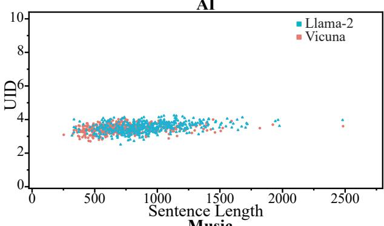

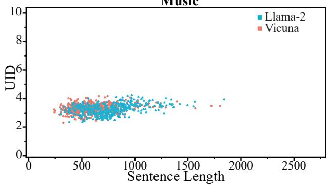  
(a)

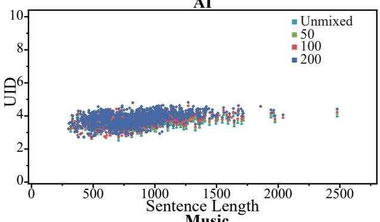

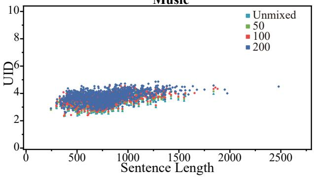  
(b)  
Figure 6: The distribution of UID values for (a) Llama-2 / Vicuna generated corpus and (b) mixed GTOK corpus in Domain AI and Music.

## F Other Results

To compare our approach with LLMs, we directly fine-tune Llama-2-7B (Touvron et al., 2023) with PEFT method (here we leverage QLoRA (Dettmers et al., 2023)) on single and multiple transfer settings. Specifically, QLoRA quantizes the LLM to 4 bits and freezes the parameters. The rank parameter r of Low-Rank Adapter layer is 64 and the scale parameter α is 16. The results are listed in Table 10. Moreover, our approach is much faster than fine-tuning LLM at both train and inference strategy. At train strategy, the average time consumption per epoch of our approach is 9.35min while Llama-2-7B is 59.82min. At inference strategy, the average time consumption per sentence of our approach is 0.71s while Llama-2-7B is 6.54s.

## G Detailed Related Work

## G.1 Cross-domain NER

Cross-domain NER is proposed to transfer knowledge from "rich" domain to "poor" domain to boost the models’ performance on target domains that only have few labeled corpora in real-world applications (Kim et al., 2015; Liu et al., 2020a; Lee et al., 2018). Previous works have introduced several approaches to handle cross-domain NER task such as adding auxiliaries (Liu et al., 2020a; Dou et al., 2023; Fang et al., 2023) or proposing novel model architecture (Wang et al., 2020; Hu et al., 2022b; Hou et al., 2020) for multi-task learning and few-shot learning. However, these methods require specific settings for entity categories as well as a vast labeled training set, which makes the transfer not that efficient. Our approach reformulates the cross-domain NER task as a text-to-text generation problem with domain-specific instruction to better learn from the source domains, hence the model could learn how to identify an entity and classify the entity.

## G.2 Large Language Models

Recently LLMs are all the rage in the NLP community and the LLMs show their potential to carry almost all NLP tasks (OpenAI and et al., 2024). Same as PLMs (Xue et al., 2021), the LLMs can be fine-tuned for downstream tasks, while even with parameter-efficient fine-tuning method(PEFT, (Houlsby et al., 2019; Li and Liang, 2021; Hu et al., 2022a)), fine-tuning a LLM for downstream tasks is still expensive and timeconsuming (Yang et al., 2024). However, we can directly apply LLMs in downstream tasks without fine-tuning them. Li et al. (2023) explores the possibility of generating high-quality corpora with LLMs instead of collecting manually in text classification tasks. Whitehouse et al. (2023) applies LLMs to expand existing multilingual commonsense reasoning datasets and the model trained on the augmented datasets achieves higher precision. Chen et al. (2024a) leverages visual-LLM to generate descriptions of plots to mitigate gaps between different domains. Inspired by the above research, we also apply LLMs to generate domainadaptation corpora to mitigate the gap between different domains for cross-domain NER tasks.

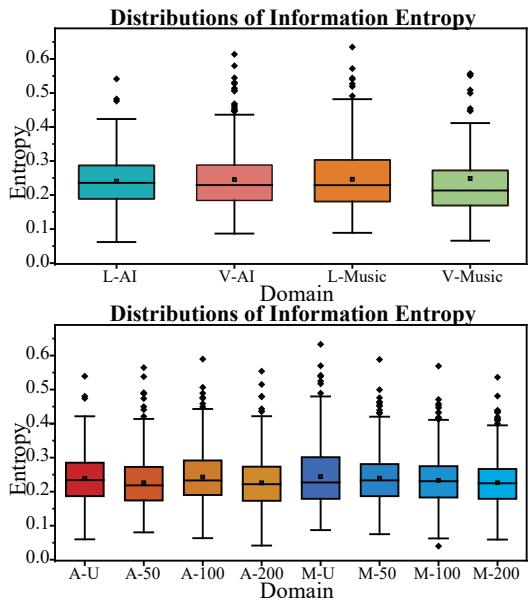  
Figure 7: The distribution of information entropy for Llama-2 and Vicuna generated corpus as well as mixed GTOK corpus in Domain AI and Music.

<table><tr><td></td><td>AI</td><td>Lit.</td><td>Mus.</td><td>Pol.</td><td>Sci.</td><td>Avg.</td></tr><tr><td colspan="7">Single-Source</td></tr><tr><td>TOPT</td><td>72.34</td><td>77.85</td><td>82.03</td><td>81.55</td><td>80.16</td><td>78.78</td></tr><tr><td>Llama-2-7B</td><td>60.24</td><td>63.43</td><td>68.26</td><td>71.40</td><td>69.78</td><td>66.62</td></tr><tr><td colspan="7">Multi-Source</td></tr><tr><td>TOPT</td><td>73.50</td><td>79.86</td><td>83.63</td><td>85.87</td><td>81.09</td><td>80.79</td></tr><tr><td>Llama-2-7B</td><td>66.46</td><td>73.97</td><td>71.99</td><td>73.68</td><td>70.51</td><td>71.32</td></tr></table>

Table 10: Performance comparison of fine-tuned Llama-2-7B and our approaches.

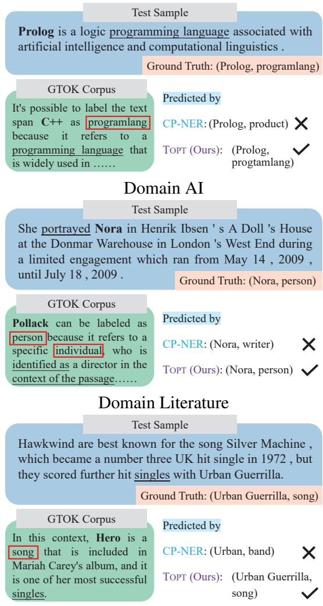  
Domain Music  
Figure 8: Additional predicting results of testing cases.

## G.3 Uniform Information Density

Information density has been applied to analyze human sentences (Genzel and Charniak, 2002; Aylett and Turk, 2004). Based on the information density, uniform information density (UID) theory is proposed to explain how humans can communicate efficiently. Jaeger and Levy (2006) and Zhan and Levy (2019) introduce the relationship between UID and how humans talk while Collins (2014) introduces the UID could predict which syntactic alternations humans sounded more natural. Meister et al. (2020) argues the beam search used in decode-models is related to the UID of model outputs. Meister et al. (2021) introduces the relationship between UID and reading time, which quantifies the communication efficiency of the sentence. Based on this research, we adopt the UID theory for corpus analysis.