# MatchTime: Towards Automatic Soccer Game Commentary Generation

Jiayuan Rao∗, Haoning Wu∗, Chang Liu, Yanfeng Wang†, Weidi Xie†

School of Artificial Intelligence, Shanghai Jiao Tong University, China {jy\_rao, whn15698781666, liuchang666, wangyanfeng622, weidi}@sjtu.edu.cn https://haoningwu3639.github.io/MatchTime/

## Abstract

Soccer is a globally popular sport with a vast audience, in this paper, we consider constructing an automatic soccer game commentary model to improve the audiences’ viewing experience. In general, we make the following contributions: First, observing the prevalent video-text misalignment in existing datasets, we manually annotate timestamps for 49 matches, establishing a more robust benchmark for soccer game commentary generation, termed as SN-Captiontest-align; Second, we propose a multi-modal temporal alignment pipeline to automatically correct and filter the existing dataset at scale, creating a higher-quality soccer game commentary dataset for training, denoted as MatchTime; Third, based on our curated dataset, we train an automatic commentary generation model, named MatchVoice. Extensive experiments and ablation studies have demonstrated the effectiveness of our alignment pipeline, and training model on the curated dataset achieves stateof-the-art performance for commentary generation, showcasing that better alignment can lead to significant performance improvements in downstream tasks.

## 1 Introduction

Soccer, as one of the most popular sports globally, has captivated over 5 billion (FIFA, 2023) viewers with its dynamic gameplay and intense moments. Commentary plays a crucial role in improving the viewing experience, providing context, analysis, and emotional excitement to the audience. However, creating engaging and insightful commentary requires significant expertise and can be resourceintensive. In recent years, advancements in artificial intelligence, particularly in foundational visuallanguage models, have opened new possibilities for automating various aspects of content creation. This paper aims to develop an high-quality, automatic soccer commentary system.

In the literature on video understanding, there has been relatively little attention on sports videos. Pioneering work such as SoccerNet (Giancola et al., 2018a) introduces the first soccer game dataset, containing videos of 500 soccer matches. Subsequently, SoccerNet-Caption (Mkhallati et al., 2023) compiles textual commentary data for 471 of these matches from the Internet, establishing the first dataset and benchmark for soccer game commentary. However, upon careful examination, we observe that the quality of existing data is often unsatisfactory. For instance, as illustrated in Figure 1 (left), since the textual commentaries are often collected from the text live broadcast website, there can be a delay with respect to the visual content, leading to prevalent misalignment between textual commentaries and video clips.

In this paper, we start by probing the effect of the above-mentioned misalignment on the soccer game commentary systems. Specifically, we manually correct the timestamps of commentaries for 49 matches in the SoccerNet-Caption test set to obtain a new benchmark, termed as SN-Caption-testalign. With manual check, we observe that these misalignments can result in temporal offsets for up to 152 seconds, with an average absolute offset of 16.63 seconds. As depicted in Figure 1 (right), after manual correction, pre-trained off-the-shelf SN-Caption model (Mkhallati et al., 2023) has exhibited large performance improvements, underscoring the effect of temporal alignment.

To address the aforementioned misalignment issue between textual commentaries and visual content, we propose a two-stage pipeline to automatically correct and filter the existing commentary training set at scale. We first adopt WhisperX (Bain et al., 2023) to extract narration texts with corresponding timestamps from the background audio, which are then summarised into event descriptions by LLaMA-3 (AI@Meta, 2024) at fixed intervals. Subsequently, we utilize LLaMA-3 to select the most appropriate time intervals based on the similarity between these timestamped event descriptions and textual commentaries. Given such an operation only provides rough alignment, we further align the video and commentary by training a multi-modal temporal alignment model on a small set of manually annotated videos.

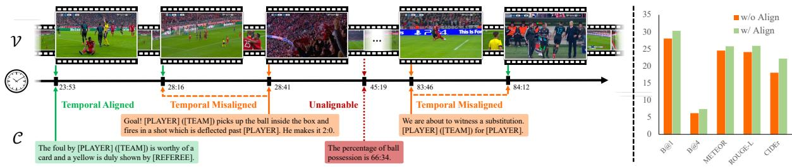

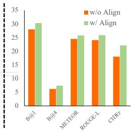  
Figure 1: Overview. (a) Left: Existing soccer game commentary datasets contain significant misalignment between visual content and textual commentaries. We aim to align them to curate a better soccer game commentary benchmark. (b) Right: While evaluating on manually aligned videos, existing models can achieve better commentary quality in a zero-shot manner. (The temporal window size is set to 10 seconds here.)

Our alignment pipeline enables to significantly mitigate the temporal offsets between the visual content and textual commentaries, resulting in an higher-quality soccer game commentary dataset, named MatchTime. With such a curated dataset, we further develop a video-language model by connecting visual encoders with language model, termed as MatchVoice, that enables to generate accurate and professional commentaries for soccer match videos. Experimentally, we have thoroughly investigated the different visual encoders, demonstrating state-of-the-art performance in both precision and contextual relevance.

To summarize, we make the following contributions: (i) we show the effect of misalignment in automatic commentary generation evaluation by manually correcting the alignment errors in 49 soccer matches, which can later be used as a new benchmark for the community, termed as SN-Captiontest-align, as will be detailed in Sec. 2; (ii) we further propose a multi-modal temporal video-text alignment pipeline that corrects and filters existing soccer game commentary datasets at scale, resulting in an high-quality training dataset for commentary generation, named MatchTime, as will be detailed in Sec. 3; (iii) we present a soccer game commentary model named MatchVoice, establishing a new state-of-the-art performance for automatic soccer game commentary generation, as will be detailed in Sec. 4.

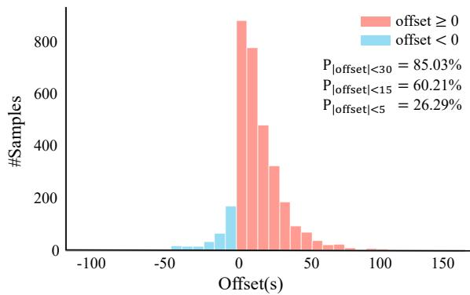  
Figure 2: Distribution of temporal offsets in our manually corrected SN-Caption-test-align. Through manual annotation, we find that the temporal discrepancy between the textual commentary and the visual content in the existing benchmark can even exceed 100 seconds.

## 2 Benchmark Curation

To probe the effect of misalignment on the performance of soccer game commentary models, we have manually annotated the timestamps of textual commentaries for 49 matches in the test set of SoccerNet-Caption, resulting in a new benchmark, denoted as SN-Caption-test-align.

Mannual Annotations. We recruit 20 football fans to manually align textual commentaries with video content for 49 matches from the test set of SoccerNet-Caption (Mkhallati et al., 2023), following several rules: (i) Volunteers should watch the entire video, and adjust the timestamps of original textual commentaries to match the moments when events occur; (ii) To ensure the continuity of actions such as shots, passes, andfouls, the manually annotated timestamps are adjusted 1 second earlier to capture the full context; (iii) For scenes with replays, the timestamp of the event’s first occurrence is marked as the corresponding commentary timestamp to maintain visual integrity and consistency.

Here, our annotated dataset serves two purposes: first, it acts as a more accurate benchmark for evaluating soccer game commentary generation; second, it can be used as supervised data for training and evaluating temporal alignment pipelines.

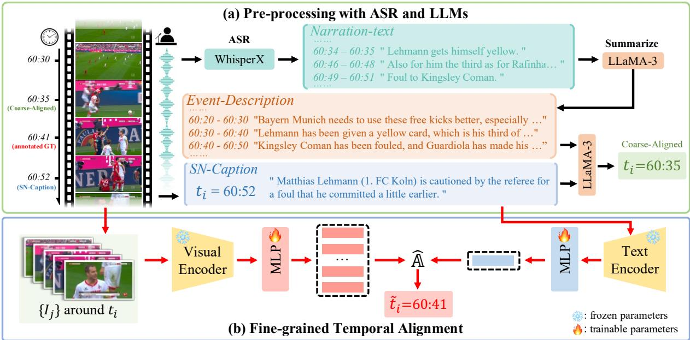  
Figure 3: Temporal Alignment Pipeline. (a) Pre-processing with ASR and LLMs: We use WhisperX to extract narration texts and corresponding timestamps from the audio, and leverage LLaMA-3 to summarize these into a series of timestamped events, for data pre-processing. (b) Fine-grained Temporal Alignment: We additionally train a multi-modal temporal alignment model on manually aligned data, which further aligns textual commentaries to their best-matching video frames at a fine-grained level.

Data Statistics. After manually annotating the test set videos, we obtain a total of 3,267 video-text pairs. As depicted in Figure 2, we show the temporal offset between the original noisy timestamps of the textual commentary and the manually annotated ground truth, which ranges from -108 to 152 seconds, with an average offset of 13.85 seconds and a mean absolute offset of 16.63 seconds. Only 26.29%, 60.21%, 74.96%, and 85.03% of the data falls within 10s, 30s, 45s, and 60s windows around the key frames, respectively. This highlights the severe misalignment in existing datasets, which will potentially confuse the model training for automatic commentary generation.

## 3 Aligning Commentary and Videos

In this section, we develop an automatic pipeline for aligning the timestamps of given textual commentaries to the corresponding video content in existing soccer game commentary datasets. In Sec. 3.1, we start with the problem formulation for temporal alignment, and subsequently, in Sec. 3.2, we elaborate on the details of our proposed multimodal temporal alignment pipeline.

## 3.1 Problem Formulation

Given a soccer match video from the SoccerNet-Caption dataset, $i . e . , \ : \mathcal { X } = \{ \mathcal { V } , \mathcal { C } \}$ , where = $\{ ( I _ { 1 } , \widehat { t } _ { 1 } ) , \ldots , ( I _ { n } , \widehat { t } _ { n } ) \}$ denotes key frames of the video and their corresponding timestamps, and ${ \mathcal { C } } =$ $\{ ( C _ { 1 } , t _ { 1 } ) , \ldots , ( C _ { k } , t _ { k } ) \}$ represents the k textual commentaries and their provided timestamps in the video, with $n \gg k$ . Here, our goal is to improve the soccer game commentary dataset by better aligning textual commentaries with key frames. Concretely, we adopt a contrastive alignment pipeline to update their timestamps: $\tilde { t } = \Phi ( \nu , \mathcal { C } ; \Theta _ { 1 } )$ , where $\Theta _ { 1 }$ denotes the trainable parameters of the alignment model Φ, and t˜represents the modified timestamps for all textual commentaries.

## 3.2 Method

As depicted in Figure 3, we propose a two-stage temporal alignment pipeline: (i) pre-processing with an off-the-shelf automatic speech recognition model (ASR) and large language model (LLMs), (ii) train an alignment model with contrastive learning. We will elaborate on the details as follows.

Pre-processing with ASR and LLMs. We propose to roughly align the textual commentary with video content by leveraging the audio narration, which may include key event descriptions. Specifically, we first adopt WhisperX (Bain et al., 2023)

for automatic speech recognition (ASR), to obtain the converted narration text with corresponding timestamp intervals from the audio. Given that live soccer commentary tends to be fragmented and colloquial, we use LLaMA-3 (AI@Meta, 2024) to summarize the ASR results into event descriptions for each 10-second video clip with the prompt described in Appendix A.2. Subsequently, we feed these event descriptions and the textual commentaries into LLaMA-3 to predict new timestamps for the textual commentaries based on sentence similarities using the prompt detailed in Appendix A.2. Note that, as some videos may not have audio commentary, or narrations that are irrelevant to the video content, such as the background information for certain players, such pre-processing only allows for a coarse-grained alignment of the commentary to video key frames.

Fine-grained Temporal Alignment. Here, we further propose to train a multi-modal temporal alignment model with contrastive learning. Concretely, we adopt pre-trained CLIP (Radford et al., 2021) to encode textual commentaries and key frames, followed by trainable MLPs, $i . e . , f ( \cdot )$ and $g ( \cdot )$

$$
\mathrm { C , V } = f ( \Phi _ { \mathrm { C L I P - T } } ( \mathcal { C } ) ) , \ g ( \Phi _ { \mathrm { C L I P - V } } ( \mathcal { V } ) )
$$

where $\mathbf { C } \in \mathbb { R } ^ { k \times d } , \mathbf { V } \in \mathbb { R } ^ { n \times d }$ denotes the resulting textual and visual embeddings, respectively.

We compute the affinity matrix between the textual commentaries and video key frames as:

$$
\hat { \mathbb { A } } [ i , j ] = \frac { \mathbf { C } _ { i } \cdot \mathbf { V } _ { j } } { \vert \vert \mathbf { C } _ { i } \vert \vert \cdot \vert \vert \mathbf { V } _ { j } \vert \vert } , ~ \hat { \mathbb { A } } \in \mathbb { R } ^ { k \times n }
$$

With the manual annotated SN-Caption-test-align as introduced in Sec. 2, we can construct the ground truth label matrix with the same form, i.e., $\mathbb { Y } \in \{ 0 , 1 \} ^ { k \times n } , \mathbb { Y } [ i , j ] = 1$ if the i-th commentary corresponds to the j-th key frame, otherwise 0.

We train the joint visual-textual embeddings for alignment with contrastive learning (Oord et al., 2018), by maximising similarity scores between the commentary and its corresponding visual frame:

$$
\mathcal { L } _ { \mathrm { a l i g n } } = - \frac { 1 } { k } \sum _ { i = 1 } ^ { k } \log \left[ \frac { \sum _ { j } ^ { n } \mathbb { Y } [ i , j ] \exp ( \hat { \mathbb { A } } [ i , j ] ) } { \sum _ { j } ^ { n } \exp ( \hat { \mathbb { A } } [ i , j ] ) } \right]
$$

Training and Inference. At training time, we use the 45 manually annotated videos with 2,975 video clip-text pairs from our curated SN-Caption-testalign, and leave the 4 videos for evaluation. Frames sampled at 1FPS with a two-minute window around the manually annotated ground truth timestamps are utilized for training. At inference time, considering that data pre-processing has provided a coarse alignment, and there might be replays in soccer match videos, we sample frames at 1FPS from 45 seconds before and 30 seconds after the current textual commentary timestamp as visual candidates for alignment. To validate the effectiveness of our alignment model, we evaluate it on 292 samples of 4 unseen annotated matches, results can be found in Sec. 5.1.

<table><tr><td>Datasets</td><td>Alignment</td><td># Soccer Matches # Commentary</td><td></td></tr><tr><td>Test</td><td>Manual</td><td>49</td><td>3,267</td></tr><tr><td>Validation</td><td>Auto</td><td>49</td><td>3,418</td></tr><tr><td>Training</td><td>Auto</td><td>373</td><td>26,058</td></tr></table>

Table 1: Data Statistics on our SN-Caption-test-align and MatchTime datasets.

With the trained model, we perform fine-grained temporal alignment for each textual commentary $\mathrm { C } _ { i }$ by updating its timestamp to $\tilde { t } _ { i }$ with $\hat { t } _ { j }$ of the visual frame $I _ { j }$ , which exhibits the highest crossmodal similarity score among all the candidates:

$$
\tilde { t } _ { i } : = \hat { t } _ { j } , \mathrm { ~ w h e r e ~ } j = \arg \operatorname* { m a x } ( \hat { \mathbb { A } } [ i , : ] )
$$

Using the alignment pipeline described above, we have aligned all the pre-processed training data from SoccerNet-Caption. As for the matches lacking audio, which cannot undergo pre-processing, we directly apply our fine-grained temporal alignment model. As a result, we have aligned 422 videos (373 as the training set and 49 as the validation set), amounting to 29,476 video-text pairs (26,058 for training and 3,418 for validation) in total. This contributes a high-quality dataset, termed as MatchTime, for training an automatic soccer game commentary system. The detailed statistics of our datasets are listed in Table 1.

## 4 Automatic Soccer Game Commentary

Based on the curated dataset, we consider training a visual-language model for automatic commentary generation on given input video segments, termed as MatchVoice. Specifically, we start by describing the problem scenario, and followed by detailing on our proposed architecture.

Problem Formulation. Given a soccer game video with multiple clips, i.e., ${ \mathcal { V } } = \{ \mathbf { V } _ { 1 } , \mathbf { V } _ { 2 } , \dots , \mathbf { V } _ { T } \}$ our goal is to develop a visual-language model that generates corresponding textual commentary for each video segment, $i . e . , \hat { \mathbf { C } } _ { i } = \Psi ( \mathbf { V } _ { i } ; \boldsymbol { \Theta } _ { 2 } )$ , where $\Theta _ { 2 }$ refers to the trainable parameters.

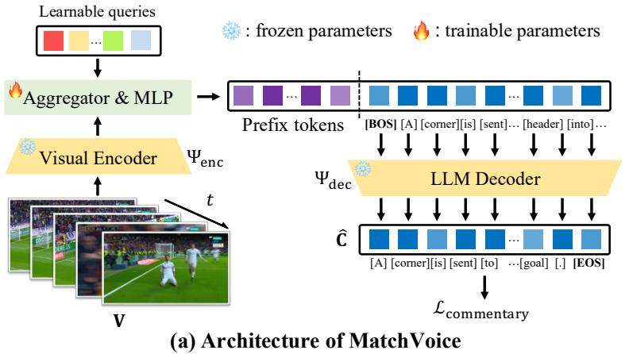

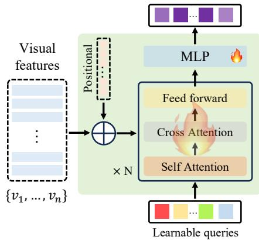  
(b) Temporal Aggregator & MLP  
Figure 4: MatchVoice Architecture Overview. Our proposed MatchVoice model leverages a pretrained visual encoder to encode video frames into visual features. A learnable temporal aggregator aggregates the temporal information among these features. The temporally aggregated features are then projected into prefix tokens of LLM via a trainable MLP projection layer, to generate the corresponding textual commentary.

Architecture. As depicted in Figure 4, our proposed model comprises of three components. Here, we focus on processing one segment, and ignore the subscripts for simplicity.

First, we adopt the frozen, pre-trained visual encoder to compute the framewise features within the video clip, i.e., $\{ v _ { 1 } , v _ { 2 } , \ldots , v _ { n } \} = \Psi _ { \mathrm { e n c } } ( \mathbf { V } )$ Note that, all visual encoders are framewise, except InternVideo, which takes 8 frames per second and aggregates them into 1 feature vector by itself.

Second, we use a Perceiver-like architecture (Jaegle et al., 2021) aggregator to aggregate the temporal information among visual features. Specifically, we adopt two transformer decoder layers, with a fixed-length learnable query, and visual features as keys and values, to obtain the temporally-aware features, i.e., $\mathbf { F } = \Psi _ { \mathrm { a g g } } ( v _ { 1 } , v _ { 2 } , \dots , v _ { n } )$

Last, an MLP projection layer is used to map the output queries into desired feature dimensions, used as prefix tokens for a decoder-only large language model (LLMs), to generate the desired textual commentary, i.e., $\hat { \mathbf { C } } = \Psi _ { \mathrm { d e c } } \big ( \Psi _ { \mathrm { p r o j } } ( \mathbf { F } ) \big )$ . With the ground truth commentary for the soccer video clips, the model is then trained with standard negative log-likelihood loss for language generation.

## 5 Experiments

In this section, we separately describe the experiment results for the considered tasks, namely, soccer commentary alignment (Sec. 5.1), and automatic soccer commentary generation (Sec. 5.2).

## 5.1 Video-Commentary Temporal Alignment

In this part, we first introduce the implementation details and evaluation metrics of our temporal alignment pipeline, followed by a quantitative comparison and analysis of the alignment results.

<table><tr><td>Pre-processing Contrastive-Align</td><td>X X</td><td>√ X</td><td>X √</td><td>√ √</td></tr><tr><td>avg(∆) (s)</td><td>10.21</td><td>-0.96</td><td>6.35</td><td>0.03</td></tr><tr><td>avg(|∆|) (s)</td><td>13.89</td><td>13.75</td><td>12.15</td><td>6.89</td></tr><tr><td>window10 (%)</td><td>35.32</td><td>34.86</td><td>77.06</td><td>80.73</td></tr><tr><td>window30 (%)</td><td>65.60</td><td>69.72</td><td>83.49</td><td>91.28</td></tr><tr><td>window45 (%)</td><td>77.98</td><td>80.28</td><td>86.70</td><td>95.41</td></tr><tr><td>window60 (%)</td><td>88.07</td><td>85.32</td><td>90.37</td><td>98.17</td></tr></table>

Table 2: Alignment Statistics. We report the temporal offset statistics on 4 manually annotated test videos (comprising a total of 292 samples). ∆ and window represent the temporal offset and the percentage of commentaries that fall within a window of t seconds around the visual key frames, respectively.

Implementation Details. We use pretrained offthe-shelf CLIP ViT-B/32 model to extract visual and textual features for our alignment pipeline, which are then passed through two MLP layers to get 512-dim features for contrastive learning. We use the AdamW (Loshchilov and Hutter, 2019) optimizer and the learning rate is set to $5 \times 1 0 ^ { - 4 }$ to train the alignment model for 50 epochs.

Evaluation Metrics. To evaluate temporal videotext alignment quality, we report various metrics on 4 unseen videos (with 292 samples) from our curated SN-Caption-test-align benchmark, including the average temporal offset $( \mathrm { a v g } ( \Delta ) )$ , the average absolute temporal offset $\left( \mathrm { a v g } ( | \Delta | ) \right)$ , and the percentage of textual commentaries falling within 10s, 30s, 45s, and 60s windows around each key frame.

Quantitative Results. As depicted in Table 2, our proposed automatic temporal alignment pipeline effectively aligns visual content and textual commentary in a coarse-to-fine manner. Specifically, our approach reduces the average absolute offset by 7.0s (from 13.89 seconds to 6.89 seconds) and significantly enhances the alignment of textual commentary with key frames. It is important to highlight that, in comparison to solely using a contrastive alignment model, incorporating data pre-processing enhances coarse alignment. This provides a robust foundation for subsequent finegrained alignment, consistently leading to further improvements in performance. Furthermore, the proportion of commentary that aligns within a precise 10-second window increases dramatically by 45.41% (from 35.32% to 80.73%). Remarkably, nearly all (98.17%) textual commentaries now fall within a 60-second window surrounding the key frames, underscoring the efficacy of our two-stage alignment pipeline.

<table><tr><td>Method</td><td>Visual Features</td><td>BLEU-1</td><td>BLEU-4</td><td>METEOR</td><td>ROUGE-L</td><td>CIDEr</td><td>GPT-score</td></tr><tr><td colspan="8">Zero-shot</td></tr><tr><td>Video-LLaMA(7B)</td><td>ViT</td><td>12.95</td><td>0.52</td><td>6.11</td><td>15.06</td><td>1.97</td><td>2.91</td></tr><tr><td>Video-LLaMA(13B)</td><td>ViT</td><td>12.64</td><td>0.58</td><td>6.75</td><td>20.47</td><td>1.76</td><td>3.78</td></tr><tr><td colspan="8">Trained on original SoccerNet-Caption</td></tr><tr><td rowspan="2">SN-Caption</td><td>C3D</td><td rowspan="2">22.13 26.46</td><td>4.25 5.33</td><td>23.14 23.58</td><td>23.25 23.58</td><td>11.97 13.71</td><td>5.80 6.28</td></tr><tr><td>ResNet Baidu</td><td>29.61 6.83</td><td>25.38</td><td>25.28</td><td>20.61</td><td>6.72</td></tr><tr><td rowspan="6">MatchVoice (Ours)</td><td></td><td rowspan="6">28.85</td><td rowspan="6">5.62 5.87</td><td rowspan="6">23.29 23.78</td><td rowspan="6">26.69 26.69</td><td rowspan="6">19.06 20.65 23.34</td><td rowspan="6">6.90 6.75 6.80</td></tr><tr><td>C3D</td></tr><tr><td></td></tr><tr><td>28.75 28.50</td></tr><tr><td>InternVideo CLIP 28.65</td></tr><tr><td>Baidu</td></tr><tr><td colspan="7">Trained on our aligned MatchTime</td></tr><tr><td rowspan="4">SN-Caption</td><td>C3D</td><td rowspan="2">26.81 27.63</td><td rowspan="2">5.24 5.75</td><td rowspan="2">23.57</td><td>23.12</td><td rowspan="2">13.78 15.65</td><td rowspan="2">6.27</td></tr><tr><td>ResNet</td><td>24.05</td></tr><tr><td>Baidu</td><td rowspan="2">29.74 28.67</td><td rowspan="2">7.31 6.55</td><td rowspan="2">26.40</td><td>23.42 26.19</td><td>23.74</td><td rowspan="2">6.33 6.84</td></tr><tr><td>C3D</td><td>24.46</td><td>27.38</td></tr><tr><td rowspan="6">MatchVoice (Ours)</td><td></td><td rowspan="6">29.21 29.18 29.56</td><td rowspan="6">6.60 6.89 6.90</td><td rowspan="6">24.11</td><td rowspan="6"></td><td rowspan="6">24.32 28.18</td><td rowspan="6">26.53 28.56 30.22 28.66</td></tr><tr><td>ResNet</td></tr><tr><td>InternVideo</td><td>25.04</td></tr><tr><td>CLIP</td><td>31.25</td></tr><tr><td>Baidu</td><td>29.66 38.42</td></tr><tr><td>Apply LoRA to the LLM decoder in MatchVoice</td><td></td></tr><tr><td colspan="7"></td></tr><tr><td>Frozen LLM</td><td>Baidu</td><td>31.42</td><td>8.92</td><td>26.12</td><td>29.66</td><td>38.42</td><td>7.08 7.21</td></tr><tr><td>Rank = 8</td><td>Baidu</td><td>30.85</td><td>8.77</td><td>26.45</td><td>26.44</td><td>37.72</td></tr><tr><td>Rank = 16</td><td>Baidu</td><td>33.22</td><td>10.10</td><td>26.79</td><td>26.06</td><td>39.27</td></tr><tr><td>Rank = 32</td><td>Baidu</td><td>31.55</td><td>9.33</td><td>26.53</td><td>21.62</td><td>42.00</td></tr><tr><td>Rank = 64</td><td>Baidu</td><td>30.71</td><td>8.63</td><td>26.36</td><td>24.32</td><td>35.33</td><td>7.23 7.35</td></tr></table>

Table 3: Quantitative Comparison on Commentary Generation. All variants of SN-caption baseline methods, our MatchVoice are retrained on both the original unaligned SoccerNet-Caption and our temporally aligned MatchTime training sets, while MatchVoice with LoRA applied on LLM decoder was trained on MatchTime training sets for only. All the commentary models are evaluated on our manually curated SN-Caption-test-align benchmark. In each unit, we denote the best performance in RED and the second-best performance in BLUE.

## 5.2 Soccer Commentary Generation

In this part, we first detail on the implementation details and evaluation metrics of the commentary generation model. Then, we analyze the results from both quantitative and qualitative perspectives. Finally, we validate the effectiveness of the modules through ablation experiments.

Implementation Details. Our automatic commentary model can employ various visual features such as C3D (Tran et al., 2015), ResNet (He et al., 2016), Baidu (Zhou et al., 2021), CLIP (Radford et al., 2021), and InternVideo (Wang et al., 2022). All visual features are extracted from the video at 2FPS, except for InternVideo and Baidu, which are extracted at 1FPS. The number of query vectors in the temporal aggregator is fixed at 32, and the MLP projection layer projects the aggregated features to a 768-dimensional prefix token that is then fed into LLaMA-3 (AI@Meta, 2024) for decoding the textual commentaries. The learning rate is set to $1 \times 1 0 ^ { - 4 }$ to train the commentary model for 100 epochs. All experiments are conducted with one single Nvidia RTX A100 GPU. For baselines, we retrain several variants of SN-Caption (Mkhallati et al., 2023) using its official implementation.

<table><tr><td rowspan=1 colspan=2>Align Win (s)</td><td rowspan=1 colspan=1>B@1</td><td rowspan=1 colspan=1>B@4</td><td rowspan=1 colspan=1>M</td><td rowspan=1 colspan=1>R-L</td><td rowspan=1 colspan=1>C</td></tr><tr><td rowspan=1 colspan=1>X</td><td rowspan=1 colspan=1>10304560</td><td rowspan=1 colspan=1>25.0230.3230.2930.08</td><td rowspan=1 colspan=1>5.008.457.978.60</td><td rowspan=1 colspan=1>23.3225.2525.2625.41</td><td rowspan=1 colspan=1>24.6529.4024.6223.96</td><td rowspan=1 colspan=1>19.3433.8429.3735.08</td></tr><tr><td rowspan=1 colspan=1>√</td><td rowspan=1 colspan=1>10304560</td><td rowspan=1 colspan=1>29.0131.4230.0729.87</td><td rowspan=1 colspan=1>8.388.928.328.13</td><td rowspan=1 colspan=1>25.4926.1225.6525.43</td><td rowspan=1 colspan=1>24.9429.6629.6524.30</td><td rowspan=1 colspan=1>40.5138.4236.5136.00</td></tr></table>

Table 4: Ablation study on window size. Using the visual content within 30s around key frames yields the best commentary performance, and temporal alignment of data leads to a universal performance improvement.

Evaluation Metrics. To evaluate the quality of generated textual commentaries, we adopt various popular metrics, including BLEU (B) (Papineni et al., 2002), METEOR (M) (Banerjee and Lavie, 2005), ROUGE-L (R-L) (Lin, 2004), CIDEr (C) (Vedantam et al., 2015). Additionally, we also report the GPT-score (Fu et al., 2024), ranging from 1 to 10, based on semantic information, expression accuracy, and professionalism. This score is provided by GPT-3.5 using the ground truth and generated textual commentary as inputs, with the prompt described in Appendix A.3.

Quantitative Results. As depicted in Table 3, we can draw the following four observations: (i) Off-the-shelf vision-language models struggle to achieve satisfactory performance on the soccer game commentary generation task in a zero-shot manner, indicating that the professional nature of this task requires additional training on specific data to be adequately addressed; (ii) Our proposed MatchVoice significantly outperforms existing methods in generating professional soccer game commentary, establishing new state-ofthe-art performance; (iii) Both the baseline methods and our MatchVoice benefit from temporally aligned data, demonstrating the superiority and necessity of temporal alignment; (iv) Commentary models based on Baidu visual encoder perform better than others, we conjecture this is because the pretraining on soccer data further improves the quality of commentary generation.

<table><tr><td>Coarse</td><td>Fine</td><td>B@1</td><td>B@4</td><td>M</td><td>R-L</td><td>C</td></tr><tr><td>X</td><td>X</td><td>30.32</td><td>8.45</td><td>25.25</td><td>29.40</td><td>33.84</td></tr><tr><td>√</td><td>X</td><td>30.52</td><td>8.90</td><td>25.73</td><td>28.18</td><td>37.53</td></tr><tr><td>X</td><td>√</td><td>30.55</td><td>8.81</td><td>26.03</td><td>29.40</td><td>36.13</td></tr><tr><td>√</td><td>√</td><td>31.42</td><td>8.92</td><td>26.12</td><td>29.66</td><td>38.42</td></tr></table>

Table 5: Ablation study on alignment strategy. The quality of temporal alignment is directly reflected in downstream commentary generation tasks: better alignment leads to better commentary generation quality.

Qualitative Results. In Figure 6, we present qualitative examples on temporal alignment, showing that our model enables to correctly align the commentary text with corresponding visual frame. In Figure 5, we show the predictions from our MatchVoice model, and compare them with baseline results and ground truth. It can be seen that our proposed model can generate accurate textual commentaries for professional soccer games that are rich in semantic information.

Ablation Studies. All ablation experiments are conducted using MatchVoice with Baidu features.

(i) Window Size. The size of the temporal window affects the number of input frames, which in turn impacts the performance of commentary generation. Therefore, we sample frames within windows of 10s, 30s, 45s, and 60s around the commentary timestamps, and then train and evaluate the commentary generation model to assess the effect of window size on generation quality. As shown in Table 4, our MatchVoice performs best with a window size of 30 seconds, which is shorter than the 45s window raised in previous work (Mkhallati et al., 2023). This indicates that our alignment pipeline precisely synchronizes visual information with the corresponding timestamps. Additionally, the aligned data improves performance across all temporal window settings, especially in the extreme case of a 10s window, demonstrating the necessity of temporal alignment.

(ii) Alignment Strategy. To validate the benefits of temporal alignment on downstream tasks, we train our MatchVoice model using data with different levels of alignment, with a fixed window size of 30 seconds, and compare their performance (where ‘Coarse’ refers to only data pre-processing and ‘Fine’ stands for fine-grained temporal alignment). As depicted in Table 5, compared to using the original misaligned dataset, training on either coarse-aligned or fine-aligned data significantly improves performance. Furthermore, the model trained on the two-stage aligned data exhibits the largest performance improvement, which demonstrates the necessity of temporal alignment to boost commentary generation quality.

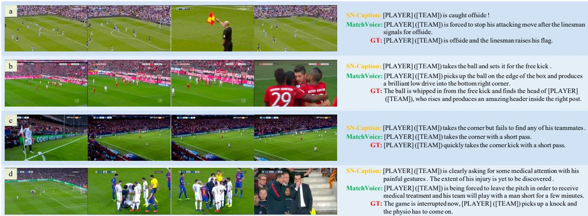  
Figure 5: Qualitative results on commentary generation. Our MatchVoice demonstrates advantages in multiple aspects: (a) richer semantic descriptions, (b) full commentaries of multiple incidents in a single video, (c) accuracy of descriptions, and (d) predictions of incoming events.

(iii) LoRA on LLMs Decoder. Given that the Baidu visual encoder pretrained on soccer data could potentially boost performance, we further investigate the impact of fine-tuning the language decoder on soccer-specific data. Considering the high computational cost of fine-tuning the entire LLM, we introduce a small number of trainable LoRA (Hu et al., 2022) layers within the LLMs decoder to capture the priors from soccer game commentary data. As presented in Table 3, introducing these LoRA layers leads to notable performance improvements, highlighting the necessity of leveraging soccer-specific priors within the dataset.

## 6 Related Works

Temporal video-text alignment aims to precisely associate textual descriptions or narratives with their corresponding video segments. Large-scale instructional videos such as HowTo100M (Miech et al., 2019) and YouCook2 (Zhou et al., 2018) have already catalyzed extensive multi-modal alignment works based on vision-language co-training. Concretely, TAN (Han et al., 2022) directly aligns procedure narrations transcribed through Automatic Speech Recognition (ASR) with video segments. DistantSup (Lin et al., 2022) and VINA (Mavroudi et al., 2023) further explore leveraging external knowledge bases (Koupaee and Wang, 2018) to assist the alignment process, while Li et al. (2024c) propose integrating both action and step textual information to accomplish the video-text alignment.

In this paper, we train a multi-modal alignment model to automatically correct existing data and build a higher-quality soccer game commentary dataset. Moreover, we further demonstrate the superiority and indispensability of our alignment pipeline through downstream commentary tasks, confirming its critical significance.

Video captioning has been a long-standing research challenge in computer vision (Krishna et al., 2017; Yang et al., 2023), primarily due to the limited annotation and expensive computation. Benefiting from the development of LLMs, recent models, such as LLaMA-VID (Li et al., 2024b) and Video-LLaMA (Zhang et al., 2023) propose strategies for linking visual features to language prompts, harnessing the capabilities of LLaMA (Touvron et al., 2023a,b) models for video description. Furthermore, VideoChat (Li et al., 2023, 2024a) treats video captioning as a subtask of visual question answering, while StreamingCaption (Zhou et al., 2024) can generate captions for streaming videos using a memory mechanism.

Notably, the AutoAD series (Han et al., 2023b,a, 2024) apply video captioning to a specific domain – synthesizing descriptive narrations for movie scenes to assist visually impaired individuals in watching movies. Similarly, in the context of soccer, a distinctive sports scenario, we develop a tailored soccer game commentary model to enrich the viewing experience for audiences.

Sports video understanding (Thomas et al., 2017) has widely attracted the interest of researchers due to its complexity and professional relevance. Early works such as FineGym (Shao et al., 2020) and FineDiving (Xu et al., 2022) aim to develop fine-grained datasets for action recognition and understanding in specific sports. Subsequently, focusing on soccer, a series of SoccerNet (Giancola et al., 2018a) datasets systematically address various challenges related to soccer, including player detection (Vandeghen et al., 2022), action spotting (Giancola et al., 2018a), replay grounding (Held et al., 2023), player tracking (Cioppa et al., 2022), camera calibration (Giancola et al., 2018b) and re-identification (Deliege et al., 2021). These endeavours have paved the way for more ambitious research goals, such as utilizing AI for soccer game commentary (Mkhallati et al., 2023; Qi et al., 2023). Additionally, other approaches have targeted aspects of sports analysis, such as basketball game narration (Yu et al., 2018) and tactics analysis (Wang et al., 2024).

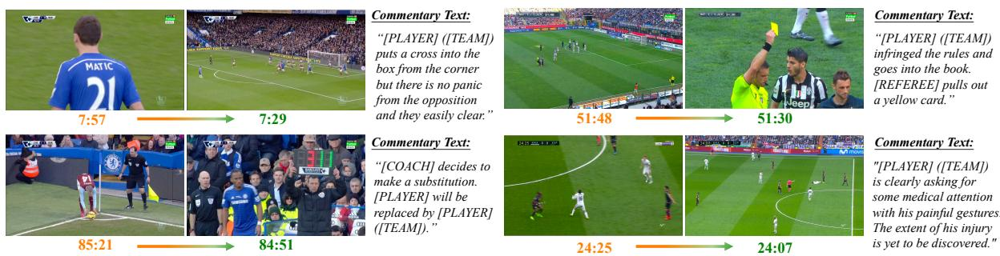  
Figure 6: Qualitative results on Temporal Alignment. For the same commentary text, original timestamps in SoccerNet-Caption are in Orange, those timestamps after alignment in MatchTime are in Green.

A concurrent work, SoccerNet-Echoes (Gautam et al., 2024) proposes to leverage audio from videos for ASR and translation to obtain richer text commentary data. However, this approach overlooks that unprocessed audios often contain non-gamerelated utterances, which may confuse model training. Building upon the aforementioned progress, our goal is to construct a dataset with improved alignment to train a more professional soccer game commentary model, thereby achieving a better understanding of sports video.

## 7 Conclusion

In this paper, we consider a highly practical and commercially valuable task: automatically generating professional textual commentary for soccer games. Specifically, we have observed a prevalent misalignment between visual contents and textual commentaries in existing datasets. To address this, we manually correct the timestamps of textual commentary in 49 videos in the existing dataset, establishing a new benchmark for the community, termed as SN-Caption-test-align. Building upon the manually checked data, we propose a multi-modal temporal video-text alignment pipeline that automatically corrects and filters existing data at scale, which enables us to construct a higher-quality soccer game commentary dataset, named MatchTime. Based on the curated dataset, we present MatchVoice, a soccer game commentary model, which can accurately generate professional commentary for given match videos, significantly outperforming previous methods. Extensive experiments have validated the critical performance improvements achieved through data alignment, as well as the superiority of our proposed alignment pipeline and commentary model.

## Limitations

Although our proposed MatchVoice model can generate professional textual commentary for given soccer game videos, it still inherits some limitations from existing data and models: (i) Following previous work, our commentary remains anonymous and cannot accurately describe player information on the field. This is left for future work, where we aim to further improve the dataset and incorporate knowledge and game background information as additional context; and (ii) MatchVoice may sometimes struggle to distinguish between highly similar actions, such as corner kicks and free kicks. This mainly stems from the current frozen pre-trained visual encoders and language decoders. Our preliminary findings suggest that fine-tuning on soccerspecific data might effectively address this issue in the future.

## Acknowledgments

This work is funded by National Key R&D Program of China (No.2022ZD0161400).

## References

AI@Meta. 2024. Llama 3 model card.

Max Bain, Jaesung Huh, Tengda Han, and Andrew Zisserman. 2023. Whisperx: Time-accurate speech transcription of long-form audio. INTERSPEECH 2023.

Satanjeev Banerjee and Alon Lavie. 2005. Meteor: An automatic metric for mt evaluation with improved correlation with human judgments. In Proceedings of the ACL Workshop on Intrinsic and Extrinsic Evaluation Measuresfor Machine Translation and/or Summarization, pages 65–72.

Anthony Cioppa, Silvio Giancola, Adrien Deliege, Le Kang, Xin Zhou, Zhiyu Cheng, Bernard Ghanem, and Marc Van Droogenbroeck. 2022. Soccernettracking: Multiple object tracking dataset and benchmark in soccer videos. In Proceedings of the IEEE Conference on Computer Vision and Pattern Recognition, pages 3491–3502.

Adrien Deliege, Anthony Cioppa, Silvio Giancola, Meisam J Seikavandi, Jacob V Dueholm, Kamal Nasrollahi, Bernard Ghanem, Thomas B Moeslund, and Marc Van Droogenbroeck. 2021. Soccernet-v2: A dataset and benchmarks for holistic understanding of broadcast soccer videos. In Proceedings of the IEEE Conference on Computer Vision and Pattern Recognition, pages 4508–4519.

FIFA. 2023. The football landscape – the vision 2020- 2023 | fifa publications.

Jinlan Fu, See-Kiong Ng, Zhengbao Jiang, and Pengfei Liu. 2024. Gptscore: Evaluate as you desire. In Proceedings of the Conference of the North American Chapter of the Association for Computational Linguistics.

Sushant Gautam, Mehdi Houshmand Sarkhoosh, Jan Held, Cise Midoglu, Anthony Cioppa, Silvio Giancola, Vajira Thambawita, Michael A Riegler, Pål Halvorsen, and Mubarak Shah. 2024. Soccernetechoes: A soccer game audio commentary dataset. arXiv preprint arXiv:2405.07354.

Silvio Giancola, Mohieddine Amine, Tarek Dghaily, and Bernard Ghanem. 2018a. Soccernet: A scalable dataset for action spotting in soccer videos. In Proceedings of the IEEE Conference on Computer Vision and Pattern Recognition Workshops, pages 1711–1721.

Silvio Giancola, Mohieddine Amine, Tarek Dghaily, and Bernard Ghanem. 2018b. Soccernet: A scalable dataset for action spotting in soccer videos. In Proceedings of the IEEE Conference on Computer Vision and Pattern Recognition Workshops, pages 1711–1721.

Silvio Giancola and Bernard Ghanem. 2021. Temporally-aware feature pooling for action spotting in soccer broadcasts. In Proceedings ofthe IEEE Conference on Computer Vision and Pattern Recognition, pages 4490–4499.

Tengda Han, Max Bain, Arsha Nagrani, Gul Varol, Weidi Xie, and Andrew Zisserman. 2023a. Autoad ii: The sequel-who, when, and what in movie audio description. In Proceedings of the International Conference on Computer Vision, pages 13645–13655.

Tengda Han, Max Bain, Arsha Nagrani, Gül Varol, Weidi Xie, and Andrew Zisserman. 2023b. Autoad: Movie description in context. In Proceedings ofthe IEEE Conference on Computer Vision and Pattern Recognition, pages 18930–18940.

Tengda Han, Max Bain, Arsha Nagrani, Gül Varol, Weidi Xie, and Andrew Zisserman. 2024. Autoad iii: The prequel - back to the pixels. In Proceedings ofthe IEEE Conference on Computer Vision and Pattern Recognition, pages 18164–18174.

Tengda Han, Weidi Xie, and Andrew Zisserman. 2022. Temporal alignment networks for long-term video. In Proceedings of the IEEE Conference on Computer Vision and Pattern Recognition, pages 2906–2916.

Kaiming He, Xiangyu Zhang, Shaoqing Ren, and Jian Sun. 2016. Deep residual learning for image recognition. In Proceedings of the IEEE Conference on Computer Vision and Pattern Recognition, pages 770– 778.

Jan Held, Anthony Cioppa, Silvio Giancola, Abdullah Hamdi, Bernard Ghanem, and Marc Van Droogenbroeck. 2023. Vars: Video assistant referee system for automated soccer decision making from multiple views. In Proceedings of the IEEE Conference on Computer Vision and Pattern Recognition, pages 5085–5096.

Sepp Hochreiter and Jürgen Schmidhuber. 1997. Long short-term memory. Neural Computation, 9(8):1735– 1780.

Edward J Hu, Yelong Shen, Phillip Wallis, Zeyuan Allen-Zhu, Yuanzhi Li, Shean Wang, Lu Wang, and Weizhu Chen. 2022. Lora: Low-rank adaptation of large language models. In Proceedings ofthe International Conference on Learning Representations.

Andrew Jaegle, Felix Gimeno, Andy Brock, Oriol Vinyals, Andrew Zisserman, and Joao Carreira. 2021. Perceiver: General perception with iterative attention. In Proceedings of the International Conference on Machine Learning, pages 4651–4664. PMLR.

Mahnaz Koupaee and William Yang Wang. 2018. Wikihow: A large scale text summarization dataset. arXiv preprint arXiv:1810.09305.

Ranjay Krishna, Kenji Hata, Frederic Ren, Li Fei-Fei, and Juan Carlos Niebles. 2017. Dense-captioning events in videos. In Proceedings of the International Conference on Computer Vision, pages 706–715.

KunChang Li, Yinan He, Yi Wang, Yizhuo Li, Wenhai Wang, Ping Luo, Yali Wang, Limin Wang, and Yu Qiao. 2023. Videochat: Chat-centric video understanding. arXiv preprint arXiv:2305.06355.

Kunchang Li, Yali Wang, Yinan He, Yizhuo Li, Yi Wang, Yi Liu, Zun Wang, Jilan Xu, Guo Chen, Ping Luo, Limin Wang, and Yu Qiao. 2024a. Mvbench: A comprehensive multi-modal video understanding benchmark. In Proceedings ofthe IEEE Conference on Computer Vision and Pattern Recognition, pages 22195–22206.

Yanwei Li, Chengyao Wang, and Jiaya Jia. 2024b. Llama-vid: An image is worth 2 tokens in large language models. In Proceedings of the European Conference on Computer Vision.

Zeqian Li, Qirui Chen, Tengda Han, Ya Zhang, Yanfeng Wang, and Weidi Xie. 2024c. Multi-sentence grounding for long-term instructional video. In Proceedings of the European Conference on Computer Vision.

Chin-Yew Lin. 2004. Rouge: A package for automatic evaluation of summaries. In Text Summarization Branches Out, pages 74–81.

Xudong Lin, Fabio Petroni, Gedas Bertasius, Marcus Rohrbach, Shih-Fu Chang, and Lorenzo Torresani. 2022. Learning to recognize procedural activities with distant supervision. In Proceedings ofthe IEEE Conference on Computer Vision and Pattern Recognition, pages 13853–13863.

Ilya Loshchilov and Frank Hutter. 2019. Decoupled weight decay regularization. In Proceedings of the International Conference on Learning Representations.

Effrosyni Mavroudi, Triantafyllos Afouras, and Lorenzo Torresani. 2023. Learning to ground instructional articles in videos through narrations. In Proceedings of the IEEE Conference on Computer Vision and Pattern Recognition, pages 15201–15213.

Antoine Miech, Dimitri Zhukov, Jean-Baptiste Alayrac, Makarand Tapaswi, Ivan Laptev, and Josef Sivic. 2019. Howto100m: Learning a text-video embedding by watching hundred million narrated video clips. In Proceedings of the International Conference on Computer Vision, pages 2630–2640.

Hassan Mkhallati, Anthony Cioppa, Silvio Giancola, Bernard Ghanem, and Marc Van Droogenbroeck. 2023. Soccernet-caption: Dense video captioning for soccer broadcasts commentaries. In Proceedings ofthe IEEE Conference on Computer Vision and Pattern Recognition Workshops, pages 5074–5085.

Aaron van den Oord, Yazhe Li, and Oriol Vinyals. 2018. Representation learning with contrastive predictive coding. arXiv preprint arXiv:1807.03748.

Kishore Papineni, Salim Roukos, Todd Ward, and Wei-Jing Zhu. 2002. Bleu: a method for automatic evaluation of machine translation. In Association for Computational Linguistics, pages 311–318.

Ji Qi, Jifan Yu, Teng Tu, Kunyu Gao, Yifan Xu, Xinyu Guan, Xiaozhi Wang, Bin Xu, Lei Hou, Juanzi

Li, et al. 2023. Goal: A challenging knowledgegrounded video captioning benchmark for real-time soccer commentary generation. In Proceedings ofthe 32nd ACM International Conference on Information and Knowledge Management, pages 5391–5395.

Alec Radford, Jong Wook Kim, Chris Hallacy, Aditya Ramesh, Gabriel Goh, Sandhini Agarwal, Girish Sastry, Amanda Askell, Pamela Mishkin, Jack Clark, et al. 2021. Learning transferable visual models from natural language supervision. In Proceedings ofthe International Conference on Machine Learning.

Dian Shao, Yue Zhao, Bo Dai, and Dahua Lin. 2020. Finegym: A hierarchical video dataset for finegrained action understanding. In Proceedings of the IEEE Conference on Computer Vision and Pattern Recognition, pages 2616–2625.

Graham Thomas, Rikke Gade, Thomas B Moeslund, Peter Carr, and Adrian Hilton. 2017. Computer vision for sports: Current applications and research topics. Computer Vision and Image Understanding, 159:3–18.

Hugo Touvron, Thibaut Lavril, Gautier Izacard, Xavier Martinet, Marie-Anne Lachaux, Timothée Lacroix, Baptiste Rozière, Naman Goyal, Eric Hambro, Faisal Azhar, et al. 2023a. Llama: Open and efficient foundation language models. arXiv preprint arXiv:2302.13971.

Hugo Touvron, Louis Martin, Kevin Stone, Peter Albert, Amjad Almahairi, Yasmine Babaei, Nikolay Bashlykov, Soumya Batra, Prajjwal Bhargava, Shruti Bhosale, et al. 2023b. Llama 2: Open foundation and fine-tuned chat models. arXiv preprint arXiv:2307.09288.

Du Tran, Lubomir Bourdev, Rob Fergus, Lorenzo Torresani, and Manohar Paluri. 2015. Learning spatiotemporal features with 3d convolutional networks. In Proceedings of the International Conference on Computer Vision, pages 4489–4497.

Renaud Vandeghen, Anthony Cioppa, and Marc Van Droogenbroeck. 2022. Semi-supervised training to improve player and ball detection in soccer. In Proceedings of the IEEE Conference on Computer Vision and Pattern Recognition, pages 3481–3490.

Ramakrishna Vedantam, C Lawrence Zitnick, and Devi Parikh. 2015. Cider: Consensus-based image description evaluation. In Proceedings of the IEEE Conference on Computer Vision and Pattern Recognition, pages 4566–4575.

Yi Wang, Kunchang Li, Yizhuo Li, Yinan He, Bingkun Huang, Zhiyu Zhao, Hongjie Zhang, Jilan Xu, Yi Liu, Zun Wang, et al. 2022. Internvideo: General video foundation models via generative and discriminative learning. arXiv preprint arXiv:2212.03191.

Zhe Wang, Petar Velickoviˇ c, Daniel Hennes, Nenad´ Tomašev, Laurel Prince, Michael Kaisers, Yoram

Bachrach, Romuald Elie, Li Kevin Wenliang, Federico Piccinini, et al. 2024. Tacticai: an ai assistant for football tactics. Nature Communications, 15(1):1– 13.

Jinglin Xu, Yongming Rao, Xumin Yu, Guangyi Chen, Jie Zhou, and Jiwen Lu. 2022. Finediving: A finegrained dataset for procedure-aware action quality assessment. In Proceedings ofthe IEEE Conference on Computer Vision and Pattern Recognition, pages 2949–2958.

Antoine Yang, Arsha Nagrani, Paul Hongsuck Seo, Antoine Miech, Jordi Pont-Tuset, Ivan Laptev, Josef Sivic, and Cordelia Schmid. 2023. Vid2seq: Largescale pretraining of a visual language model for dense video captioning. In Proceedings ofthe IEEE Conference on Computer Vision and Pattern Recognition, pages 10714–10726.

Huanyu Yu, Shuo Cheng, Bingbing Ni, Minsi Wang, Jian Zhang, and Xiaokang Yang. 2018. Fine-grained video captioning for sports narrative. In Proceedings of the IEEE Conference on Computer Vision and Pattern Recognition, pages 6006–6015.

Hang Zhang, Xin Li, and Lidong Bing. 2023. Videollama: An instruction-tuned audio-visual language model for video understanding. In Proceedings of the Conference on Empirical Methods in Natural Language Processinng.

Luowei Zhou, Chenliang Xu, and Jason Corso. 2018. Towards automatic learning of procedures from web instructional videos. In Proceedings of the AAAI Conference on Artificial Intelligence, volume 32.

Xin Zhou, Le Kang, Zhiyu Cheng, Bo He, and Jingyu Xin. 2021. Feature combination meets attention: Baidu soccer embeddings and transformer based temporal detection. arXiv preprint arXiv:2106.14447.

Xingyi Zhou, Anurag Arnab, Shyamal Buch, Shen Yan, Austin Myers, Xuehan Xiong, Arsha Nagrani, and Cordelia Schmid. 2024. Streaming dense video captioning. In Proceedings of the IEEE Conference on Computer Vision and Pattern Recognition.

## A Appendix

## A.1 Dataset Split

We split the total 471 matches of our dataset (including automatically aligned MatchTime and manually curated SN-Caption-test-align benchmark) into training (373 matches), validation (49 matches), and test (49 matches) sets, consisting of 26,058, 3,418, and 3,267 video clip-text pairs, respectively. Notably, all test samples are from our manually checked SN-Caption-test-align, which serves as a better benchmark on soccer game commentary generation for the community.

## A.2 Implementation Details

In this section, we provide additional details regarding the implementations as follows.

Baseline Methods. For baselines, we retrain several variants of SN-Caption (Mkhallati et al., 2023) with its official implementation. NetVLAD++ (Giancola and Ghanem, 2021) is adopted to aggregate the temporal information of the extracted features. Then the pooled features are decoded by an LSTM (Hochreiter and Schmidhuber, 1997).

Event Summarization. Considering that the narrations by commentators may be fragmented and colloquial, we feed the ASR-generated narration texts into the LLaMA-3 (AI@Meta, 2024) model and use the following prompt to summarize them into event descriptions for every 10 seconds:

"I will give you an automatically recognized speech with timestamps from a soccer game video. The narrator in the video is commenting on the soccer game. Your task is to summarize the key eventsfor every 10 seconds, each commentary should be clear about the person name and soccer terminology. Here is this automatically recognized speech: \n \n {timestamp intervals: ASR sentences} \n \n You need to summarize 6 sentence commentariesfor 0- 10s, 10-20s, 20-30s, 30-40s, 40-50s, 50-60s according to the timestamps in automatically recognized speech results, every single sentence commentary should be clear and consise about the incidents happened within that 10 secondsfor around 20-30 words. Now please write these 6 commentaries.\n Answer:"

Timestamp Prediction. With the event descriptions and their corresponding timestamps, we input them along with the textual commentaries into

LLaMA-3 (AI@Meta, 2024) to predict the timestamps for the textual commentaries based on sentence similarity, providing a solid foundation for fine-grained alignment. The prompt used for this step is as follows:

"I have a text commentary of a soccer game event at the original time stamp: \n \nOriginal timestamp here: {Original commentary here (from SoccerNet-Caption)} \n \n and I want to locate the time of this commentary among the following events with timestamp: \n {timestamp intervals of 10s: summarized events}. \n These are the words said by narrator and I want you to temporally align the first text commentary according to these words by narrators since there is afair chance that the original timestamp is somehow inaccurate in time. So please return me with a number oftime stamp that event is most likely to happen. I hope that you can choose a number of time stamp from the ranges of candidates. But if really none of the candidates is suitable, you can just return me with the original time stamp. Your answer is:"

## A.3 Evaluation Metrics

In this paper, most evaluation metrics (BLEU (Papineni et al., 2002), METEOR (Banerjee and Lavie, 2005), ROUGE-L (Lin, 2004), CIDEr (Vedantam et al., 2015)) are calculated using the same function settings with SoccerNet-Caption (Mkhallati et al., 2023), by the implementation of pycocoevalcap library. GPT-score (Fu et al., 2024) is given by GPT-3.5 with the following text as prompt:

"You are a grader of soccer game commentaries. There is a predicted commentary by AI model about a soccer game video clip and you need to score it comparing with ground truth. \n \n You should rate an integer score from 0 to 10 about the degree of similarity with ground truth commentary (The higher the score, the more correct the candidate is). You must first consider the accuracy of the soccer events, then to consider about the semantic information in expressions and the professional soccer terminologies. The names of players and teams are masked by "[PLAYER]" and "[TEAM]". \n \n The ground truth commentary of this soccer game video clip is: \n \n "{Ground truth here.}" \n \n I need you to rate the following predicted commentary from 0 to 10: \n \n "{Predicted Commentary here.}" \n \n The score you give is (Just return one number, no other word or sentences):"

## A.4 Details of Temporal Alignment

For our proposed fine-grained temporal alignment model, sampling appropriate positive and negative examples for contrastive learning affects the results.

<table><tr><td>Window(s)</td><td>60</td><td>120</td><td>150</td><td>180</td><td>240</td></tr><tr><td>avg(∆) (s) avg(|∆|) (s)</td><td>-0.54 14.06</td><td>0.03 6.89</td><td>0.44 15.06</td><td>2.34 11.94</td><td>-5.77 16.77</td></tr><tr><td>window10 (%) window30 (%) window45 (%)</td><td>97.71 94.04 81.65</td><td>98.17 95.41 91.28</td><td>91.28 88.07 84.40</td><td>91.28 88.53 83.94</td><td>85.78 82.57</td></tr></table>

Table 6: Alignment Results of Different Windows

As depicted in Table 6, we have experimented with sampling windows of different lengths and observed that using a 120-second window around the manually annotated ground truth (i.e., 60 seconds before to 60 seconds after) can yield optimal alignment performance. Specifically, for each text commentary, we treat the key frame corresponding to its ground truth timestamp as the positive sample, while other samples within a fixed window size, sampled at 1 FPS, serve as negative samples (i.e., those within 5 to 60 seconds temporal distance to the ground truth timestamp).

Considering that data pre-processing based on ASR and LLM provides a coarse alignment and that there might be replays in soccer game videos, during the inference stage, we use key frames from 45 seconds before to 30 seconds after the current textual commentary timestamp as candidates.

## A.5 Divergence Among Annotators

Although the recruited volunteers are all football enthusiasts, there exists noticeable subjectivity and variability in manual annotations due to different understandings of soccer terminology and actions.

To quantify this, three volunteers are asked to annotate two matches from our SN-Caption-test-align benchmark. We observe an “alignable/unalignable” disagreement among different annotators on 6.29% of the samples. Additionally, the average of maximum discrepancy between the timestamps provided by different annotators is 5.57 seconds, which can somehow seen as the performance upper-bound of automatic alignment models.

## A.6 More Qualitative Results

In this part, we present more qualitative results of our proposed MatchVoice model on soccer game commentary generation, shown in Figure 7.

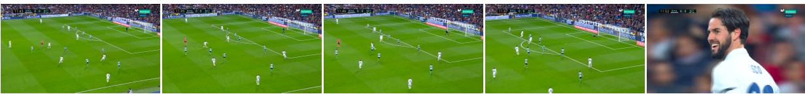  
[PLAYER] ([TEAM]) latches on to a precise low pass on the edge of the box and unleashes a shot that goes narrowly wide of the left post.MatchVoice: GT: [PLAYER] ([TEAM]) strikes a shot towards goal from the edge of the penalty box, but it flies just wide of the left post.

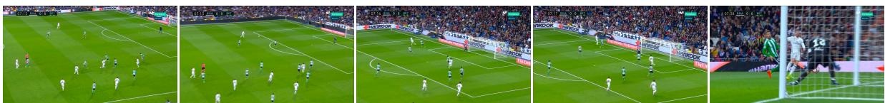  
[PLAYER] ([TEAM]) latches on to a precise pass on the edge of the box and unleashes a low drive towards the middle of the goal. [PLAYER] pulls off aMatchVoice: comfortable save. The ball goes out of play and [TEAM] will have a goal kick.  
GT: [PLAYER] ([TEAM]) shoots from the edge of the penalty area. The ball travels towards the bottom right corner, but [PLAYER] easily deals with the threat.

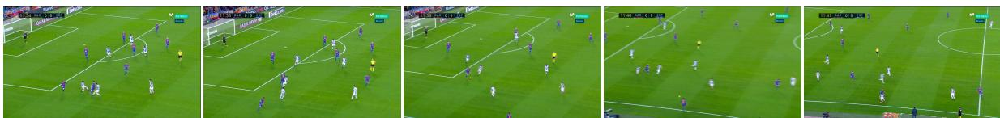  
[PLAYER] ([TEAM]) tries to find [PLAYER], but he puts too much weight on his pass.MatchVoice: GT: [PLAYER] ([TEAM]) crosses the ball forward but it is intercepted

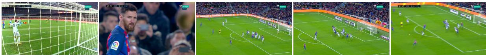  
[PLAYER] ([TEAM]) takes the corner kick and sends the ball into the box, but one of the defenders reacts well to avert the danger.MatchVoice: GT: [PLAYER] ([TEAM]) whips the ball in from the long-range free kick, but the first man gets it clear.

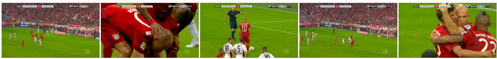  
[PLAYER] ([TEAM]) will take the responsibility and he is already preparing the ball.MatchVoice: GT: [PLAYER] ([TEAM]) confidently powers his spot-kick into the left side of the goal.

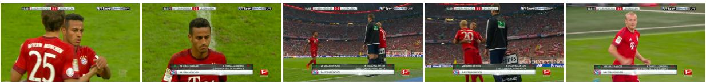  
The referee stops play so that a substitution can be made and [PLAYER] ([TEAM]) comes onto the pitch for [PLAYER].MatchVoice: GT: [COACH] has decided to make a change. [PLAYER] ([TEAM]) replaces [PLAYER].

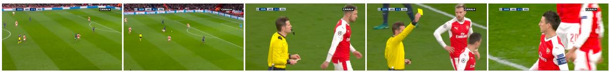  
[PLAYER] ([TEAM]) is booked after bringing down an opponent. [REFEREE] made the right call.MatchVoice: GT: [PLAYER] ([TEAM]) picks up a yellow card for a foul. [TEAM] win a free kick. It's a promising situation for a direct shot.

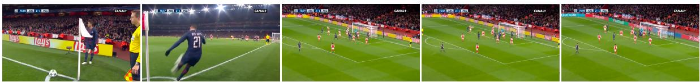  
[PLAYER] ([TEAM]) goes over to take the corner kick and it looks like he will send the ball into the penalty box.MatchVoice: GT: [PLAYER] ([TEAM]) will try to find the head of one of his teammates from a corner kick.

Figure 7: More qualitative results on commentary generation.