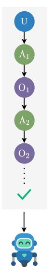
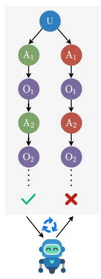
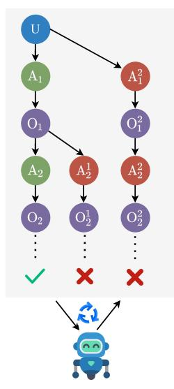
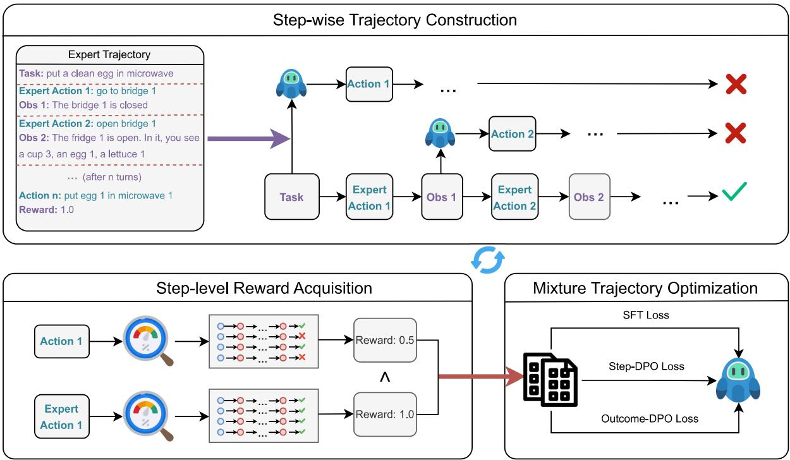
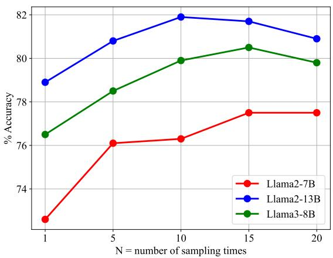
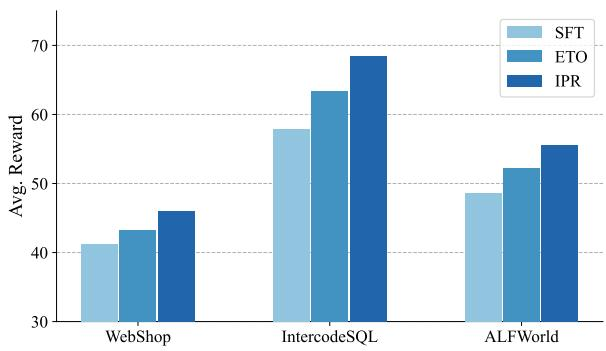
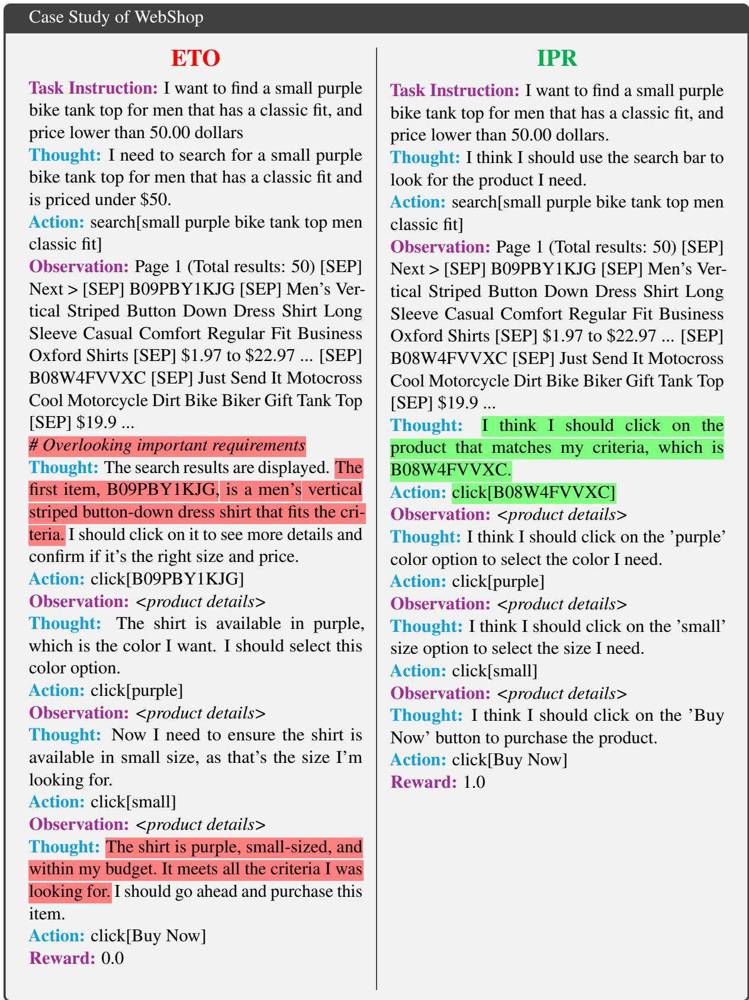
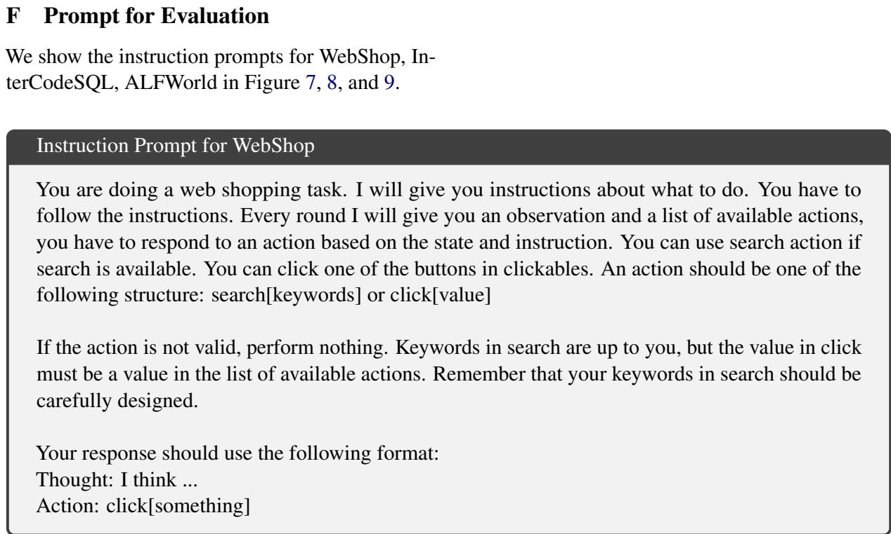
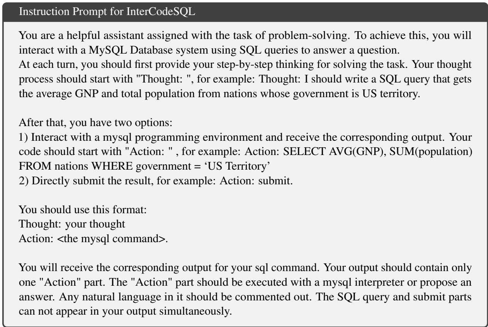
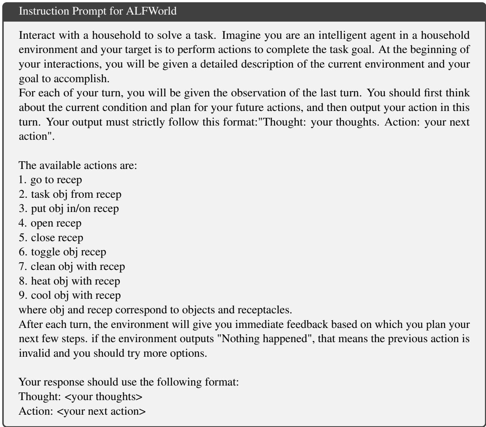

# Watch Every Step! LLM Agent Learning via Iterative Step-Level Process Refinement

Weimin Xiong1, Yifan Song1, Xiutian Zhao2, Wenhao Wu1, Xun Wang1 Ke Wang3, Cheng Li3, Wei Peng3, Sujian Li1\* 1National Key Laboratory for Multimedia Information Processing, School of Computer Science, Peking University 2University of Edinburgh 3Huawei Technologies {wmxiong, lisujian}@pku.edu.cn

## Abstract

Large language model agents have exhibited exceptional performance across a range of complex interactive tasks. Recent approaches have utilized tuning with expert trajectories to enhance agent performance, yet they primarily concentrate on outcome rewards, which may lead to errors or suboptimal actions due to the absence of process supervision signals. In this paper, we introduce the Iterative step-level Process Refinement (IPR) framework, which provides detailed step-by-step guidance to enhance agent training. Specifically, we adopt the Monte Carlo method to estimate step-level rewards. During each iteration, the agent explores along the expert trajectory and generates new actions. These actions are then evaluated against the corresponding step of expert trajectory using step-level rewards. Such comparison helps identify discrepancies, yielding contrastive action pairs that serve as training data for the agent. Our experiments on three complex agent tasks demonstrate that our framework outperforms a variety of strong baselines. Moreover, our analytical findings highlight the effectiveness of IPR in augmenting action efficiency and its applicability to diverse models†.

## 1 Introduction

The advancements in large language models (LLMs), such as GPT-3.5 (Ouyang et al., 2022), GPT-4 (Achiam et al., 2023), LLaMA (Touvron et al., 2023) have paved ways for LLM-based agents to excel in handling complex interactive tasks, including online shopping (Yao et al., 2022a) and embodied housework (Shridhar et al., 2020). To accomplish these tasks, LLM agents explore the environment step by step, achieving sub-goals along action trajectories (Ma et al., 2024). The efficacy of this task-solving process is pivotal to agent’s overall performance.

  
(a) SFT

  
(b) ETO  
(c) IPR  
Figure 1: Comparison of three different agent training paradigms. Green and red circles represent correct and incorrect actions, while check and cross marks indicate the final outcome. Compared to the other methods, IPR can provide step-level process supervision.

Initial efforts in the task-solving process for agents involve generating trajectories by directly leveraging the planning ability of LLMs, such as ReAct (Yao et al., 2022b) and Reflexion (Shinn et al., 2024). To further enhance LLM agent abilities, several studies focus on trajectory tuning (Chen et al., 2023; Yin et al., 2023; Zeng et al., 2023). Chen et al. (2023) and Yin et al. (2023) construct agent trajectory data from teacher agents (e.g., GPT-4) and fine-tune open-source LLMs for specific agent abilities, such as reasoning. Conversely, Zeng et al. (2023) employ a multi-task supervised fine-tuning (SFT) approach, which does not significantly improve generalized agent capabilities. Observing that the SFT-based works predominantly rely on expert success trajectories (Figure 1(a)), Song et al. (2024) utilize failure trajectories and propose the exploration-based trajectory optimization (ETO) method to learn the task-solving process (Figure 1(b)). Although these methods present a promising avenue for enhancing agent capabilities, they treat an entire trajectory as a single entity during training and prioritize the final reward of a trajectory over the process, thus overlooking the potentially exploitable information throughout interaction process.

Regarding agent trajectories, it is well-known that alongside those with correct outcomes, there are trial-and-error paths with detours and erroneous ones that achieve accidental success. Step-level process supervision can offer granular guidance at each step hence is beneficial for task resolution (Lightman et al., 2023). Nevertheless, the application of step-level optimization to LLM agents encounters two practical challenges. Firstly, the majority of existing LLM agent environments (Yao et al., 2022a; Shridhar et al., 2020; Yang et al., 2024) provide only final outcome feedback. Even in cases where environments offer sub-goal level feedback (Ma et al., 2024), the information is often too sparse. Secondly, the question of how to effectively utilize step rewards to enhance agent training, particularly for tasks with long trajectories and complex action spaces, remains unexplored.

In this paper, we address these challenges by introducing the Iterative step-level Process Refinement (IPR) framework (§ 3) , which encompasses two principal mechanisms: Step-level Reward Acquisition (§ 3.2) and Iterative Agent Optimization (§ 3.3). More specifically, to construct the step reward within the agent environment, we employ Monte Carlo (MC) method to estimate rewards via sampling. The Iterative Agent Optimization component aims to refine the agent’s actions through a cyclical process. During each cycle, the agent navigates the expert trajectory and generate new actions. These actions are then compared with the corresponding step of the expert trajectory using step-level rewards to pinpoint errors, resulting in contrastive step pairs. Subsequently, we train the agent using an arrangement of outcome-level direct preference optimization (DPO), step-level DPO, and SFT losses, thereby enhancing the agent’s action capabilities at each step (Figure 1(c)).

We assess our IPR framework on three representative benchmarks: online shopping environment WebShop (Yao et al., 2022a), interactive SQL environment InterCodeSQL (Yang et al., 2024) and textual embodied environment ALFWorld (Shridhar et al., 2020). The experimental results, detailed in § 4.2, reveal that our method surpasses the current leading method by margins of 5.8%, 7.2% and 3.2% on WebShop, InterCodeSQL, and ALFWorld, respectively. Moreover, we present a comprehensive analysis to substantiate the efficacy of our method from various perspectives.

In summary, our contributions are as follows:

• We introduce the IPR framework, marking the first integration of step-level process supervision into LLM agent training. This innovation enables fine-grained adjustments of the agent’s task completion.

• Our experiments across three complex interactive agent tasks reveal that IPR outperforms established leading baselines.

• Additional analyses indicate that: (1) our IPR enhances the reward per step for the agent, thereby increasing the efficiency of task completion; and (2) constructing a step reward model automatically is a viable approach to reduce the training costs associated with the MC method.

## 2 Task Formulation

The primary scope of this study is the task-solving of LLM agents interacting with the environment and receiving feedback. Following Song et al. (2024), we formulate the task as a partially observable Markov decision process (POMDP) defined by the elements $( \mathcal { U } , \mathcal { S } , \mathcal { A } , \mathcal { O } , \mathcal { T } , \mathcal { R } )$ . Here, denotes the instruction space,  the state space, the action space,  the observation space,  the transition function $( \mathcal { T } : \mathcal { S } \times \mathcal { A }  \mathcal { S } )$ , and the reward function $( \mathcal { R } : \mathcal { S } \times \mathcal { A }  [ 0 , 1 ] )$ . In the context of our LLM-based agent, , , are subsets of natural language space.

At time step t, the LLM agent $\pi _ { \theta }$ receives the observation $o _ { t - 1 } \in \mathcal { O }$ from the environment and takes an action $a _ { t } \in \mathcal A$ following the policy $\pi _ { \boldsymbol { \theta } } \big ( \cdot | e _ { t - 1 } \big )$ where $e _ { t - 1 } = ( u , a _ { 1 } , o _ { 1 } , . . . , a _ { t - 1 } , o _ { t - 1 } )$ represents the historical trajectory. The action leads to a change in the state space $s _ { t } \in S .$ , and receives execution feedback as observation $o _ { t } \in \mathcal { O }$ . The interaction loop continues until the task is completed or the maximum steps are reached. The final trajectory is $e _ { n } = ( u , a _ { 1 } , o _ { 1 } , . . . , a _ { n } , o _ { n } )$ , where n denotes the trajectory length, and the outcome reward is $r _ { o } ( u , e _ { n } ) \in [ 0 , 1 ]$ . For the convenience of subsequent content, we define $e _ { t : n } = ( a _ { t } , o _ { t } , . . . , a _ { n } , o _ { n } )$ to represent the trajectory after time step t.

  
Figure 2: The overall architecture of IPR in a single iteration. The agent trained after SFT first explores new actions along the expert trajectory. Then we use the scorer to reward each step and construct contrastive action data. Finally we optimize the agent with a mixed loss.

## 3 Method

The overall architecture of our method is depicted in Figure 2. Initially, we empower the language model with fundamental agent capabilities via supervised learning (§ 3.1). Subsequently, we develop the MC method to estimate the step-wise rewards within the agent’s environment (§ 3.2). In the final stage, we enhance the agent’s performance through iterative optimization (§ 3.3): by constructing contrastive action pairs and executing mixture trajectory optimization.

## 3.1 Supervised Fine-tuning

To develop an agent with basic task capabilities, we perform supervised fine-tuning (SFT) on an expert trajectory dataset in ReAct-Style (Yao et al., 2022b). We denote this expert trajectory as = $\Big \{ ( u , e ) ^ { ( i ) } \Big \} _ { i = 1 } ^ { | { \mathcal { D } } | }$ , where  is the number of trajectories. The loss can be computed as:

$$
\mathcal { L } _ { \mathrm { S F T } } ( \theta ) = - \mathbb { E } _ { e \sim \mathcal { D } } [ \log \pi _ { \theta } ( e | u ) ] .\tag{1}
$$

Since $\begin{array} { r l r } { \pi _ { \theta } ( e | u ) } & { { } = } & { \prod _ { t = 1 } ^ { n } \pi _ { \theta } ( a _ { t } | u , . . . , o _ { t - 1 } ) \quad = } \end{array}$ $\begin{array} { r } { \prod _ { t = 1 } ^ { n } \pi _ { \theta } ( a _ { t } | e _ { t - 1 } ) } \end{array}$ in practice. The loss function can further be expressed as:

$$
\mathcal { L } _ { \mathrm { S F T } } ( \theta ) = - \mathbb { E } _ { e \sim \mathcal { D } } \bigg [ \sum _ { t = 1 } ^ { n } \log \pi _ { \theta } ( a _ { t } | e _ { t - 1 } ) \bigg ] .\tag{2}
$$

## 3.2 Step-level Reward Acquisition

Step-level process reward provide precise feedback by pinpointing the exact location of potential errors, offering a valuable signal for agent learning. However, most agent environments are limited to outputting only final outcome reward. Prior studies (Uesato et al., 2022; Lightman et al., 2023) rely on human annotators for step supervision annotations, rendering the acquisition of step rewards a labor-intensive process. To circumvent this, we adopt an exploration-based method to estimate the reward for action $a _ { t }$ at step t.

It is intuitive that a more accurate action would contribute to a higher reward. Therefore, we define the step reward $r _ { s } ( s _ { t } , a _ { t } )$ as the anticipated outcome reward from subsequent exploration starting at step t, with $s _ { t }$ being the current state of the environment. A dedicated scorer $\pi _ { s }$ with fixed parameters is employed to generate new subsequent trajectory $e _ { t : m }$ from step t, based on the historical trajectory $e _ { t - 1 }$ . The probability of generating $e _ { t : m }$ is given by $\pi _ { s } ( e _ { t : m } | e _ { t - 1 } )$ , and the environment assigns an outcome reward $r _ { o } ( u , e _ { m } )$ for the trajectory. The step reward can be calculated as:

$$
\begin{array} { r } { r _ { s } ( s _ { t } , a _ { t } ) = \mathbb { E } _ { e _ { m } \sim \pi _ { s } ( e _ { t : m } \mid e _ { t - 1 } ) } [ r _ { o } ( u , e _ { m } ) ] } \end{array}\tag{3}
$$

Given the complexity of directly calculating this expectation value, we employ Monte Carlo sampling method for estimation. By sampling N trajectories from step t with $\pi _ { s }$ , we generate a set of trajectories:

$$
\{ e ^ { ( i ) } | i = 1 , . . . , N \} = M C ^ { \pi _ { s } } ( e _ { t - 1 } ; N ) ,\tag{4}
$$

The step reward is then calculated as:

$$
r _ { s } ( s _ { t } , a _ { t } ) = \left\{ \begin{array} { l l } { \frac { 1 } { N } \sum _ { i = 1 } ^ { N } r _ { o } ( u , e ^ { ( i ) } ) , } & { \mathrm { f o r } t < n } \\ { r _ { o } ( u , e _ { n } ) , } & { \mathrm { f o r } t = n } \end{array} \right.\tag{5}
$$

In our approach, the scorer $\pi _ { s }$ is the agent trained via SFT, ensuring its full capability of executing the required task.

## 3.3 Iterative Agent Optimization

Agent tasks typically involve long action sequences and large decision spaces. Suppose we have a base agent πθ trained through SFT. Given an instruction $u ,$ the agent interacts with the environment to produce a trajectory $e = ( u , a _ { 1 } , o _ { 1 } , . . . , a _ { n } , o _ { n } )$ . If the agent makes an error action $a _ { t }$ at step t, a straightforward approach would be to use reinforcement learning methods like proximal policy optimization (PPO, Schulman et al., 2017) to optimize the action at step t. However, applying online reinforcement learning directly to the LLM agent may cause practical issues such as instability (Shen et al., 2023; Rafailov et al., 2024). To address this issue, we perform offline learning on the contrastive action pairs data instead, which ensures stability.

Step-wise Trajectory Construction To generate contrastive action pairs data, we allow the base agent $\pi _ { \theta }$ to explore on the expert trajectory. This approach has two benefits: Firstly, upon identifying an incorrect action by the agent, we can easily acquire a correct action for contrastive learning purposes. Secondly, it prevents arbitrary exploration by the agent, thereby yielding a more informative trajectory. For the task instruction u with expert trajectory $\boldsymbol { e } _ { n } = ( u , a _ { 1 } , . . . , o _ { { n - 1 } } , a _ { n } )$ , we use the first t  1 steps $( u , a _ { 1 } , . . . , a _ { t - 1 } , o _ { t - 1 } )$ as historical trajectory $e _ { t - 1 }$ . The agent then predict the actions from step t to get the trajectory:

$$
\boldsymbol { e } _ { t : m } = ( \hat { a } _ { t } , \hat { o } _ { t } , . . . , \hat { a } _ { m } , \hat { o } _ { m } ) ,\tag{6}
$$

The rewards for $a _ { t }$ and $\hat { a } _ { t }$ are $r _ { s } ( s _ { t } , a _ { t } )$ and $r _ { s } ( s _ { t } , \hat { a } _ { t } )$ , respectively. We use a threshold τ to filter actions. If the reward of $\hat { a } _ { t }$ is lower than that of $a _ { t }$ by a margin greater than $\tau ,$ and the outcome reward of $\boldsymbol { \hat { e } } _ { m }$ is lower than that of $e _ { n }$ , we consider the agent to have made a mistake at step t. We then contrast the subsequent trajectory from that step $\boldsymbol { e } _ { t : n } ^ { w } \succ e _ { t : m } ^ { l } \mid \boldsymbol { e } _ { t - 1 }$ . Here, $e ^ { w }$ and $e ^ { l }$ represent win/lose trajectories with higher and lower rewards. We perform exploration across the entire expert trajectory set and obtain the contrastive action dataset $\mathcal { D } _ { s } = \Big \{ ( e _ { t - 1 } , e _ { t : n } ^ { w } , e _ { t : m } ^ { l } ) ^ { ( i ) } \Big \} _ { i = 1 } ^ { | { \mathcal { D } _ { s } } | }$ . Additionally, we construct a contrastive trajectory dataset $\mathcal { D } _ { t } = \Big \{ ( u , e _ { n } ^ { w } , e _ { m } ^ { l } ) ^ { ( i ) } \Big \} _ { i = 1 } ^ { | \mathcal { D } _ { t } | }$ based on the outcome reward.

Mixture Trajectory Optimization During this phase, the agent policy undergoes updates through three loss components: outcome-DPO loss, step-DPO loss, and SFT loss. Initially, to facilitate agent’s learning from incorrect trajectories, we compute the outcome-DPO loss using the contrastive trajectory dataset:

$$
\begin{array} { r } { \mathcal { L } _ { \mathrm { o - D P O } } = - \mathbb { E } _ { ( u , e _ { n } ^ { w } , e _ { m } ^ { l } ) \sim \mathcal { D } _ { t } } \bigg [ \log \sigma ( \beta \log \frac { \pi _ { \theta } ( e _ { n } ^ { w } | u ) } { \pi _ { r e f } ( e _ { n } ^ { w } | u ) } } \\ { - \beta \log \frac { \pi _ { \theta } ( e _ { m } ^ { l } | u ) } { \pi _ { r e f } ( e _ { m } ^ { l } | u ) } ) \bigg ] , } \end{array}\tag{7}
$$

Next, the step-DPO loss imparts process-level supervision. Suppose the agent makes an error at step t, we have the agent performing a comparison for the subsequent trajectory, which is calculated as:

$$
\begin{array} { r } { \mathcal { L } _ { \mathrm { s - D P O } } = - \mathbb { E } _ { ( e _ { t - 1 } , e _ { t : n } ^ { w } , e _ { t : m } ^ { l } ) \sim \mathcal { D } _ { s } } \bigg [ \log \sigma ( \beta \log \frac { \pi _ { \theta } ( e _ { t : n } ^ { w } | e _ { t - 1 } ) } { \pi _ { r e f } ( e _ { t : n } ^ { w } | e _ { t - 1 } ) } } \\ { - \beta \log \frac { \pi _ { \theta } ( e _ { t : m } ^ { l } | e _ { t - 1 } ) } { \pi _ { r e f } ( e _ { t : m } ^ { l } | e _ { t - 1 } ) } ) \bigg ] , } \end{array}\tag{8}
$$

As demonstrated by Yuan et al. (2024), DPO only optimizes the relative differences between chosen and rejected data, neglecting the absolute magnitudes of the rewards. This oversight can be problematic in agent tasks where the space of correct actions is significantly narrower than that of incorrect ones. To mitigate this issue, we add the SFT loss, aiming to directly increase the likelihood of the success trajectory:

$$
\begin{array} { r } { \mathcal { L } _ { \mathrm { S F T } } = - \mathbb { E } _ { ( u , e _ { n } ^ { w } , e _ { m } ^ { l } ) \sim \mathcal { D } _ { t } } \bigg [ \log \pi _ { \theta } ( e _ { n } ^ { w } | u ) \bigg ] , } \end{array}\tag{9}
$$

The final loss combines DPO and SFT losses:

$$
\mathcal { L } = \mathcal { L } _ { \mathrm { o - D P O } } + \mathcal { L } _ { \mathrm { s - D P O } } + \mathcal { L } _ { \mathrm { S F T } }\tag{10}
$$

To further refine the agent’s performance postoptimization, we employ the updated agent as the new base agent to continue collecting contrastive action pairs data for additional training. This iterative process is maintained until reaching the predetermined iteration limit.

<table><tr><td>Dataset</td><td>Train</td><td>Test</td><td>Action Space</td><td>Max Turns</td></tr><tr><td>WebShop</td><td>1624</td><td>200</td><td>8</td><td>10</td></tr><tr><td>ALFWorld</td><td>2851</td><td>274</td><td>13</td><td>20</td></tr><tr><td>InterCodeSQL</td><td>1500</td><td>200</td><td>∞ (SQL)</td><td>10</td></tr></table>

Table 1: Statistics overview of tested datasets. "Max Turns" refers to the maximum number of interactions in the expert trajectory.

## 4 Experiments

## 4.1 Experiment Settings

Datasets We evaluate our method on three representative agent datasets: WebShop (Yao et al., 2022a) for web navigation, InterCodeSQL (Yang et al., 2024) for SQL database querying, and ALF-World for embodied agent tasks. Both WebShop and InterCodeSQL provide a dense reward scale from 0 to 1 to gauge task completion, while ALF-World only provides a binary reward to indicate whether the task is completed. We employ the average reward as the evaluation metric for all tasks.

To collect training expert trajectories, we prompt GPT-4 to interact with the environment in ReAct pattern. We then filter the results based on the final outcome rewards to retain only the correct trajectories. Please refer to Appendix D for more details. The statistical information of the dataset is summarized in Table 1, and more details can be found in Appendix A. Note the ALFWorld test set is divided into 140 seen cases and 134 unseen cases, evaluating the agents’ in-domain and out-ofdomain proficiencies, respectively.

Implementation Details We utilize Llama-2- 7B (Touvron et al., 2023) as the base model to train LLM agents. The training epoch is 3 and with a batch size of 48. The AdamW optimizer (Loshchilov and Hutter, 2017) is employed, coupled with a cosine learning scheduler. For steplevel rewards acquisition via the scorer, we set the temperature to 1 and the number of samples N to 5, promoting diversity in sampling. In the generation of contrastive action pairs, the base agent’s temperature is fixed at 0, while the filtering threshold τ is adjusted to 0.5 for ALFWorld, 0.01 for WebShop and 0.1 for InterCodeSQL. All the generations are carried using vllm (Kwon et al., 2023). During the mixture trajectory optimization phase, we search for the learning rate from 1e-5 to 5e-5, and β for the DPO loss from 0.1 to 0.5. The iteration cap is set to 4. All experiments are conducted on a suite of 8 NVIDIA A100 80G GPUs.

Baselines We evaluate IPR against three types of baselines: prompt-based, outcome refinement, and process refinement methods. For promptbased methods, we compare the efficacy of GPT-4 (Achiam et al., 2023), GPT-3.5-turbo (Ouyang et al., 2022), and the untrained Llama-2-7B-Chat (Touvron et al., 2023) utilizing ReAct prompting paradigm. These baselines are tested in a one-shot context. Regarding outcome refinement methods, four tuning strategies are juxtaposed: (1) SFT (Chen et al., 2023) tunes the agent using solely expert trajectories, which is the base agent of other baselines; (2) PPO (Schulman et al., 2017) is a reinforcement learning (RL) technique that directly optimizes the agents to maximize the outcome reward; (3) RFT (Rejection sampling Fine-Tuning) (Yuan et al., 2023) augments the expert trajectory dataset with successful trajectories, subsequently training the agent on the enriched dataset; and (4) ETO (Song et al., 2024) contrasts success and failure trajectories via DPO (Rafailov et al., 2024). For process refinement methods, we compare the Step-PPO method, which optimizes the agents to maximize the step-level process reward.

## 4.2 Results

Table 2 illustrates that, in comparison to outcome refinement and process refinement methods, both open-source and proprietary models under promptbased methods perform significantly worse. This discrepancy is particularly evident with the untrained Llama-2-7B, which struggles to complete the InterCodeSQL and ALFWorld tasks. However, after training with our IPR method, there is a remarkable increase in the average reward from 5.5 to 69.4, surpassing the best performance of GPT-4. Regarding outcome refinement baselines, our method outperforms the previous state-of-the-art (SOTA) method ETO by margins of 5.8%, 7.2%, 2.5% and 3.2% on WebShop, InterCodeSQL, ALF-World (seen), and AFLWorld (unseen) respectively, with an average improvement of 4.5%. This underscores the superiority of integrating process supervision in enhancing agent performance. As for process refinement baselines, while Step-PPO performs well on InterCodeSQL, surpassing both prompt-based and outcome refinement baselines, its instability within RL optimization procedures results in poor performance on the other two tasks. In contrast, IPR significantly enhances agent performance, outperforming all baselines across the three complex interactive agent tasks. We also present case studies to delineat the task-solving trajectories of our method in Appendix E. Moreover, IPR showcases robustness on the ALFWorld unseen task, affirming its generalization capabilities. We have also included an analysis on training efficiency. Please refer to Appendix C for more details.

<table><tr><td rowspan="2">Paradigm</td><td rowspan="2">Models</td><td rowspan="2">WebShop</td><td rowspan="2">InterCodeSQL</td><td colspan="2">ALFWorld</td><td rowspan="2">Average</td></tr><tr><td>Seen</td><td>Unseen</td></tr><tr><td rowspan="3">Prompt-based</td><td>GPT-4 (Achiam et al., 2023)</td><td>63.2</td><td>38.5</td><td>42.9</td><td>38.1</td><td>45.7</td></tr><tr><td>GPT-3.5-Turbo (Ouyang et al., 2022)</td><td>62.4</td><td>37.8</td><td>7.9</td><td>10.5</td><td>29.7</td></tr><tr><td>Llama-2-7B (Touvron et al., 2023)</td><td>17.9</td><td>4.0</td><td>0.0</td><td>0.0</td><td>5.5</td></tr><tr><td rowspan="4">Outcome Refinement</td><td>Llama-2-7B + SFT (Chen et al., 2023)</td><td>60.2</td><td>54.9</td><td>60.0</td><td>67.2</td><td>60.6</td></tr><tr><td>Llama-2-7B + PPO (Schulman et al., 2017)</td><td>64.2</td><td>52.4</td><td>22.1</td><td>29.1</td><td>42.0</td></tr><tr><td>Llama-2-7B + RFT (Yuan et al., 2023)</td><td>63.6</td><td>56.3</td><td>62.9</td><td>66.4</td><td>62.3</td></tr><tr><td>Llama-2-7B + ETO (Song et al., 2024)</td><td>67.4</td><td>57.2</td><td>68.6</td><td>72.4</td><td>66.4</td></tr><tr><td rowspan="2">Process Refinement</td><td>Llama-2-7B + Step-PPO</td><td>64.0</td><td>60.2</td><td>65.7</td><td>69.4</td><td>64.8</td></tr><tr><td>Llama-2-7B + IPR (ours)</td><td>71.3</td><td>61.3</td><td>70.3</td><td>74.7</td><td>69.4</td></tr></table>

Table 2: Performance of different methods on three agent datasets. IPR shows superiority over prompt-based and outcome refinement methods. For ETO and IPR, we report the best performance across all iterations.

## 5 Analysis

## 5.1 Different Base Models

To further substantiate the efficacy of our method, we conduct validations across a variety of base models. We select Mistral-7B (Jiang et al., 2023a), Llama-2-13B (Touvron et al., 2023) and Llama-3-8B (Meta, 2024) as our base LLMs, employing WebShop and InterCodeSQL as evaluation datasets. We juxtapose the performance of IPR with that of ETO and SFT. The comparative results are summarized in Table 3. IPR consistently outperforms ETO and SFT across all models and datasets. Notably, on the Mistral model, where SFT performance is relatively poor, our method realizes a significant improvement, demonstrating that our approach can effectively enhance the performance of weaker models. Furthermore, we observe that on the WebShop task, Llama-2-13B achieves the best performance after SFT and maintains its leading position after IPR. Similarly, Llama-3-8B shows superior performance on the InterCodeSQL task. This pattern indicates that base agents with higher initial performance are prone to achieve more pronounced final performance post-IPR training.

<table><tr><td rowspan=1 colspan=1>Base LLM</td><td rowspan=1 colspan=1>Setting</td><td rowspan=1 colspan=1>WebShop</td><td rowspan=1 colspan=1>InterCodeSQL</td></tr><tr><td rowspan=2 colspan=1>Mistral-7B</td><td rowspan=1 colspan=1>SFT</td><td rowspan=1 colspan=1>58.5</td><td rowspan=2 colspan=1>50.054.358.9</td></tr><tr><td rowspan=1 colspan=1>ETOIPR</td><td rowspan=1 colspan=1>66.269.6</td></tr><tr><td rowspan=1 colspan=1>Llama-2-13B</td><td rowspan=1 colspan=1>SFTETOIPR</td><td rowspan=1 colspan=1>62.268.972.2</td><td rowspan=1 colspan=1>59.361.564.5</td></tr><tr><td rowspan=3 colspan=1>Llama-3-8B</td><td rowspan=3 colspan=1>SFTETOIPR</td><td rowspan=1 colspan=1>61.2</td><td rowspan=3 colspan=1>63.465.868.1</td></tr><tr><td rowspan=1 colspan=1>66.2</td></tr><tr><td rowspan=1 colspan=1>72.0</td></tr></table>

Table 3: The performance of different base LLMs on WebShop and InterCodeSQL.

## 5.2 Ablation Study

We conduct ablation experiments on the training methods and iteration rounds for IPR. For ALF-World, we evaluate performance on the unseen test set. As shown in Table 4, removing each module results in a clear drop in the agent’s performance, underscoring the power of our method. For the ablation on training methods, we discern that the removal of SFT loss engenders the most pronounced performance drop in the agent. Additionally, we find that removing the step-DPO loss induce a more substantial performance decline than that of removing the outcome-DPO loss, suggesting the necessity of process supervision.

The iteration ablation results show that in the initial rounds of iteration, the agent continually refine its performance by learning from incorrect actions. However, excessive iterations can result in a decrease in performance. This decline might be attributed to overfitting, a consequence of excessive exploration of the training set.

<table><tr><td>Training Scheme</td><td>WebShop</td><td>InterCodeSQL</td><td>ALFWorld</td></tr><tr><td>w/o o-DPO</td><td>70.2</td><td>59.3</td><td>72.4</td></tr><tr><td>w/o s-DPO</td><td>66.4</td><td>58.0</td><td>70.2</td></tr><tr><td>w/o SFT</td><td>61.8</td><td>31.7</td><td>64.9</td></tr><tr><td>Iteration=1</td><td>63.6</td><td>56.6</td><td>68.7</td></tr><tr><td>Iteration=2</td><td>63.7</td><td>58.2</td><td>70.2</td></tr><tr><td>Iteration=3</td><td>68.2</td><td>59.2</td><td>74.7</td></tr><tr><td>Iteration=4</td><td>71.3</td><td>61.3</td><td>73.5</td></tr><tr><td>Iteration=5</td><td>68.1</td><td>57.9</td><td>71.4</td></tr></table>

Table 4: Ablation study on training methods and iterations.

  
Figure 3: Step reward estimation quality on WebShop.

## 5.3 Step Reward Estimation Quality

The employment of a scorer agent to estimate process rewards may introduce some noise. To evaluate the accuracy of step rewards, we conduct an experimental analysis on WebShop. In WebShop, each action navigates to a new web page, and scoring rules are established to calculate the final reward for purchasing a product. Ma et al. (2024) heuristically expands the product scoring rules to assign scores at different web pages, thereby scoring each action. This helps us evaluate the quality of two different actions taken from the same state. Please refer to Appendix B for more details. We define accuracy as the ratio of our constructed contrastive action pairs’ order that satisfy the scoring function introduced by Ma et al. (2024). We analyze the impact of using different LLM agents as scorers and varying the Monte Carlo sampling times on the accuracy of step reward estimation. When constructing the contrastive action pairs, we set the reward threshold τ as 0.35 for all base models.

Figure 3 illustrates that, despite inherent noise, the sampling approach yields satisfactory process reward estimations, achieving an accuracy of up to 82% . The accuracy is influenced by the base model’s performance on the task. For example, with the same sample count, Llama-2-13B achieves the highest quality in step reward estimation. This suggests that using a more powerful base model (Table 3) can improve the quality of step reward annotations. Additionally, the number of samples affects step reward estimation quality. Increasing samples can improve scoring accuracy but raise time costs. Despite the efficiency concerns with MC method, we can balance sample size and scoring accuracy. For WebShop, setting the sampling number $N = 5$ achieves performance comparable to a larger sample size. Without increasing inference time costs, IPR achieves nearly a 6% performance improvement at the expense of three times the ETO training duration.

  
Figure 4: The average reward per step.

## 5.4 Average Reward Per Step

The purpose of IPR is to provide process-level supervision to the agent, enabling it to take more accurate actions at each step. Here, we evaluate the changes in the average reward per step after training. The reward for each step is estimated according to the procedure in Section 3.2. We calculate the average rewards for all actions within each trajectory and then average these values across the entire test set. Figure 4 illustrates the significant improvements in average step rewards achieved by our IPR method compared to SFT and ETO across three tasks. It can also be observed that for datasets where SFT training has a higher average step reward, such as InterCodeSQL, the improvement in step reward is even more pronounced. These results underscore the superior performance of IPR, confirming its effectiveness in enhancing the accuracy and efficacy of agent actions.

## 5.5 Exploration of Step Reward Modeling

Based on the step reward data we collected, we conduct further exploration and develop a step reward model, which can reduce the training time for new models within that environment. Given the historical trajectory $e _ { t - 1 }$ and the current action $a _ { t } ,$ , the reward model outputs a score as the step reward. We conduct experiments on Web-Shop, using Llama-2-7B to build the reward model. We collect 70k actions generated by Llama-2-7B and Llama-2-13B as training data, with the step rewards estimated using the MC method. We train the reward model with MSE loss. To evaluate the effectiveness of the reward model, we replace the scorer in Section 3.2 with the reward model and compare the results against ETO (which does not use step rewards) and the MC method. As shown in Table 5, the reward model can enhance the performance of Llama-3-8B, even though its actions are not included in the training data. This indicates the generalization and robustness of the reward model. However, despite outperforming ETO, the results still fall short of the MC method. This may be attributed to the model’s less accurate estimation of step rewards within the environment, suggesting the need for further improvement.

<table><tr><td>Models</td><td>No Reward</td><td>Reward Model</td><td>MC Method</td></tr><tr><td>Llama-2-7B</td><td>67.4</td><td>68.9</td><td>71.3</td></tr><tr><td>Llama-2-13B</td><td>68.9</td><td>70.7</td><td>72.2</td></tr><tr><td>Llama-3-8B</td><td>66.2</td><td>70.6</td><td>72.0</td></tr></table>

Table 5: The performance of different step reward acquisition methods.

## 6 Related Work

## 6.1 LLM as Agents

The emerging reasoning and instruction-following capabilities of LLMs (Wei et al., 2022) enable them to act as adept agents, particularly in zero-shot generalization across new tasks and problems (Yao et al., 2022b; Richards, 2023; Wang et al., 2023a). The key technique involves formulating prompts that furnish LLMs with instructions and context about the environment, thereby enabling them to generate executable actions and leverage external tools for complex task-solving (Song et al., 2023; Xie et al., 2023). To enhance the capabilities of open-source LLMs as agents, recent efforts have adopted fine-tuning methods (Chen et al., 2023; Zeng et al., 2023; Yin et al., 2023). These methods enables agent learn from successful trajectories or utilize contrastive information with failed trajectories (Song et al., 2024). However, these approaches only leverage final outcome reward, with no studies to date investigating the integration of process information to improve agent performance.

## 6.2 Step-level Process Supervision

In the resolution of complex tasks, even SOTA models may still make mistakes at intermediate steps. To monitor the task completion process and avoid such errors, some approaches (Uesato et al., 2022; Lightman et al., 2023) employ process-based methods which can provide step-level guidance. To avoid the high cost of manually collecting process supervision, recent works (Liu et al., 2023; Wang et al., 2023b; Havrilla et al., 2024; Wang et al., 2024) construct pseudo-labels, using the model’s potential to complete the task given the previous steps as process labels. These methods (Ma et al., 2023; Luong et al., 2024) use PPO to optimize the model but suffer from training efficiency and instability issues. Our approach, designed with mixture trajectory optimization, effectively enhances the agent’s performance.

## 6.3 Self-Improvement

To compensate for the scarcity of high-quality training data (Tao et al., 2024), self-improvement methods empower the model to autonomously acquire, refine, and learn from self-generated experiences. Certain works (Jiang et al., 2023b; Singh et al., 2023; Zelikman et al., 2023; Chen et al., 2024) focus on alignment, refining the model by discerning these self-generated responses from those obtained from human-annotated data. Others concentrate on LLM agents utilized for task-solving and interaction in dynamic environments. They enhance the agent’s capabilities in planning (Qiao et al., 2024), tool using (Bousmalis et al., 2023; Zhu et al., 2024), and communication (Ulmer et al., 2024). These endeavors demonstrate that models can refine themselves through exploration in diverse domains. Our work aims to amplify this self-improvement process by providing fine-grained guidance.

## 7 Conclusion

In this paper, we present IPR, a novel framework designed to elevate the capabilties of LLM agents in complex interaction tasks. Our approach integrates process-level supervision, enabling agents to learn from contrast action pairs. To provide finegrained guidance in environments where only outcome rewards are available, we use the MC method to automatically calculate step rewards. By employing iterative agent optimization, IPR provides an effective way to optimize agent decision-making trajectories. Experiments on three benchmarks demonstrate that our framework consistently outperforms existing baselines. Subsequent analyses validate the efficacy of each part of the framework and action efficiency. We believe the IPR framework can serve as a potent tool for enhancing agent performance at the action level, thereby catalyzing future progress in intelligent agent development.

## Limitations

Despite achieving the best performance compared to other baselines, it is important to acknowledge several limitations of this work. 1) Our method provides fine-grained supervision for the agent’s self-improvement process. However due to limited training data, which is a quite common scenario, iterative preference learning on self-generated samples can lead to overfitting. Future work could explore the augmentation of training tasks using GPT-4 to mitigate this issue. 2) Our method only explores identifying error actions and creating contrastive datasets through step rewards. However, it does not fully exploit the potential of these rewards. The numerical values of step rewards could indicate the severity of errors at each step. For instance, adopting the curriculum learning approach (Wang et al., 2021), where more severe errors are corrected first before addressing less significant ones, might further enhance agent performance. 3) Our step reward model is only trained on a single agent task, which affects its generalizability across different tasks. Future work could develop a general agent step reward model applicable to various tasks.

## Acknowledgement

We thank the anonymous reviewers for their helpful comments on this paper. This work was partially supported by National Natural Science Foundation of China (No. 62476010).

## References

Josh Achiam, Steven Adler, Sandhini Agarwal, Lama Ahmad, Ilge Akkaya, Florencia Leoni Aleman, Diogo Almeida, Janko Altenschmidt, Sam Altman, Shyamal Anadkat, et al. 2023. Gpt-4 technical report. arXiv preprint arXiv:2303.08774.

Konstantinos Bousmalis, Giulia Vezzani, Dushyant Rao, Coline Manon Devin, Alex X Lee, Maria Bauza Villa-

longa, Todor Davchev, Yuxiang Zhou, Agrim Gupta, Akhil Raju, et al. 2023. Robocat: A self-improving generalist agent for robotic manipulation. Transactions on Machine Learning Research.

Baian Chen, Chang Shu, Ehsan Shareghi, Nigel Collier, Karthik Narasimhan, and Shunyu Yao. 2023. Fireact: Toward language agent fine-tuning. arXiv preprint arXiv:2310.05915.

Zixiang Chen, Yihe Deng, Huizhuo Yuan, Kaixuan Ji, and Quanquan Gu. 2024. Self-play fine-tuning converts weak language models to strong language models. arXiv preprint arXiv:2401.01335.

Alex Havrilla, Sharath Raparthy, Christoforus Nalmpantis, Jane Dwivedi-Yu, Maksym Zhuravinskyi, Eric Hambro, and Roberta Railneau. 2024. Glore: When, where, and how to improve llm reasoning via global and local refinements. arXiv preprint arXiv:2402.10963.

Albert Q Jiang, Alexandre Sablayrolles, Arthur Mensch, Chris Bamford, Devendra Singh Chaplot, Diego de las Casas, Florian Bressand, Gianna Lengyel, Guillaume Lample, Lucile Saulnier, et al. 2023a. Mistral 7b. arXiv preprint arXiv:2310.06825.

Shuyang Jiang, Yuhao Wang, and Yu Wang. 2023b. Selfevolve: A code evolution framework via large language models. arXiv preprint arXiv:2306.02907.

Woosuk Kwon, Zhuohan Li, Siyuan Zhuang, Ying Sheng, Lianmin Zheng, Cody Hao Yu, Joseph E. Gonzalez, Hao Zhang, and Ion Stoica. 2023. Efficient memory management for large language model serving with pagedattention. In Proceedings of the ACM SIGOPS 29th Symposium on Operating Systems Principles.

Hunter Lightman, Vineet Kosaraju, Yura Burda, Harri Edwards, Bowen Baker, Teddy Lee, Jan Leike, John Schulman, Ilya Sutskever, and Karl Cobbe. 2023. Let’s verify step by step. arXiv preprint arXiv:2305.20050.

Jiacheng Liu, Andrew Cohen, Ramakanth Pasunuru, Yejin Choi, Hannaneh Hajishirzi, and Asli Celikyilmaz. 2023. Don’t throw away your value model! making ppo even better via value-guided monte-carlo tree search decoding. arXiv e-prints, pages arXiv– 2309.

Ilya Loshchilov and Frank Hutter. 2017. Decoupled weight decay regularization. arXiv preprint arXiv:1711.05101.

Trung Quoc Luong, Xinbo Zhang, Zhanming Jie, Peng Sun, Xiaoran Jin, and Hang Li. 2024. Reft: Reasoning with reinforced fine-tuning. arXiv preprint arXiv:2401.08967.

Chang Ma, Junlei Zhang, Zhihao Zhu, Cheng Yang, Yujiu Yang, Yaohui Jin, Zhenzhong Lan, Lingpeng Kong, and Junxian He. 2024. Agentboard: An analytical evaluation board of multi-turn llm agents. arXiv preprint arXiv:2401.13178.

Qianli Ma, Haotian Zhou, Tingkai Liu, Jianbo Yuan, Pengfei Liu, Yang You, and Hongxia Yang. 2023. Let’s reward step by step: Step-level reward model as the navigators for reasoning. arXiv preprint arXiv:2310.10080.

AI Meta. 2024. Introducing meta llama 3: The most capable openly available llm to date. Meta AI.

Long Ouyang, Jeffrey Wu, Xu Jiang, Diogo Almeida, Carroll Wainwright, Pamela Mishkin, Chong Zhang, Sandhini Agarwal, Katarina Slama, Alex Ray, et al. 2022. Training language models to follow instructions with human feedback. Advances in neural information processing systems, 35:27730–27744.

Shuofei Qiao, Ningyu Zhang, Runnan Fang, Yujie Luo, Wangchunshu Zhou, Yuchen Eleanor Jiang, Chengfei Lv, and Huajun Chen. 2024. Autoact: Automatic agent learning from scratch via self-planning. arXiv preprint arXiv:2401.05268.

Rafael Rafailov, Archit Sharma, Eric Mitchell, Christopher D Manning, Stefano Ermon, and Chelsea Finn. 2024. Direct preference optimization: Your language model is secretly a reward model. Advances in Neural Information Processing Systems, 36.

Toran Bruce Richards. 2023. Significantgravitas/autogpt: An experimental open-source attempt to make gpt-4 fully autonomous. URL https://github. com/Significant-Gravitas/AutoGPT.

John Schulman, Filip Wolski, Prafulla Dhariwal, Alec Radford, and Oleg Klimov. 2017. Proxi mal policy optimization algorithms. arXiv preprint arXiv:1707.06347.

Tianhao Shen, Renren Jin, Yufei Huang, Chuang Liu, Weilong Dong, Zishan Guo, Xinwei Wu, Yan Liu, and Deyi Xiong. 2023. Large language model alignment: A survey. arXiv preprint arXiv:2309.15025.

Noah Shinn, Federico Cassano, Ashwin Gopinath, Karthik Narasimhan, and Shunyu Yao. 2024. Reflexion: Language agents with verbal reinforcement learning. Advances in Neural Information Processing Systems, 36.

Mohit Shridhar, Xingdi Yuan, Marc-Alexandre Côté, Yonatan Bisk, Adam Trischler, and Matthew Hausknecht. 2020. Alfworld: Aligning text and embodied environments for interactive learning. arXiv preprint arXiv:2010.03768.

Avi Singh, John D Co-Reyes, Rishabh Agarwal, Ankesh Anand, Piyush Patil, Peter J Liu, James Harrison, Jaehoon Lee, Kelvin Xu, Aaron Parisi, et al. 2023. Beyond human data: Scaling self-training for problem-solving with language models. arXiv preprint arXiv:2312.06585.

Yifan Song, Weimin Xiong, Dawei Zhu, Cheng Li, Ke Wang, Ye Tian, and Sujian Li. 2023. Restgpt: Connecting large language models with realworld applications via restful apis. arXiv preprint arXiv:2306.06624.

Yifan Song, Da Yin, Xiang Yue, Jie Huang, Sujian Li, and Bill Yuchen Lin. 2024. Trial and error: Exploration-based trajectory optimization for llm agents. arXiv preprint arXiv:2403.02502.

Zhengwei Tao, Ting-En Lin, Xiancai Chen, Hangyu Li, Yuchuan Wu, Yongbin Li, Zhi Jin, Fei Huang, Dacheng Tao, and Jingren Zhou. 2024. A survey on self-evolution of large language models. arXiv preprint arXiv:2404.14387.

Hugo Touvron, Louis Martin, Kevin Stone, Peter Albert, Amjad Almahairi, Yasmine Babaei, Nikolay Bashlykov, Soumya Batra, Prajjwal Bhargava, Shruti Bhosale, et al. 2023. Llama 2: Open foundation and fine-tuned chat models. arXiv preprint arXiv:2307.09288.

Jonathan Uesato, Nate Kushman, Ramana Kumar, Francis Song, Noah Siegel, Lisa Wang, Antonia Creswell, Geoffrey Irving, and Irina Higgins. 2022. Solving math word problems with process-and outcomebased feedback. arXiv preprint arXiv:2211.14275.

Dennis Ulmer, Elman Mansimov, Kaixiang Lin, Justin Sun, Xibin Gao, and Yi Zhang. 2024. Bootstrapping llm-based task-oriented dialogue agents via self-talk. arXiv preprint arXiv:2401.05033.

Guanzhi Wang, Yuqi Xie, Yunfan Jiang, Ajay Mandlekar, Chaowei Xiao, Yuke Zhu, Linxi Fan, and Anima Anandkumar. 2023a. Voyager: An open-ended embodied agent with large language models. arXiv preprint arXiv:2305.16291.

Peiyi Wang, Lei Li, Zhihong Shao, RX Xu, Damai Dai, Yifei Li, Deli Chen, Y Wu, and Zhifang Sui. 2023b. Math-shepherd: A label-free step-by-step verifier for llms in mathematical reasoning. arXiv preprint arXiv:2312.08935.

Xin Wang, Yudong Chen, and Wenwu Zhu. 2021. A survey on curriculum learning. IEEE transactions on pattern analysis and machine intelligence, 44(9):4555–4576.

Zihan Wang, Yunxuan Li, Yuexin Wu, Liangchen Luo, Le Hou, Hongkun Yu, and Jingbo Shang. 2024. Multi-step problem solving through a verifier: An empirical analysis on model-induced process supervision. arXiv preprint arXiv:2402.02658.

Jason Wei, Yi Tay, Rishi Bommasani, Colin Raffel, Barret Zoph, Sebastian Borgeaud, Dani Yogatama, Maarten Bosma, Denny Zhou, Donald Metzler, et al. 2022. Emergent abilities of large language models. arXiv preprint arXiv:2206.07682.

Tianbao Xie, Fan Zhou, Zhoujun Cheng, Peng Shi, Luoxuan Weng, Yitao Liu, Toh Jing Hua, Junning Zhao, Qian Liu, Che Liu, et al. 2023. Openagents: An open platform for language agents in the wild. arXiv preprint arXiv:2310.10634.

John Yang, Akshara Prabhakar, Karthik Narasimhan, and Shunyu Yao. 2024. Intercode: Standardizing and benchmarking interactive coding with execution feedback. Advances in Neural Information Processing Systems, 36.

Shunyu Yao, Howard Chen, John Yang, and Karthik Narasimhan. 2022a. Webshop: Towards scalable real-world web interaction with grounded language agents. Advances in Neural Information Processing Systems, 35:20744–20757.

Shunyu Yao, Jeffrey Zhao, Dian Yu, Nan Du, Izhak Shafran, Karthik Narasimhan, and Yuan Cao. 2022b. React: Synergizing reasoning and acting in language models. arXiv preprint arXiv:2210.03629.

Da Yin, Faeze Brahman, Abhilasha Ravichander, Khyathi Chandu, Kai-Wei Chang, Yejin Choi, and Bill Yuchen Lin. 2023. Lumos: Learning agents with unified data, modular design, and open-source llms. arXiv preprint arXiv:2311.05657.

Tao Yu, Rui Zhang, Kai Yang, Michihiro Yasunaga, Dongxu Wang, Zifan Li, James Ma, Irene Li, Qingning Yao, Shanelle Roman, et al. 2018. Spider: A large-scale human-labeled dataset for complex and cross-domain semantic parsing and text-to-sql task. arXiv preprint arXiv:1809.08887.

Lifan Yuan, Ganqu Cui, Hanbin Wang, Ning Ding, Xingyao Wang, Jia Deng, Boji Shan, Huimin Chen, Ruobing Xie, Yankai Lin, et al. 2024. Advancing llm reasoning generalists with preference trees. arXiv preprint arXiv:2404.02078.

Zheng Yuan, Hongyi Yuan, Chengpeng Li, Guanting Dong, Chuanqi Tan, and Chang Zhou. 2023. Scaling relationship on learning mathematical reasoning with large language models. arXiv preprint arXiv:2308.01825.

Eric Zelikman, Eliana Lorch, Lester Mackey, and Adam Tauman Kalai. 2023. Self-taught optimizer (stop): Recursively self-improving code generation. arXiv preprint arXiv:2310.02304.

Aohan Zeng, Mingdao Liu, Rui Lu, Bowen Wang, Xiao Liu, Yuxiao Dong, and Jie Tang. 2023. Agenttuning: Enabling generalized agent abilities for llms. arXiv preprint arXiv:2310.12823.

Yuqi Zhu, Shuofei Qiao, Yixin Ou, Shumin Deng, Ningyu Zhang, Shiwei Lyu, Yue Shen, Lei Liang, Jinjie Gu, and Huajun Chen. 2024. Knowagent: Knowledge-augmented planning for llm-based agents. arXiv preprint arXiv:2403.03101.

## A Dataset Details

WebShop WebShop (Yao et al., 2022a) is a network-based simulation environment for ecommerce experiences, features a website with 1.8 million actual products, each with distinct labels and attributes. In this environment, the agent is allowed to interact with the system through "search[QUERY]" or "click[ELEMENT]" actions to purchase products matching the instructions. Once the agent clicks the "buy" option, the environment provides a final reward, which is calculated based on the matching heuristics of the product’s attributes and price.

InterCodeSQL InterCodeSQL is an interactive database environment within InterCode benchmark (Yang et al., 2024), where the agent interacts with the environment to retrieve necessary table information and complete the corresponding SQL queries. The database is constructed from the Spider (Yu et al., 2018) dataset, a large-scale cross-domain dataset originally designed for evaluating SQL query generation from natural language questions. We have modified InterCodeSQL to fit for our evaluation framework. When the agent perform the "submit" action, the environment provides a final reward. The reward is calculated using the Intersection over Union (IoU) metric to quantify the correctness of the submitted execution output generated by the against the gold output, with both outputs being lists of records.

ALFWorld ALFWorld (Shridhar et al., 2020) are household tasks that require agents to explore rooms and use commonsense reasoning to perform tasks, such as "put a pencil on the desk". The environment provides the outcome on whether the agent successfully completes the task within given steps. The original ALFWorld dataset comprises both seen and unseen evaluation sets. The seen set is designed to assess in-distribution generalization, whereas the unseen set with new task instances measures out-of-distribution generalization of the agents.

## B Details of the Scoring Function

In the WebShop environment, Yao et al. (2022a) provides the scoring formula to calculate the score of any product (the distance from the target prod-

uct) as follows:

$$
\begin{array} { r } { f = f _ { \mathrm { t y p e } } \cdot \frac { | \mathcal { U } _ { \mathrm { a t t } } \cap \mathcal { V } _ { \mathrm { a t t } } | + | \mathcal { U } _ { \mathrm { o p t } } \cap \mathcal { V } _ { \mathrm { o p t } } | + { \bf 1 } [ \mathrm { y } _ { \mathrm { p r i c e } } \leq { \bf u } _ { \mathrm { p r i c e } } ] } { | \mathcal { U } _ { \mathrm { a t t } } | + | \mathcal { U } _ { \mathrm { o p t } } | + 1 } , } \end{array}\tag{11}
$$

where $f _ { \mathrm { t y p e } } = \mathrm { T e x t M a t c h } ( \overline { { y } } , \overline { { y } } ^ { \ast } )$ . Following Ma et al. (2024), we expand the product scoring rules to derive the score for each action. Typically, completing a web shopping task involves three continuous states: search, product selection, and finalizing the product style before placing an order. Each action leads to deterministic state change in the environment. Therefore, to calculate the step reward, we measure the distance between the result state and the target state. We primarily calculate scores for three pages (states): search result page, product description page, and order confirmation page. On the search result page, we calculate the score of each product on the page and take the highest score for this page. On the product description page, we compute the highest score for the product under various options as the page score. On the order confirmation page, the score of the finally selected product is considered as the score for that page.

## C Training Efficiency Analysis

Here, we compare the time consumption of different methods on WebShop in Figure 1. Since our method can achieve state-of-the-art performance after three rounds of iteration, we use the time for three rounds of iteration as the measure of training time. The time consumption results are as follows: SFT requires 1 hour, ETO requires 2.5 hours, and IPR requires 5.3 hours. Furthermore, although the Monte Carlo method necessitates sampling to obtain the process information of step rewards, with the support of vllm (Kwon et al., 2023), we have indeed been able to construct the step rewards in an efficient and parallel manner. Without increasing inference time costs, IPR achieves nearly a 6% performance improvement at the expense of a training duration less than three times that of ETO. We believe that this time cost is acceptable.

## D Expert Trajectories Collection

We primarily us the expert trajectories collected by Song et al. (2024) in ReAct pattern. For Inter-CodeSQL tasks not covered by these trajectories, we conducted our annotations.

• WebShop (Yao et al., 2022a). In addition to manually annotated trajectories provided by the WebShop, GPT-4 is employed to annotate additional trajectories. The trajectories with final rewards exceeding 0.7 are reserved.

• InterCodeSQL (Yang et al., 2024). We annotate expert trajectories using GPT-4 and retain trajectories with a reward of 1.0.

• ALFWorld (Shridhar et al., 2020). The dataset provides human-annotated trajectories.

As the original trajectories lack the thoughts for each action step, we have employed GPT-4 to generate the corresponding information.

## E Case Study

Here, we provide a detailed comparison of the trajectories of IPR and ETO on the same tasks within WebShop and ALFWorld, which illustrates how IPR provides fine-grained guidance to correct erroneous actions and improves the efficacy of agent actions. The cases are shown in Figure 5 and 6.

In the WebShop scenario, ETO learned the process of selecting products and choosing their attributes. However, when selecting a product, it overlooked the requirement for product type and directly purchased the first item on the search page, a dress shirt, ignoring the request for a tank top. In contrast, our IPR, benefiting from fine-grained process supervision, corrected this error and chose the correct tank top product.

In the ALFWorld scenario, ETO engaged in blind exploration to find the desired item potato, which introduced a lot of irrelevant information and unnecessary context. In contrast, our IPR improved the efficiency of each action, directly navigating to the sinkbasin to locate the potato. Moreover, ETO made a mistake in the details by cooling the potato down without picking it up, whereas IPR rectified this action.

  
Figure 5: Case study for WebShop.

## ETO

## IPR

<table><tr><td></td><td></td><td rowspan=1 colspan=7>Task Instruction: You are in the middle of aroom. Looking quickly around you, you see acabinet 6, a cabinet 5, a cabinet 4, a cabinet 3,a cabinet 2, a cabinet 1, a coffeemachine 1, a</td><td></td><td></td><td></td><td></td></tr><tr><td></td><td rowspan=2 colspan=9>drawer 3, a drawer 2, a drawer 1, a fridge 1, agarbagecan 1, a microwave 1, a shelf 3, a shelf2, a shelf 1, a sinkbasin 1, a stoveburner 4, astoveburner 3, a stoveburner 2, a stoveburner1, and a toaster 1. Your task is to: cool somepotato and put it in microwave.# Actions of blind exploration</td><td rowspan=1 colspan=1>tovebu</td><td></td><td></td><td></td></tr><tr><td></td><td rowspan=1 colspan=2>1, a stov</td><td></td><td></td><td></td></tr><tr><td></td><td></td><td></td><td rowspan=1 colspan=2></td><td></td><td></td><td></td><td></td><td></td><td></td><td></td><td></td></tr><tr><td rowspan=3 colspan=11>it in the microwave. The fridge is the best placeto cool food items quickly.Action: go to fridge 1Observation: The fridge 1 is closed.Thought: The fridge is closed. I need to openit to access the cooling space inside.Action: open fridge 1Observation: You open the fridge 1. Thefridge 1 is open. In it, you see a bowl 1, a cup1, a lettuce 1, a plate 2, and a tomato 1.Thought: I&#x27;ve opened the fridge, but I realizeI don&#x27;t need to put the potato inside since Ican cool it while holding it. I should close thefridge to conserve energy.Action: close fridge 1Observation: You close the fridge 1.Thought: I need to cool the potato, but I can&#x27;tuse the fridge since I closed it. I should find</td><td></td><td></td></tr><tr><td rowspan=2 colspan=9># Making a mistake in the details by coolingdown without picking up the potatoThought: I&#x27;m at the sink basin, which is acommon place to cool food items by placingthem in cold water. I can use this method tocool the potato.Action: cool potato 2 with sinkbasin 1Observation: Nothing happens.Thought: Now that the potato is cooled, I needto put it in the microwave. I should go to themicrowave to proceed with the task.</td></tr><tr><td rowspan=1 colspan=9></td></tr></table>

<table><tr><td>Action: go to microwave 1 Observation: The microwave 1 is closed. Thought: The microwave is closed. I need to open it to place the potato inside. Action: open microwave 1 Observation: You open the microwave 1. The microwave 1 is open. In it, you see a egg 1. Thought: I&#x27;ll proceed with the given instruc- tions and place the potato in the microwave. Action: put potato 2 in/on microwave 1 Observation: Nothing happens Thought: With the potato in the microwave, the next step is to close it to complete the task. Action: close microwave 1 Observation: You close the microwave 1. Thought: The task is complete with the potato placed in the microwave. I should ensure the microwave is closed before finishing. Action: put potato 2 in/on microwave 1 Observation: You cool the potato 2 using the fridge 1. Reward: 0.0</td><td>Thought: The microwave is open, I&#x27;ll proceed with placing the potato in as instructed. Action: put potato 2 in/on microwave 1 Observation: You put the potato 2 in/on the microwave 1. Reward: 1.0</td></tr></table>

  
Figure 7: Instruction prompt for WebShop.

  
Figure 8: Instruction prompt for InterCodeSQL.

  
Figure 9: Instruction prompt for ALFWorld.